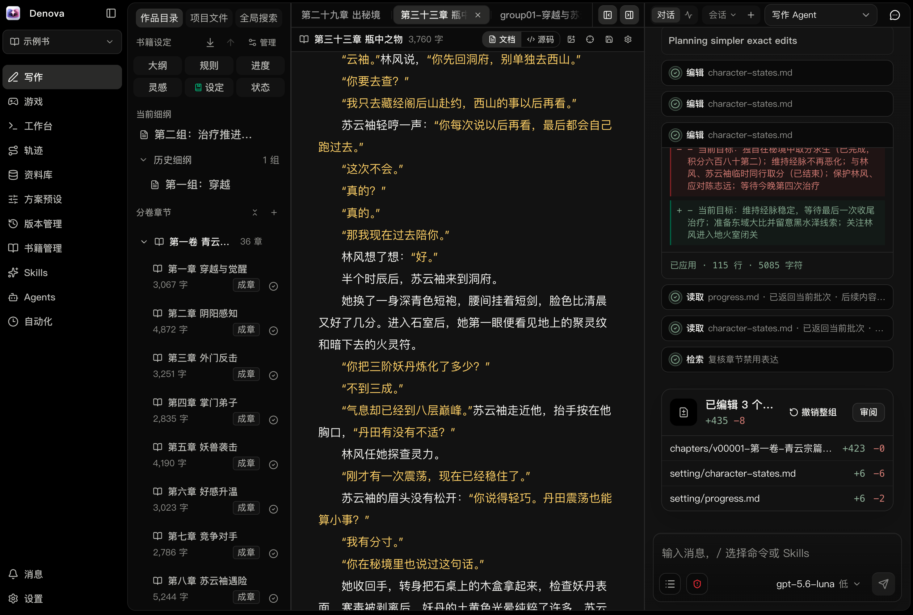
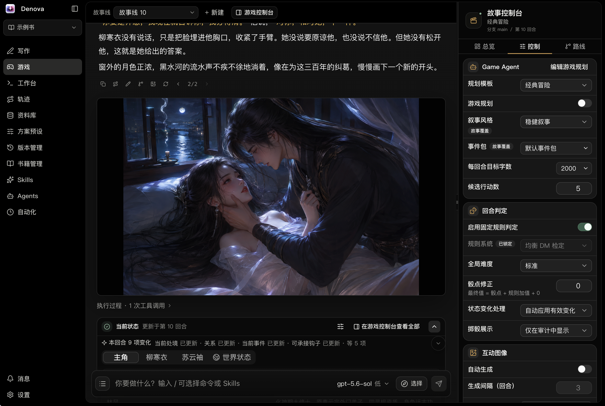
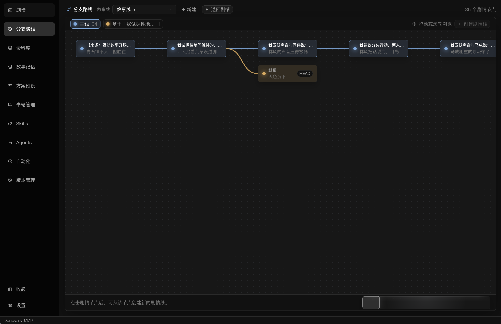
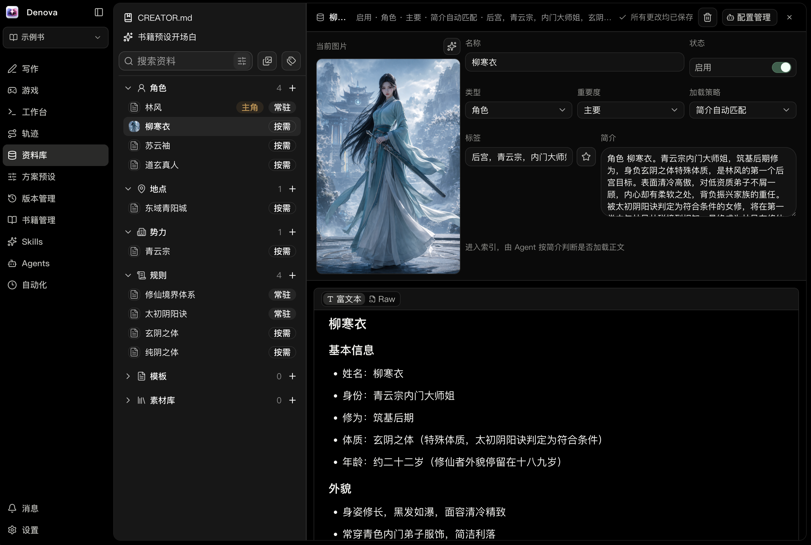
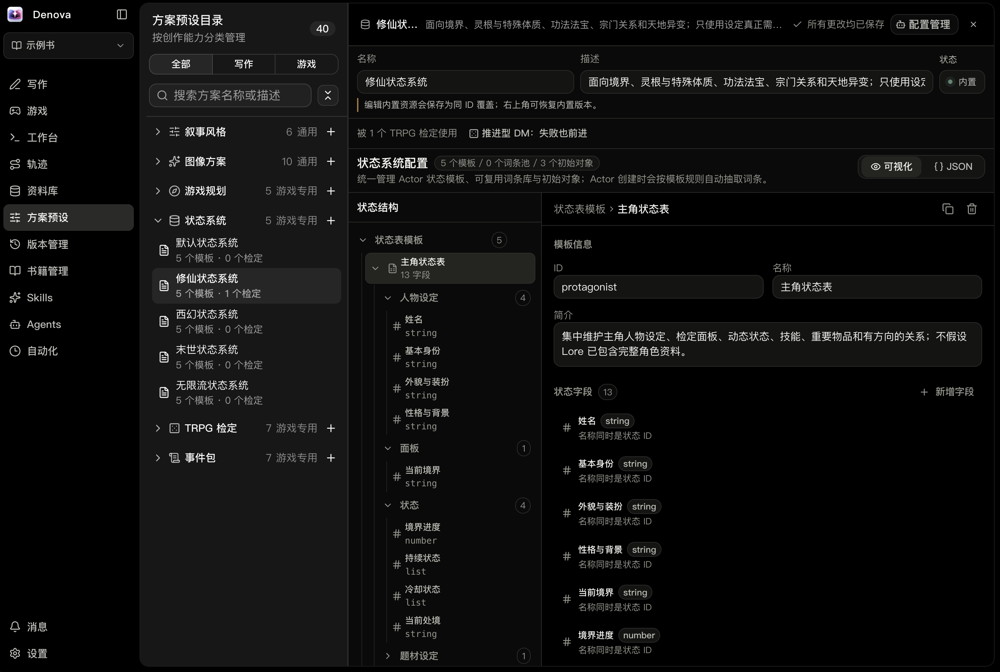

<p align="center">
  
</p>

<p align="center">
  <strong>Denova is an AI creative platform for novel writing and AI generated RPG, with built-in support for AI agents, Skills, subagent workflows, automations, image generation, and version control.</strong>
</p>

<p align="center">
  English | <a href="README.md">中文</a>
</p>

<p align="center">
  <a href="https://discord.gg/QuHu2aPya"></a>
  <a href="https://github.com/alfredxw/denova/releases"></a>
  <a href="./LICENSE"></a>
  
  
</p>

<p align="center">
  Current version: <strong>v0.3.3</strong> (2026-07-25) · Beta
</p>



<details>
<summary>View more screenshots</summary>

### Game



### Branches



### Lore Library



### Presets



</details>

## Why Denova

Denova is built for long-running creative projects and interactive entertainment. It brings together a writing IDE, interactive stories, structured lore, Agent tool calls, image generation, automation, and local version management in one project workspace so the creative process can iterate, recover, and accumulate durable context.

You can start from an original idea, import an existing novel for fan fiction, adaptation, or continuation, or import AI tavern character cards to quickly set up an interactive text adventure. Model-visible context is built with explicit sources, purposes, and size limits instead of blindly injecting the whole history, logs, or all settings into every turn.

## Core Features

- **Writing**: fiction-focused Markdown editing, multiple tabs, regex find and replace, recoverable workspace-wide replacement, chapter statistics, outlines, chapter-group plans, progress tracking, document comments, Change Review, and existing novel import.
- **Creative Agents**: read selections, files, lore, and trusted review feedback; call tools to generate or edit chapters; and use Skills / SubAgents for different writing tasks, prose styles, and workflows. General tools use the compact `read / write / edit / glob / grep / bash|pwsh / web_search / web_fetch / browser / todo / ask / skill / task` interfaces. Writes still enter the cumulative diff for review, comments, and undo.
- **Game**: run interactive text adventures with player input, story branches, storyline switching, per-story Game Agent branch planning, action suggestions, saved AI reply corrections, searchable Turn history, replayable Actor archive/restore, and customizable state layouts. The Game Console brings the current plan, actor and world state, and story routes together.
- **Lore and presets**: maintain durable settings such as characters, worlds, locations, factions, rules, and items. One catalog shows every preset type and labels its fixed availability as Shared, Game only, or Writing only. Narrative styles handle prose and scene rules. Game Planning provides multiple built-in Planning Templates, each copyable and editable as an ordered form of section titles and guidance. Every story directly composes or disables its narrative style, event packages, TRPG Check, State System, and image preset.
- **Image creation**: generate chapter illustrations, interactive images, and book covers through OpenAI-compatible image model profiles, with previews and result management in the UI.
- **Context management**: progressively assemble model context, inspect and copy its sources, build source-linked history checkpoints, improve cache reuse, and keep tool results bounded to reduce noise and token cost.
- **Versions and restore**: save local versions, inspect diffs, restore history, use restart-safe undo/redo for Agent workspace changes, and enable timed saves or automatic saves after large Agent outputs.
- **Automation**: schedule tasks, reviews, auto-continuation, and custom Prompt workflows.
- **Product experience**: Chinese and English UI, light and dark themes, OpenAI-compatible model setup, remote access, PWA phone usage, and Windows / macOS / Linux support.

## Writing and Game

Writing and Game are peer destinations in the workbench, with no separate global mode switch. Writing focuses on the fiction production line: ideas, settings, outlines, chapter plans, prose, and progress. Game focuses on playable interactive narrative: player actions, story branches, Turn history, Actor State, storylines, and choice-driven progression. Shared capabilities such as Lore, Presets, and Versions each have one common destination.

The Game Agent can maintain the active branch plan in the same turn that produces prose and state changes, keeping future intent aligned with the story that was actually committed and reducing long-term drift. Planning is controlled per story: when enabled, the Agent uses the selected Planning Template to coordinate long-term direction, mid-term arcs, near-term beats, cast deployment, and payoffs from the opening, branch history, Actor State, Lore, and player choices. Templates are edited as ordered sections and rendered to stable `##` modules at runtime. Openings and major replans initialize the complete document, while routine turns update only affected modules. When disabled, no plan is injected and no extra steering policy is applied. Creators can switch templates at any time and inspect the active plan in the Game Console.

Creators can directly combine narrative styles, event packages, TRPG Checks, State Systems, and image presets for each story, or disable any module that the story does not need. Event packages are optional material for the Game Agent; they do not impose trigger frequency, a pacing curve, or fixed chapters. Those preferences belong in the Planning Template, Skills, and user instructions. State Systems adapt to the opening and track lasting attributes, resources, relationships, injuries, and traits, while TRPG Checks add fixed-d20 rules and state-based modifiers. Committed Turns own historical facts, Actor State owns current computable facts, Lore owns stable canon, and the active branch plan owns future intent. Section edits are validated independently in the current turn draft, but the final plan is still committed as one complete document with its Turn and projects correctly through branches, rewinds, and version selection. Bounded Turn-history search recovers earlier facts, the Game Console keeps plans, actors, world state, and branches visible, and saved AI replies can be corrected without regenerating a turn.

The two creative flows share durable assets such as lore, presets, model and Agent configuration, Skills, version management, and base settings. Writing progress and chapter plans do not automatically enter Game. If an interactive story should reference a passage or current writing milestone, move stable information into lore first or reference it explicitly in the input.

## Community

Denova is iterating quickly. Feedback, bug reports, usage notes, and workflow discussions are welcome.

<p align="center">
  
</p>

[Discord community](https://discord.gg/QuHu2aPya)

## Quick Start

One-command install for macOS / Linux:

```bash
curl -fsSL https://raw.githubusercontent.com/alfredxw/denova/master/scripts/install.sh | sh
```

Run `denova` after installation.

You can also download the package for your platform manually from [GitHub Releases](https://github.com/alfredxw/denova/releases). The script supports macOS and Linux only; Windows users must download the Release manually and run `denova.exe`.

Release archives include a SHA-256-verified ripgrep binary, so no separate installation is needed. Denova's `grep` tool prefers this bundled version.

### Run from Source

Development startup requires Go 1.26.6+, Node.js 20+, pnpm, and ripgrep available on PATH. The distributable directory produced by `scripts/build.sh` downloads and bundles the pinned version automatically.

```bash
git clone https://github.com/alfredxw/denova.git
cd denova
corepack enable
./scripts/bootstrap.sh
```

Default addresses:

- Frontend: `http://localhost:5173`
- Backend: `http://localhost:8080`

## Models and Configuration

Denova configures language-model providers independently from API protocols. Providers are selected from the built-in catalog, while protocols are limited to OpenAI Chat Completions, OpenAI Responses, and Anthropic Messages. For a custom endpoint, choose Compatible / Custom Endpoint, then set its protocol and Base URL; Gemini uses Google's official OpenAI-compatible endpoint. OpenAI defaults to Responses, DeepSeek offers Chat Completions, Responses, and Anthropic routes, and MiniMax defaults to the Anthropic route so thinking blocks can be continued intact. Settings can load model suggestions through the current protocol's OpenAI-compatible or Anthropic `/models` endpoint while keeping the model name fully editable, and can test the current unsaved profile with one minimal real generation request. Legacy `openai_*` fields in `model_profiles` and the `OPENAI_*` environment variables below remain compatible Chat Completions settings.

Image models support OpenAI, xAI/Grok, ComfyUI, Volcengine Seedream, Google Gemini Image, and custom endpoints using any installed image protocol. ComfyUI defaults to discovering workflows users saved on the current server; one run after saving makes the API graph available for parsing, or users can import API Format JSON exported from ComfyUI. Denova binds only the prompt, image count, and size, while static model, sampler, CFG, and other values always stay with the workflow. Legacy `image_api_*` and image-profile `openai_api_*` settings are automatically migrated on first read after the original file is preserved in a content-addressed `.bak` backup. The recommended path is to configure language models, image models, Agent parameters, the default Writing Skill, editor options, Game Mode behavior, version management, language, theme, and fonts from Settings.

For scripted startup or deployment, you can also override model configuration with environment variables:

```bash
export OPENAI_API_KEY="your-api-key"
export OPENAI_BASE_URL="https://api.deepseek.com"
export OPENAI_MODEL="deepseek-v4-pro"
export DENOVA_IMAGE_PROVIDER="openai"
export DENOVA_IMAGE_PROTOCOL="openai-images"
export DENOVA_IMAGE_API_KEY="your-image-api-key"
export DENOVA_IMAGE_BASE_URL="https://api.openai.com/v1"
export DENOVA_IMAGE_MODEL="gpt-image-2"
```

Legacy `OPENAI_IMAGE_API_KEY`, `OPENAI_IMAGE_BASE_URL`, and `OPENAI_IMAGE_MODEL` remain accepted as aliases for the OpenAI image route. A corresponding `DENOVA_IMAGE_*` variable always takes precedence when present.

Optional Denova startup environment variables:

```bash
export DENOVA_WORKSPACE="/path/to/your-workspace"
export DENOVA_DIR="./.denova"
export DENOVA_SKILLS_DIR="./skills"
export DENOVA_WEB_DIR="./web"
export DENOVA_BACKEND_PORT="8080"
export DENOVA_FRONTEND_PORT="5173"
```

Configuration precedence:

```text
Built-in defaults < global config.toml < user-level config < environment variables
```

Common, Writing Mode, and Game Mode preferences from Settings are now stored uniformly at the user level. A workspace `.denova/config.toml` only carries workspace customizations explicitly exposed by the Agents page; other legacy fields remain on disk but no longer override user settings. Legacy environment variables are still read for compatibility; new configuration should use `.denova` / `DENOVA_*`.

Parallel read-tool execution is configurable from Settings or Agents, defaults to 8, and accepts 1–64; a workspace value overrides the user value. It applies only to consecutive read-only tools—workspace writes and child tools remain strictly ordered.

The Agents page renders each Agent's actual permissions from the backend-resolved capability manifest instead of maintaining a second frontend default matrix. Effective permissions are the intersection of the Agent kind's hard capability ceiling and configured overrides; `runtime_check` marks a conditional capability and does not guarantee that a concrete tool is registered for the current run. `shell` resolves to `bash` or `pwsh` for the current platform, and Web Search and Web Fetch can be authorized independently. General and Writing Agents now handle configuration through the `/configuration` Skill and `config_read` / `config_apply`. Configuration pages keep a right-side manager that reuses AgentChat and shares the main Project Agent's sessions, history, and recovery state. Legacy standalone Config Manager data remains untouched but no longer participates in runtime behavior or migration.

## Remote Access and Phone Usage

Denova can run locally, on your LAN, or on a self-hosted server. Release archives already include frontend assets; when deploying from source, build the frontend first:

```bash
pnpm --dir web build
```

Enable **Settings → Remote Access → Allow LAN access**, then set a username and password. Other devices can open the access URL shown in Settings. After signing in from a phone browser, you can add Denova to the home screen and use it like a standalone app.

For public or domain access, use a reverse proxy such as Caddy / Nginx to provide HTTPS. This avoids sending credentials in cleartext and keeps browser features such as clipboard access and PWA behavior working reliably.

Caddy example:

```text
denova.example.com {
    reverse_proxy 127.0.0.1:8080
}
```

## Development

Start both frontend and backend:

```bash
./scripts/bootstrap.sh
```

Start frontend or backend separately:

```bash
./scripts/bootstrap.sh fe
./scripts/bootstrap.sh be
```

Stop the Denova backend running from this repository and restart it in the foreground:

```bash
./scripts/restart-backend.sh
```

Allow LAN devices to access the frontend dev server:

```bash
./scripts/bootstrap.sh fe --lan
```

## Donate QR Code

> Buy the author a coffee and help cover the monthly AI iteration cost.

<p align="center">
  
</p>


## License

[Apache-2.0](./LICENSE)
