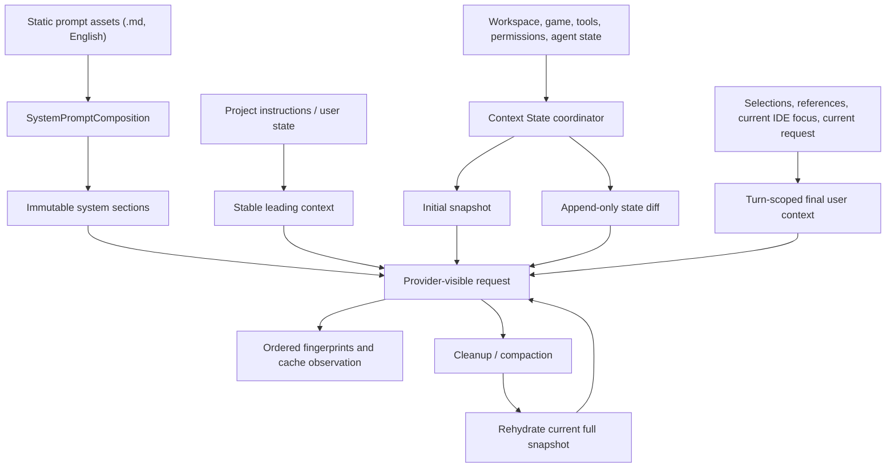

# Denova 提示词与上下文架构对标审计

> 日期：2026-08-13
>
> 状态：P0 / P1 已实现并验证；P2 Tool Schema 延迟发现按测量门槛暂缓
>
> 范围：Denova 当前工作树，以及本地 `oh-my-pi`、`codex`、`claude-code`、`prime-agent` 参考仓库
>
> 注意：本文是明确的对照审计文档，不应作为模型上下文注入 Denova。

## 1. 结论

Denova 不需要推翻现有提示词 Composer。当前实现已经具备几个很扎实的基础：片段来源与用途可追踪、硬上限 fail-closed、稳定前缀认证、动态 `ContextSource` 单一生命周期入口、工具 schema 指纹、上下文清理与压缩分层，以及写作/游戏模式各自的领域提示词。

四个参考实现中，最值得吸收的不是某一份 system prompt 的具体写法，而是下面四类架构能力：

1. **可变上下文使用“状态快照 + 增量更新”，不反复改写前缀。** 主要参考 Codex 的 World State 和 Claude Code 的增量附件。
2. **把 section 的稳定性变成显式契约。** 主要参考 Claude Code 的静态/动态边界，以及 oh-my-pi 的 Stable Prefix / Append-only Log。
3. **缓存异常能定位到首个变化 section、message 或 tool。** 主要参考 Claude Code 的 prompt cache break detection 和 Codex 的 provider-visible 缓存测试。
4. **长篇、稳定的内建提示词使用静态 Markdown 资产维护，同时保留 Denova 现有的类型化装配、准入和 manifest。** 主要参考 oh-my-pi 与 Codex。

建议优先级如下：

| 优先级 | 建议 | 预期收益 | 是否需要新用户配置 |
| --- | --- | --- | --- |
| P0 | 增加类型化 Context State 增量层 | 避免状态变化破坏长前缀；明确恢复与压缩语义 | 否 |
| P0 | 增加 section/message/tool 的首个分叉观测 | 能直接解释缓存命中下降 | 否，复用开发诊断能力 |
| P0 | 增加不变、变化、压缩、恢复四类缓存契约测试 | 防止后续改动悄悄破坏前缀 | 否 |
| P1 | 将长而稳定的内建 prompt 迁到嵌入式 `.md` | 提高可读性、审阅性和复用性 | 否 |
| P1 | 用同一状态注册表驱动压缩后的重建 | 防止漏恢复、重复注入或恢复旧状态 | 否 |
| P2 | 工具 schema 延迟发现 | 工具数量很大时缩短固定前缀 | 先测量，暂不实现 |

不建议引入另一套 Prompt Framework，也不建议照搬 Python/IPython 控制环境、通用 Prompt Template 产品、provider 专属缓存编辑协议或复杂的兼容层。

### 1.1 实施结果（2026-08-13）

本轮已经按本文建议完成以下改造：

- `ContextFragment` 新增穷尽的稳定性契约，明确区分 stable prefix、session state、turn、checkpoint 与 audit；placement 继续只负责模型可见位置。
- Agent Engine 新增持久化 Context State snapshot。首次出现、内容更新、显式删除均追加独立 User-role 状态消息；未变化 section 零注入，不回写历史。
- 同一状态注册表同时驱动自动压缩、手动压缩、只读 inspection、重试与恢复后的 rehydrate；状态更新和 removal tombstone 被压缩遮蔽时只恢复一次当前版本。
- 写作模式的 workspace runtime snapshot 与游戏模式的 resident lore 已迁入共享 session-state 协议；本轮 focus、动态工作区信息和游戏 turn runtime 仍保持 turn-scoped。
- general workflow、Harness Optimizer、Background Director 与 context compaction 四段长静态提示词已迁到 `internal/agents/prompts/assets/*.md`，继续通过 `SystemPromptComposition` 进行来源登记、预算准入、manifest 与 hash 认证。
- 开发模型输入日志新增有序 system section、message、Context State 与 tool schema 指纹；同一 session / agent 相邻请求会记录首个分叉组件，并用同一 `call_id` 关联 provider 返回的 prompt tokens、cache read tokens、未命中 tokens 与命中比例。provider 未提供 cache write 时明确记录为 unknown，而不是推断。
- 没有增加用户配置，也没有引入 provider 专属 cache 协议或第二套 Prompt Framework。

Beta 不兼容说明：轻量 Agent Store 使用新的 v1 transcript，旧版内部 runtime checkpoint 不保留兼容读取路径；产品拥有的工作区文件和 canonical conversation 数据不做迁移或覆盖。

## 2. 审计范围与基线

本次对照基于以下本地版本：

| 项目 | 本地 revision | 重点路径 |
| --- | --- | --- |
| Denova | 当前工作树 | `internal/agents/prompts`、`agent/context`、`agent/compaction`、`internal/agents/conversation`、`internal/agents/run/model_input.go` |
| oh-my-pi | `59619623e` | `system-prompt.ts`、`append-only-context.ts`、`compaction/*` |
| Codex | `902bd9e06b` | `context/world_state/*`、`context-fragments`、`compact.rs`、`prompt_caching.rs` |
| Claude Code | `5a774a2` | `systemPromptSections.ts`、`prompts.ts`、`toolSchemaCache.ts`、`promptCacheBreakDetection.ts`、`compact/*` |
| Prime Agent | `a18809e0` | `system-prompt.ts`、`skills.ts`、`prompt-templates.ts`、`compaction/*`、`context-tree.ts` |

本文聚焦“提示词如何定义、上下文如何进入模型、可变状态如何更新、压缩后如何恢复、缓存如何验证”。对具体文案和 Tool Schema 的逐项审计，继续参见 [agent-prompt-architecture-audit.md](./agent-prompt-architecture-audit.md)。

## 3. Denova 当前做得好的地方

### 3.1 System Prompt 已经有可靠的准入边界

[`internal/agents/prompts/composer.go`](../internal/agents/prompts/composer.go) 中的 `SystemPromptFragment` / `SystemPromptComposition` 已经提供：

- 稳定 ID、来源、标题、用途；
- 单片段与总量硬上限；
- required / overflow 策略；
- 完整 instruction hash、片段 hash 和 manifest；
- agent kind 校验与准入日志。

这部分比简单字符串拼接更可靠，应继续作为 system prompt 的唯一装配入口。后续改造应该深化它，而不是平行新增另一套 composer。

### 3.2 动态上下文已经有单一生命周期入口

[`agent/definition.go`](../agent/definition.go) 将 `ContextSource.Materialize` 定义为动态模型上下文的唯一扩展入口；[`agent/context/assembler.go`](../agent/context/assembler.go) 统一处理来源、用途、placement、hard limit、hash 和总量预算。

现有 placement 已经区分：

- `leading_message`：稳定前缀；
- `final_user_prefix`：本轮动态背景；
- `final_user_message`：完整替换本轮模型可见用户消息；
- `audit_only`：仅审计。

这已经是很好的模块边界。真正缺少的是“跨 turn 的状态演进协议”，不是另一个注入入口。

### 3.3 稳定前缀不是口头约定，而是经过认证

[`agent/model_loop.go`](../agent/model_loop.go) 的 `authenticatedStablePrefixMessages` 会在 middleware 之后重新验证生命周期拥有的前缀字节；[`agent/definition.go`](../agent/definition.go) 的 `prefixFingerprint` 还覆盖 model identity、instructions、tools、稳定 context 与 middleware identity。

因此，oh-my-pi 的 Stable Prefix 思路在 Denova 中大部分已经存在。需要吸收的是它对“历史从哪个 message 开始发生字节变化”的处理和观测，而不是再做一个重复的 StablePrefix 类型。

### 3.4 Context 清理和压缩已经分层

Denova 已经具备：

- 基于真实 provider token 与 stable-prefix token 的压力判断；
- 可恢复 tool result 的提前清理；
- 正式 compaction checkpoint；
- `ContextData` 交给产品 ContextSource 恢复领域上下文；
- retry、recovery、compaction 共享 provider-visible 装配路径。

这与参考项目中的“先便宜清理，再做模型压缩”方向一致。后续重点应放在“哪些上下文必须恢复”的统一登记，而不是另写一套压缩器。

### 3.5 已有 provider-visible 诊断基础

[`internal/agents/run/model_input.go`](../internal/agents/run/model_input.go) 与
[`internal/agents/run/model_input_cache.go`](../internal/agents/run/model_input_cache.go) 现在记录：

- 有序 system section、message 与 Context State fingerprint；
- tool schema aggregate 与逐 tool fingerprint；
- 相邻请求的首个分叉位置及原因；
- 通过同一 `call_id` 关联的 provider cache-read token、未命中 token 与命中比例；
- 完整 provider-visible messages 与 tools（仅开发模式）。

provider 未提供 cache-write 指标时会明确记录 unknown，不用估算值制造错误结论。该能力沿用既有开发日志体系，没有新增用户配置或第二套 tracing 管道。

## 4. 四个参考实现的可吸收设计

### 4.1 Codex：类型化 World State 和增量上下文

关键设计位于：

- [`context/world_state/mod.rs`](../../codex/codex-rs/core/src/context/world_state/mod.rs)
- [`context_manager/history.rs`](../../codex/codex-rs/core/src/context_manager/history.rs)
- [`context_manager/updates.rs`](../../codex/codex-rs/core/src/context_manager/updates.rs)
- [`context-fragments/src/fragment.rs`](../../codex/codex-rs/context-fragments/src/fragment.rs)
- [`core/src/compact.rs`](../../codex/codex-rs/core/src/compact.rs)
- [`core/tests/suite/prompt_caching.rs`](../../codex/codex-rs/core/tests/suite/prompt_caching.rs)

其核心不是“多放几段 context”，而是把可变环境建模为有稳定 section ID 的状态：

- 每个 section 负责生成类型化 snapshot；
- 与上一份 snapshot 比较，未变化则不发消息；
- 变化、删除和首次出现分别渲染为明确的 context update；
- update 只追加到历史尾部，不回写旧消息；
- compaction 后用当前完整 snapshot 重建新基线；
- contextual message 与真实用户 turn boundary 分开处理。

Denova 最值得直接吸收这一思想。当前 `ContextSource.Materialize` 每轮生成完整投影，稳定 workspace context 被重新放在前缀，动态 workspace context 被放在本轮 user prefix；它能保证正确性，但没有持久化的 section snapshot/diff 语义。状态变化时，系统只能看到“本轮投影不同”，无法表达“哪个 section 被替换或删除”，也无法避免低频状态变化对长前缀的影响。

不应照搬的部分：

- 为旧历史格式保留的 legacy matcher 和兼容恢复路径；Denova beta 应直接切到新语义并删除旧路径。
- 参考项目较小的单项 token 上限；Denova 应继续使用可配置且高于 50KB 的硬上限，超限拒绝而不是随意截断。
- 所有状态都动态化。模型身份、核心运行契约等真正的 system instruction 仍应保持不可变。

### 4.2 Claude Code：稳定性边界和缓存破坏归因

关键设计位于：

- [`constants/systemPromptSections.ts`](../../claude-code/src/constants/systemPromptSections.ts)
- [`constants/prompts.ts`](../../claude-code/src/constants/prompts.ts)
- [`services/api/claude.ts`](../../claude-code/src/services/api/claude.ts)
- [`utils/toolSchemaCache.ts`](../../claude-code/src/utils/toolSchemaCache.ts)
- [`services/api/promptCacheBreakDetection.ts`](../../claude-code/src/services/api/promptCacheBreakDetection.ts)
- [`utils/mcpInstructionsDelta.ts`](../../claude-code/src/utils/mcpInstructionsDelta.ts)
- [`services/compact/compact.ts`](../../claude-code/src/services/compact/compact.ts)

最有价值的三个点：

1. **section 默认 memoize。** 需要每轮重算的 section 必须使用名称明确的危险入口并说明原因，使“会破坏缓存”成为代码审查可见的决策。
2. **静态内容在前，动态内容在后。** system prompt 有明确的动态边界；tool schema 也保持稳定顺序和稳定字节。
3. **缓存下降可归因。** 相邻请求会比较 system、每个 tool、cache control、model 与 beta 等输入，先记录预期变化，再结合 provider 观察到的 cache read 下降判断原因。

其 MCP instructions delta 也值得借鉴：后连接能力不改写已有 system prompt，而是追加“新增/移除能力”的持久化状态消息。这与 Codex World State 本质相同，可以统一为 Denova 的 Context State 增量层。

不应照搬的部分：

- 将大量功能开关和产品特例堆入核心 system prompt；
- 把 provider 专属 `cache_control` 或 cache editing 语义泄漏进通用 Agent 层；
- 在缺少数据前引入 Tool Search；
- 将缓存 TTL 写成核心上下文策略。provider 差异应留在 adapter 内。

### 4.3 oh-my-pi：静态 Prompt 资产和 Append-only Context

关键设计位于：

- [`coding-agent/src/system-prompt.ts`](../../oh-my-pi/packages/coding-agent/src/system-prompt.ts)
- [`prompts/system/system-prompt.md`](../../oh-my-pi/packages/coding-agent/src/prompts/system/system-prompt.md)
- [`agent/src/append-only-context.ts`](../../oh-my-pi/packages/agent/src/append-only-context.ts)
- [`agent/src/compaction/pruning.ts`](../../oh-my-pi/packages/agent/src/compaction/pruning.ts)
- [`agent/src/compaction/shake.ts`](../../oh-my-pi/packages/agent/src/compaction/shake.ts)
- [`agent/src/compaction/tool-protection.ts`](../../oh-my-pi/packages/agent/src/compaction/tool-protection.ts)
- [`agent/src/compaction/message-cache.ts`](../../oh-my-pi/packages/agent/src/compaction/message-cache.ts)

可吸收点：

- 长篇系统提示词以静态 `.md` 维护，代码只负责选择、填入动态数据和确定顺序；
- Stable Prefix 与 Append-only Log 分开建模；
- 历史被局部改写时寻找“最长字节稳定前缀”，只从首个变化 message 重新发送；
- compaction 前先做低成本 pruning，对已被新 read 覆盖的旧 read、低价值 tool result 做清理；
- skill read 等高价值 tool result 可声明保护策略；
- message 转换和 token 估算有按 message 的缓存，并在结构变化时精确失效。

Denova 已经有稳定前缀认证、tool result 清理与压缩分层，所以不需要复制整套实现。最有价值的补充是：

- 把长篇稳定 prompt 从 Go 多行字符串迁到嵌入式 Markdown；
- 在诊断中计算“首个变化 message index”；
- 让 tool result retention policy 能解释为什么保留或清理某一类结果；
- 对重复 token 估算和 provider-neutral message 规范化做按 message 的精确缓存，但只在 profiling 证明有收益后实施。

不应照搬的部分：

- 体量很大的单一基础 prompt；
- 在核心流程写死 prompt preparation timeout；
- 证据不足时引入多种压缩算法和 provider/local 专属归档协议；
- 将内部资源 URI 约定暴露给所有 Agent。

### 4.4 Prime Agent：渐进式 Skills、压缩归因和多 Agent 用量树

关键设计位于：

- [`core/system-prompt.ts`](../../prime-agent/packages/coding-agent/src/core/system-prompt.ts)
- [`core/skills.ts`](../../prime-agent/packages/coding-agent/src/core/skills.ts)
- [`core/prompt-templates.ts`](../../prime-agent/packages/coding-agent/src/core/prompt-templates.ts)
- [`core/compaction/compaction.ts`](../../prime-agent/packages/coding-agent/src/core/compaction/compaction.ts)
- [`core/context-tree.ts`](../../prime-agent/packages/coding-agent/src/core/context-tree.ts)
- [`core/prompts/rlm.ts`](../../prime-agent/packages/coding-agent/src/core/prompts/rlm.ts)

可吸收点：

- Skills 在 system prompt 中只暴露名称、描述和位置，具体正文按需读取；
- compaction 明确区分完整 turn 与被切开的 turn，并把前一份 summary、最近消息和文件操作合并到新 summary；
- 多 Agent 用量同时展示自身用量与包含子 Agent 的总用量，避免把子 Agent 成本重复归到父 Agent；
- 上下文树能展示每个 Agent 的 compaction 状态和 context utilization。

其中，渐进式 Skills 与 Denova “一般提示词需求由 Skills 承载，工具能力由 Tools / Bash 承载”的方向一致，应继续加强；多 Agent 用量树也适合扩展现有 context analysis。

不建议吸收：

- 为 Denova 增加另一套 Prompt Template 产品。可复用工作流优先继续用 Skills 表达，避免概念重叠。
- 将 Python/IPython 常驻执行环境变成所有 Agent 的核心控制平面。它会把产品能力、模型提示词和运行时强耦合。
- 将可执行 Skill 另建成与 Tools/Bash 平行的执行协议。
- 用简单字符估算替代 Denova 已有的 provider observation 与正式上下文压力模型。

## 5. 建议的目标架构

目标不是增加更多层，而是让现有两个入口职责更纯粹：

- `SystemPromptComposition`：只拥有 session 内不可变的高优先级指令；
- `ContextSource`：仍是唯一动态入口，但其内部由一个状态协调器统一管理稳定投影、增量更新和压缩重建。



### 5.1 明确四种稳定性，而不是只看 placement

建议在内部 section registry 中使用穷尽枚举表达稳定性：

| 稳定性 | 典型内容 | 更新方式 | 缓存预期 |
| --- | --- | --- | --- |
| Immutable System | 核心运行契约、输出协议、Agent 职责 | session 内不变 | 必须字节稳定 |
| Stable Leading | `AGENTS.md`、`CREATOR.md`、用户 Agent 偏好、常驻资料 | 低频变化；变化是显式结构事件 | 变化时允许前缀失效，但必须可归因 |
| Mutable State | 工作区状态、游戏状态、可用能力、子 Agent 状态 | snapshot diff 追加 | 不改写旧前缀 |
| Turn Ephemeral | 本轮 IDE focus、选择区、引用、计划模式、本轮请求 | 仅进入最后 user turn | 每轮允许变化 |

placement 解决“放在哪里”，稳定性解决“何时可以变化、变化后如何恢复”。二者不要混成一个字段。

### 5.2 在现有 ContextSource 后面增加一个深模块

不要再暴露一组平行的 Context API。实现由 Agent 在现有 `ContextSource` 产出片段后统一调用内部 Context State coordinator，其主要操作为：

```text
Materialize(current state, previous snapshot, compaction checkpoint)
  -> model-visible fragments
  -> current snapshot or patch
  -> ordered manifest
```

协调器内部负责：

- section 注册顺序；
- 稳定 ID、来源、用途、revision 和 hard limit；
- snapshot 序列化与 hash；
- 首次注入、未变化、更新、删除四种穷尽状态；
- 同 role 的相邻 diff 合并；
- compaction 后输出完整当前 snapshot；
- retry/recovery 使用同一 snapshot 和相同字节；
- manifest 供日志、Context Analysis 和测试使用。

每个 section 只拥有自己的状态读取、snapshot 和 diff 渲染。它不应知道 provider、session store、压缩算法或其他 section。

### 5.3 状态变化必须追加，不能回写历史

建议的语义：

1. session 首次请求：输出完整当前 snapshot，并持久化 snapshot identity；
2. 后续请求状态未变：不输出该 section；
3. 状态变化：追加带稳定 section ID、旧 revision、新 revision 的 update；
4. 状态删除：追加明确 removal，不能用空字符串暗示；
5. retry/recovery：重复使用已准入的 update，不能重新读取 wall clock 或实时状态；
6. compaction：丢弃旧 diff 链，在新 checkpoint 后只重建一次完整当前 snapshot。

这里的“追加”是 provider-visible 历史语义，不要求每个 diff 永久写成一条独立数据库消息。持久化层可以保存紧凑 patch，但必须能重建相同的模型可见顺序和字节。

### 5.4 System Prompt 使用静态 Markdown，但保留类型化装配

建议只迁移长而稳定的内建正文：

```text
internal/agents/prompts/assets/
  runtime-contract.md
  ide-agent.md
  interactive-story-agent.md
  director-agent.md
  config-manager-agent.md
  compaction.md
```

实现原则：

- 使用 `go:embed`；
- 所有模型可见资产只写英文；
- 短小的 section 选择、顺序、来源、用途和预算仍在 Go 中；
- 优先纯静态 Markdown。只有确实需要动态字段时才使用小型、类型化 render input；
- 不引入面向任意字符串替换的通用模板 DSL；
- 迁移后 `SystemPromptComposition` 的 manifest、hash 和 admission 行为保持唯一真源；
- 每个资产有 provider-visible golden test，避免空白和换行变化无人察觉。

这能吸收 oh-my-pi/Codex 的可维护性，同时避免把 Denova 的类型安全退化为模板字符串拼接。

### 5.5 缓存观测要回答“从哪里开始失效”

现有日志已经有 aggregate 和 per-tool fingerprint。建议补充：

- 有序 system section fingerprint；
- 有序 leading context fingerprint；
- 每条 provider-visible message fingerprint；
- stable-prefix message count 与 token count；
- 相邻请求的 first divergent component：`system[i]`、`tool[name]`、`message[i]`、model、provider option；
- provider 返回的 cache read、cache write、input token 指标；
- 预期变化与观察到的命中下降是否一致；
- 每个诊断记录有数量和大小上限，不保存无限历史。

推荐的开发输出示例：

```text
cache_prefix_changed=true
first_divergence=message[4]
component=workspace_state
previous_revision=8d7...
current_revision=0aa...
stable_prefix_tokens=18240
observed_cache_read_tokens=18196
```

完整内容继续只在显式开发模式记录；日常 telemetry 只保留 hash、字节数、token 数和变化原因，避免泄漏用户创作内容。

### 5.6 Compaction 从同一注册表重建上下文

压缩后的恢复不应由每个调用点手写“记得把某些内容再拼回去”。同一 section registry 应声明：

- 是否需要持久化 snapshot；
- 是否在 compaction 后重建；
- 重建为完整 snapshot 还是可以省略；
- 是否为高价值 tool result，需要保护到 checkpoint；
- 当前 revision 和恢复 receipt。

写作与游戏模式都应走同一恢复协议，但注册不同领域 section：

- 写作：工作区稳定状态、常驻资料 revision、当前文件/选择区等；
- 游戏：世界状态、分支、回合、常驻 lore、玩家可见状态等；
- 共通：项目指令、用户状态、工具能力、权限、Goal、子 Agent 状态。

恢复后必须满足：当前状态只出现一次、旧 revision 不可见、动态 turn context 不被误当成长期状态。

## 6. 落地顺序与完成状态

### 阶段 0：先建立测量基线（已完成）

目标：不改变模型行为，只让缓存变化可解释。

- 在现有 model input log 增加 section/message 有序 fingerprint；
- 计算相邻请求的首个分叉点；
- 对接各 provider 已有 cache usage 字段；
- 补写作和游戏各一组相同状态连续 turn 的 provider-visible snapshot test；
- 记录 system、tools、leading context、history、current turn 的 token/byte 分布。

完成标准：任一次缓存命中下降，都能判断是 system、tool、leading context、历史改写还是 provider/TTL 原因。

### 阶段 1：外置长篇稳定 Prompt（已完成首批四项）

目标：只改善维护边界，不同时改变上下文生命周期。

- 选择一个较独立的长 prompt 作为端到端切片；
- 使用 `go:embed` 静态 Markdown；
- 保持现有 `SystemPromptComposition` API、manifest 和硬上限；
- 用 provider-visible golden test 验证迁移前后的语义与顺序；
- 切片通过后再迁移其他长篇正文。

不保留旧 Go 字符串 fallback；切换完成后直接删除旧路径。

### 阶段 2：实现最小 Context State 闭环（已完成）

目标：先证明“snapshot → diff → compaction rehydrate”端到端可工作，再扩展 section。

- 在现有 `ContextSource` 内引入一个 coordinator，不新增第二套 lifecycle seam；
- 选择一个共通、描述性、可安全替换的 mutable state section；
- 实现首次完整注入、无变化零注入、变化 update、删除 removal；
- 持久化 snapshot/patch；
- compaction 后重建完整当前 snapshot；
- 写作与游戏至少各接入一个 section，验证共享抽象没有偏向单一模式；
- 删除被替代的完整重复注入路径。

不要第一步就迁移高优先级 system instruction，也不要一次把所有 ContextSource 改成 diff。

### 阶段 3：统一压缩恢复登记（Context State 范围已完成）

目标：让恢复义务从调用点散落逻辑变成 section 自描述策略。

- 将领域状态、Goal、调用过的 Skills、需要保护的 tool result 纳入明确登记；
- 添加 receipt，证明每个 required section 已恢复到目标 revision；
- 删除手写且重复的 post-compaction reinjection；
- Context Analysis 展示恢复来源、revision、字节数和是否当前可见。

### 阶段 4：根据数据决定是否延迟 Tool Schema（暂缓）

只有同时满足以下条件才值得实施：

- 常驻 tool schema 已成为固定前缀的显著占比；
- 大量工具在绝大多数 turn 从不使用；
- provider 对动态工具发现的行为可靠；
- 延迟发现后的额外 turn 成本低于缓存与 token 收益。

如果需要实现，应由 Toolset descriptor 声明 `always_available` / `deferred`，provider adapter 决定 wire 表达；不能把某个 provider 的 Tool Search 语义写进通用 system prompt。

## 7. 测试与验收标准

### 7.1 稳定性

- 相同 session、相同状态、连续两个 turn：system、tools、所有 leading messages 字节完全相同；
- 未变化的 mutable section 不产生新模型可见片段；
- middleware 修改稳定前缀时，认证边界归零并产生日志；
- section 顺序由注册表固定，不能依赖 map 遍历。

### 7.2 增量状态

- section 首次出现、无变化、更新、删除四种状态全部有测试；
- 更新时旧历史保持字节不变，只在尾部追加 update；
- removal 是显式消息；
- 多个 section 部分失败时，能报告逐项结果，不因一个可选 section 失败而丢失全部成功项；required section 失败则 fail-closed；
- 每个注入片段都有 source、purpose、resource、revision 和高于 50KB 的可配置硬上限。

### 7.3 Compaction 与恢复

- 压缩后只保留一份当前 snapshot；
- 旧 revision、旧 removal 前状态和重复 diff 不可见；
- 被切开的 turn 不制造伪造 user boundary；
- retry、recovery、manual compact、automatic compact 的重建字节一致；
- 写作和游戏模式均覆盖稳定状态、动态状态、空状态与超限状态。

### 7.4 缓存归因

- tool 新增、删除、重排、描述变化、schema 变化分别能定位；
- system section 换行变化也能定位；
- leading context 改变能定位到具体 source/revision；
- history 经过 cleanup 后能定位到首个变化 message；
- provider cache usage 缺失时明确标记 `unknown`，不能推断成命中或未命中。

## 8. 配置与兼容性决策

### 8.1 不建议新增用户配置的部分

以下都是内部正确性与性能策略，不应增加用户理解成本：

- section 稳定性分类；
- snapshot/diff 协议；
- static prompt assets；
- cache-break fingerprint；
- compaction rehydration registry。

继续复用现有 Agent context budget、per-fragment hard limit 和开发诊断开关即可。

### 8.2 暂缓配置的部分

Tool schema 延迟发现如果未来实施，应先作为 provider capability 与自动策略，不急于暴露用户开关。只有用户确实需要在“更低首轮 token”与“工具立即可用”之间做选择时，才考虑配置项。

### 8.3 不保留兼容层

Denova 当前是 beta，落地时应：

- 新 state coordinator 完整接管某类上下文后，删除旧的完整重复注入路径；
- 不同时维护 snapshot/diff 与旧字符串拼接两种恢复协议；
- 不为旧内部 checkpoint 结构增加长期迁移层；如涉及用户工作区内容，先做可回滚备份并明确不兼容说明；
- provider 专属能力只放在 adapter，核心状态协议保持 provider-neutral。

## 9. 最终建议

建议把下一轮提示词架构工作定义为：

> 在保留 `SystemPromptComposition`、`ContextSource`、现有 cleanup/compaction 和 provider-visible inspection 的前提下，为 Denova 增加类型化、可持久化、append-only 的 Context State 更新协议，并用有序指纹与缓存观测证明其收益。

这是四个参考实现优点的最小交集，也是最适合 Denova 长期演进的方向。它能同时服务写作和游戏，不会增加新的用户概念，并且把缓存、压缩、恢复和上下文审计收敛到同一份状态真源。

上述目标现已完成 P0 / P1 实现。后续仅在日志数据证明常驻 Tool Schema 已成为显著固定成本时，再评估阶段 4；在此之前不增加 Tool Search 或延迟 schema 复杂度。

## 10. 参考源码索引

### Denova

- [`internal/agents/prompts/composer.go`](../internal/agents/prompts/composer.go)
- [`internal/agents/prompts/composition.go`](../internal/agents/prompts/composition.go)
- [`agent/definition.go`](../agent/definition.go)
- [`agent/model_loop.go`](../agent/model_loop.go)
- [`agent/context/assembler.go`](../agent/context/assembler.go)
- [`agent/context_state.go`](../agent/context_state.go)
- [`internal/agents/lifecycle/project_context.go`](../internal/agents/lifecycle/project_context.go)
- [`internal/agents/conversation/model_context.go`](../internal/agents/conversation/model_context.go)
- [`agent/cleanup/standard.go`](../agent/cleanup/standard.go)
- [`agent/compaction/standard.go`](../agent/compaction/standard.go)
- [`internal/agents/run/model_input.go`](../internal/agents/run/model_input.go)
- [`internal/agents/run/model_input_cache.go`](../internal/agents/run/model_input_cache.go)
- [`internal/agents/prompts/assets/`](../internal/agents/prompts/assets/)

### 参考项目

- [oh-my-pi system prompt](../../oh-my-pi/packages/coding-agent/src/system-prompt.ts)
- [oh-my-pi append-only context](../../oh-my-pi/packages/agent/src/append-only-context.ts)
- [oh-my-pi compaction](../../oh-my-pi/packages/agent/src/compaction/compaction.ts)
- [Codex world state](../../codex/codex-rs/core/src/context/world_state/mod.rs)
- [Codex context history](../../codex/codex-rs/core/src/context_manager/history.rs)
- [Codex prompt caching tests](../../codex/codex-rs/core/tests/suite/prompt_caching.rs)
- [Claude Code prompt sections](../../claude-code/src/constants/systemPromptSections.ts)
- [Claude Code cache-break detection](../../claude-code/src/services/api/promptCacheBreakDetection.ts)
- [Claude Code compaction](../../claude-code/src/services/compact/compact.ts)
- [Prime Agent system prompt](../../prime-agent/packages/coding-agent/src/core/system-prompt.ts)
- [Prime Agent skills](../../prime-agent/packages/coding-agent/src/core/skills.ts)
- [Prime Agent compaction](../../prime-agent/packages/coding-agent/src/core/compaction/compaction.ts)
