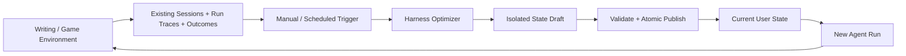

# Harness 优化 V1 设计

> 状态：Implemented；2026-08-12 完成实现一致性与故障恢复审计
> 范围：仅 User State 与 Harness Optimization，不包含 Project State 和 Weight Learner

## 1. 结论

V1 把持续学习收敛为一条异步 Harness 优化链路：已有 Agent Session、Run trace 和显式 Outcome 组成 trajectory；用户手动触发或定时触发 Harness Optimizer；Optimizer 在隔离 draft 中用普通文件工具修改 State；应用完成完整校验、原子发布和版本记录；之后的新 Run 使用新的 Harness。



核心决定：

1. 只有一份用户级 State，位于 `<DenovaDir>/state`，不实现 Project State。
2. Skills 沿用现有目录和加载机制，不迁入 State。
3. 当前文件是事实源；Git 只是 Denova 应用层的本地历史实现。
4. `agent/state` 不依赖 Git，只提供 snapshot、CAS、draft、原子发布、恢复和 Run pin。
5. `internal/agents/harnessstate` 只定义 Denova Harness schema、校验和运行时物化。
6. `internal/app/continuallearning` 独占 go-git、版本、Diff、Restore、Optimizer、schedule 和产品 API 编排。
7. 不增加 `/refine`；手动触发只在 Agents → Harness 优化页面。
8. 定时优化属于 V1，与手动优化汇合到同一个 `StartTask` 用例。
9. Harness Optimizer 使用普通 `read/write/edit/glob/grep/shell/skill/task` 等能力，不增加 Git、State lifecycle 或 delete 专用工具。
10. Lab 默认关闭；关闭时页面、Optimizer、schedule 和 State 注入均不生效，已有 State 文件和历史保留。

## 2. 模块边界

```text
agent/state
├── immutable content snapshot + revision
├── compare-and-swap update
├── isolated durable draft
├── atomic publish + crash recovery
└── Run-scoped snapshot pin
    └── no Git dependency and no Denova schema

internal/agents/harnessstate
├── prompts/context/tools/subagents schema
├── Markdown/TOML parser
├── complete-snapshot validator
└── Snapshot → Prompt/Context/Tools/SubAgents
    └── no Git dependency

internal/app/continuallearning
├── product service and API contracts
├── app-owned go-git history
├── semantic versions, Diff and Restore
├── Harness Optimizer lifecycle
├── trajectory catalog and outcomes
└── periodic scheduler
```

依赖方向是应用层组合 Agent 能力，而不是 Agent 包反向承载产品版本策略：

```text
Denova continuallearning app
        ├── harnessstate schema
        ├── agent/state mechanics
        └── go-git history
```

go-git 只能出现在 `internal/app/continuallearning/state_history.go` 的 State 版本实现中。Agent State 与 Harness State 都不能暴露 Commit、HEAD、working tree 或 Git hash 语义。API 的 `StateVersionID` 是应用层 opaque ID。

## 3. 存储

```text
<DenovaDir>/
├── skills/                              # 现有 Skills
├── state/                               # 当前 User State，事实源
│   ├── .git/                            # 应用层管理，UI/Agent 不展示
│   ├── prompts/<agent-kind>.md
│   ├── context/<fragment-id>.md
│   ├── tools.toml
│   └── subagents/<subagent-id>.md
├── runtime/harness-state/               # Agent State 私有运行数据
│   ├── drafts/
│   ├── snapshots/
│   ├── runs/
│   └── transaction/recovery metadata
└── continual-learning/
    ├── sessions/                        # Harness Optimizer Session
    ├── outcomes.jsonl                   # append-only explicit feedback
    └── schedule.json                    # last attempt/success/task
```

约束：

- `state/` 中除 `.git` 外的当前文件就是当前策略。
- `runtime/harness-state` 必须在可见 State 根目录之外。
- State 枚举忽略 `.git/**`，拒绝绝对路径、`..`、符号链接和非普通文件。
- 发布以 content revision 做 CAS；完整候选状态先校验，再作为一个事务替换。
- 事务在 candidate 与 `published` recovery marker 都持久化后即视为提交成功；marker 或 draft 的后置清理失败只产生可观测告警，不把已提交变更伪装为失败。恢复标记只在发布或回滚已持久化后删除。
- draft 不包含 `.git`，Optimizer 无法通过工作目录接触版本仓库。
- durable draft 的恢复先校验 ID、base revision 与文件系统安全性，允许重新打开暂时不满足 schema 的中间编辑；完整 schema 校验仍是完成与发布的硬门槛。
- 外部直接编辑合法 State 文件后，下次应用读取会把它视为当前 State；版本页面会由应用层归档该事实源。
- 上层 UI 和 Agent 只看到当前 State、语义化版本、Diff 和 Restore，不看到 Git 操作。

## 4. State schema

### 4.1 Prompt

`prompts/<agent-kind>.md` 是用户行为和偏好，追加在不可覆盖的 runtime contract 与内置产品 Prompt 之后：

```text
Immutable Runtime Contract
→ Built-in Product Prompt
→ User State Prompt
```

State Prompt 不能修改权限、工具 schema、输出协议、恢复语义或领域提交边界。稳定内置前缀保持在前，用户 State 位于后缀，减少 State 更新对 prefix cache 的影响。

### 4.2 Context / Memory

V1 不增加 Memory engine，使用 `context/*.md`：

```markdown
---
id: concise-review
purpose: Preserve the user's durable review preference.
agents: [general, ide]
placement: leading_message
enabled: true
---

Lead with concrete edits and avoid repeating the full plot.
```

每个片段物化时带明确的 Source、Purpose、Resource、content revision 和 HardLimit。V1 只支持 `leading_message`。硬上限来自 Agent Context 配置，默认高于 50 KiB；超限拒绝整个候选 snapshot，不静默截断。

### 4.3 Tool description

```toml
[tools.read]
description = "Read the narrowest relevant source before changing files."
```

只允许覆盖已注册工具的 description；名称、参数 schema、实现、Descriptor、权限和启用状态仍由应用配置决定。

### 4.4 SubAgent spec

```markdown
---
id: reviewer
name: Reviewer
description: Review one bounded artifact.
enabled: true
parents: [general]
model_profile: default
tools: [workspace_read]
---

Return concise findings with evidence.
```

文件名与 ID 必须一致；parent、model profile 和 capability 必须存在；capability 不得突破 parent ceiling。

## 5. 生效与 Run 一致性

- Lab 开启时，新 Run 在 Agent composition root 获取当前 State。
- 同一个未完成 Run 的所有 cycle 和冷恢复使用固定 snapshot。
- 已完成旧 Session 的下一 Run 重新获取当前 State，因此无需迁移旧会话。
- State 更新不改写旧消息、工具结果和已完成 Run 审计。
- State content revision 参与 Prompt、Context、Tool composition identity，但时间、作者和 Git metadata 不进入模型。
- State 校验与运行时物化读取当前应用配置快照；模型 profile、工具策略或注入预算在长驻进程中更新后，不会继续使用 Manager 初始化时的旧配置。
- 同内容得到同 revision、稳定排序和相同前缀；State 实际变化才改变后续 Run。
- Lab 关闭时 Harness State 返回空 contribution，不把保留在磁盘上的 State 注入普通 Agent。

## 6. Trajectory

V1 不创建第二套 trajectory 数据库：

```text
Trajectory = existing Agent Sessions + bounded Run traces + explicit Outcomes
```

Harness Optimizer 通过普通 `read` 工具读取应用注册的 URI：

```text
trajectory://index
trajectory://outcomes
trajectory://projects/<project-id>/sessions/<session-id>
trajectory://projects/<project-id>/runs/<run-id>
```

规则：

- index 只列已有 Project 的 Session 和 Run summary。
- 精确 URI 按需读取内容，避免把所有 trajectory 注入稳定 system prefix。
- Project workspace 与 state root 只用于服务端解析，JSON 不返回机器路径。
- Session trajectory 排除模型 `thinking` 展示流，只提供可观察的用户输入、Assistant 输出、工具与 Ask 结果；嵌套内容中的 workspace/state root 同样递归脱敏。
- Run trace 是有界元数据，不保存完整 Prompt、thinking 或原始工具结果。
- Outcome 使用 append-only JSONL，支持 positive、negative、correction，并绑定 Session 或 Run。
- trajectory cap 是用户配置，默认每个 Project 50 条，最大 500 条。

## 7. Harness Optimizer

Harness Optimizer 是一个持久化 user-level Agent Session。它与 General Agent 共用 model、tool、skill 和 context policy resolver，避免复制第二套 capability preset。

运行步骤：

1. 捕获当前 State revision。
2. 基于该 revision 创建 durable isolated draft。
3. 把 Agent workspace 绑定到 draft。
4. 注册 `trajectory://` read adapter。
5. Agent 使用普通文件、Shell、Skills、Ask、Todo 和 Task 能力分析与修改。
6. Run 成功后，应用层持有历史锁，完整校验并原子发布 draft。
7. 应用层使用 go-git 记录语义化版本。
8. Run 失败或中止时丢弃当前进程持有的 draft；恢复时通过 opaque restore data 重新打开 durable draft。
9. 没有变化时成功 no-op，不创建新版本。

当模型准备结束但 draft 仍不合法时，completion guard 把全部结构化 diagnostics 反馈给同一个 Agent Run；Agent 可继续使用普通工具一次修复多个问题。只有完整校验通过后，最终回答才进入发布阶段。

Optimizer contract 明确禁止把 Project 私有正文、完整 trajectory、凭证、临时任务或模型推理写入全局 State，也禁止直接操作 `.git` 和 runtime 私有目录。

## 8. 触发与 schedule

### 手动

- 用户打开 Agents → Harness 优化。
- 页面自动打开 Harness Optimizer Chat。
- “立即优化”或自然语言消息调用同一个 manual trigger。
- 不存在 `/refine` 命令。
- `/clear` 只清理 Optimizer 对话历史，不修改 State。

### 定时

用户设置：

```toml
[labs]
continual_learning = true
continual_learning_schedule = true
continual_learning_interval_hours = 24
continual_learning_trajectory_cap = 50
```

应用内 scheduler 每分钟检查是否到期，但 LLM Run 本身没有硬编码超时或最大运行时长。schedule 只保存 last attempt、last success 和 task ID；启动失败也记录 attempt，避免每分钟重复轰击。手动和定时任务都进入 `StartTask`，共享 admission、Session、draft、校验、发布与版本语义。

尚未发生的 attempt/success 在 API 中省略，不输出零时间；服务初始化失败可在存储修复后重试，不会被一次临时错误永久锁死。

## 9. 页面

Lab 默认关闭。开启后，Agents 页面增加实验功能分组中的“Harness 优化 / Harness optimization”，点击不会切换写作或游戏模式。

页面包含：

- User State 文件树和 Markdown/TOML 编辑器。
- 新建 Prompt、Context、Tool Description、SubAgent 模板。
- revision CAS 保存和删除确认。
- 版本历史、Diff 和 Restore。
- schedule 状态。
- Harness Optimizer Chat、历史消息、流恢复和 Ask。
- 中文与英文文案，以及宽屏/窄屏 adaptive layout。

页面不提供 User/Project scope 切换，不展示 Git 术语，不提供 Commit 按钮。普通 Agents 配置页不再暴露旧 Prompt/SubAgent 编辑入口，避免两套写路径。

Restore 不会覆盖编辑器中未保存的内容；用户必须先保存或放弃当前编辑。

## 10. API

全局应用 API：

```text
GET/PUT  /api/continual-learning/state
GET      /api/continual-learning/versions
GET      /api/continual-learning/versions/diff
POST     /api/continual-learning/versions/:id/restore
POST/GET /api/continual-learning/optimize/stream
GET      /api/continual-learning/optimize/active
GET      /api/continual-learning/optimize/messages
POST     /api/continual-learning/optimize/clear
POST     /api/continual-learning/optimize/asks/:id/answer|cancel
GET      /api/continual-learning/schedule
GET/POST /api/continual-learning/outcomes
```

feature disabled 时用户接口失败关闭。API handler 只依赖 `internal/app/continuallearning` 的稳定 DTO，不依赖 Harness schema 或 go-git 类型。

## 11. 安全与校验

完整 snapshot 校验：

- 相对路径、允许目录、扩展名和 UTF-8。
- strict YAML frontmatter 与 strict TOML。
- ID/文件名一致性。
- Agent kind、tool、parent、model profile 引用。
- Context placement、provenance 与注入预算。
- SubAgent capability ceiling。
- 所有独立错误尽量一次返回，降低 Agent 的昂贵重试。

运行边界：

- State 当前文件与 private runtime 分离。
- Agent draft 与 `.git` 分离。
- go-git 不在 Agent package 或 Harness package。
- Git 失败不会被伪装为成功；下一次 history observation 可以归档合法当前事实源。
- goroutine 入口 recover 并记录英文日志。
- 当前文件始终优先于历史，Restore 作为一次新更新发布，不改写历史。
- State version ID 必须使用应用定义的 opaque 前缀与完整对象 ID；API 不接受裸 Git hash，`.git` 也不得是符号链接或普通文件。

## 12. 验证标准

1. `agent/state` 和 `internal/agents/harnessstate` 没有 go-git import。
2. 只有应用层 State history 创建和操作 `state/.git`。
3. current、CAS update、draft publish、冲突、恢复和 Run pin 有自动测试。
4. Prompt、Context、Tool Description、SubAgent 的 schema 与预算有自动测试。
5. 新旧 Session 的新 Run 使用当前 State；同一 active Run 使用固定 State。
6. trajectory index/detail 不泄露 workspace 或 state root。
7. 手动和定时触发共享同一 Optimizer 链路。
8. Lab 默认关闭，关闭不初始化产品 State 服务且不注入 State。
9. 页面隐藏/显示、State 保存、创建后放弃、设置持久化和中英文 key 有前端测试。
10. 完整 Go tests、TypeScript、i18n、前端 tests、构建和应用内浏览器核心链路通过。

本轮审计额外覆盖：暂时非法 draft 的冷恢复与修复、事务回滚失败后的 marker 保留、损坏 snapshot cache、Optimizer completion 多诊断重试、动态配置刷新、opaque version ID、`.git` symlink、UTF-8 版本摘要、trajectory 嵌套路径脱敏与 thinking 排除、Outcome 服务端身份、损坏 JSONL、空 schedule 时间以及未保存编辑的 Restore 拦截。

## 13. 后续

只有真实 Project State 用例出现后，才设计 Project Override、User/Project 合并和授权语义。V1 不预埋 `StateScope`、Resolver 或迁移层。Weight Learner、即时学习和独立 Evaluator/Critic runtime 也不在本阶段。
