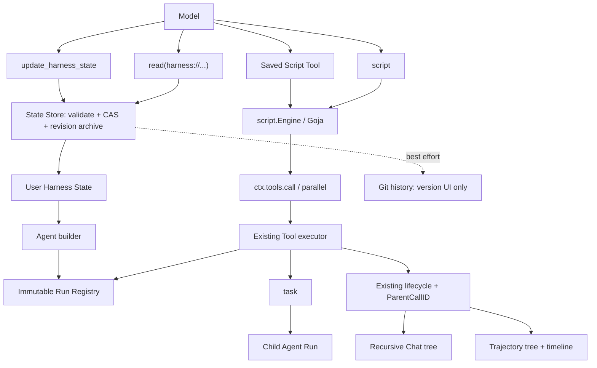

# Denova Script 工具与动态编排设计

- 状态：Proposed
- 范围：`agent` package、Denova Agent 组装、Harness State、持续学习、Chat、Trajectory
- 目标版本：Beta；直接采用新协议，不保留旧入口或兼容层

## 1. 一页结论

Denova 只增加一个脚本执行内核，并在它上面提供两种入口：

| 入口 | 生命周期 | 模型看到什么 | 用户用途 |
| --- | --- | --- | --- |
| `script` | 一次调用，不持久化 | 一个稳定的内置工具 | 临时组合当前 Agent 的工具 |
| `tools/<name>.js` | User Harness State，跨 Session | 一个独立的普通工具 | 保存可复用的编排 |

脚本使用同步 JavaScript function body，不要求用户声明 `main`：

```javascript
const files = ctx.tools.parallel([
  { tool: "read", input: { path: "README.md" } },
  { tool: "read", input: { path: "CHANGELOG.md" } }
])

return { files: files }
```

模型只需理解两个工具调用原语：

```javascript
ctx.tools.call(name, input)
ctx.tools.parallel(calls)
```

管理 User Harness State 不增加 Script Tool CRUD：

- 读取复用现有 `read` 工具，通过 `harness://` ReadAdapter 完成。
- 修改只增加一个原子工具 `update_harness_state`。
- UI、普通根 Agent 和 Harness Optimizer 共用同一个 State Service。

核心规则只有八条：

1. `script` 可调用当前 Run Registry 中除自身和 Harness State 管理入口外的所有工具，包括其他 Script Tool 与 `task`。
2. `task` 是唯一的子 Agent 编排入口；不增加 `workflow`、`agent()` 或第二套子 Agent runtime。
3. 每个内部调用都重新进入现有完整 Tool pipeline；绝不直接调用 `Tool.Run`。
4. User Script Tool 就是普通 `ToolDefinition`，没有专用 capability、dispatcher 或 CRUD。
5. active Run 固定 Registry、脚本实现和 Harness revision；发布只影响后续新 Run。
6. 内部调用复用现有 lifecycle，只在调用起始事件增加 `ParentCallID`。
7. 只有外层脚本结果进入调用方模型 transcript；内部调用仍完整进入权限、Chat、Trajectory 和审计。
8. State 更新始终是完整 candidate 校验加 CAS；失败零写入。

### 1.1 用户可感知能力

方案落地后，用户可以：

- 让 Agent 即时写一小段脚本，完成循环、条件、批量读取、工具聚合和子 Agent 协作。
- 把稳定流程保存成一个有独立名称、描述和参数 Schema 的普通工具。
- 在 Harness State 页面创建、编辑、禁用、删除、查看历史和恢复 Script Tool。
- 明确要求当前根 Agent 直接保存或修改 User Script Tool，并在提交前确认跨项目的 User State diff。
- 在 Chat 中展开脚本内部的真实工具树，看到权限等待、失败节点和 `task` 子 Agent。
- 在 Trajectory 中查看相同调用树与真实并行时间线，并从调用跳转到固定源码 revision。
- 让 Harness Optimizer 从重复的高质量 trajectory 中创建或改进 Script Tool。

不会提供 Session 级工具、active Run 热注册、脚本内工具管理、Node.js 环境或编辑器专用执行协议。

## 2. 为什么这个模型足够简单

本设计采用“简单且正确优先于复杂且完整”的取舍。权限、CAS、恢复和 transcript 配对必须正确；为了少见或假想需求增加的第二套抽象可以不做。

| 不采用的复杂方案 | 采用的直接方案 |
| --- | --- |
| Runtime interface + provider factory | 一个具体的 `script.Engine` |
| Promise、async/await、宿主 event loop | 同步 `call` 和批量 `parallel` |
| 每个工具生成一个 JS 方法 | 一个稳定的 `call(name, input)` |
| Script 专用 scheduler 和 events | 复用 Tool batch scheduler 与 lifecycle |
| Script 专用子 Agent API | 调用现有 `task` |
| `read_harness_state` 新工具 | 复用现有 `read` 的 `harness://` adapter |
| Git intent、pending 写屏障和第二套恢复状态机 | `agent/state.Store` 的内容寻址 revision archive |
| Script Tool CRUD API | 一个通用原子 `update_harness_state` |
| 静态工作流图 | 固定源码 revision + 本次真实调用树 |

必须保持的正确性不变量：

- 每个真实副作用经过目标工具自己的 policy、permission 和 post-check。
- 外层脚本结束时，不存在仍归属于它的非 detached 内部调用。
- provider transcript 始终保持 tool call/result 配对。
- Run 恢复时使用原先固定的 Harness revision，绝不回退到最新 State。
- Chat 与 Trajectory 从同一调用身份得到同一父子关系。
- State 校验或 CAS 失败时，live files 不发生部分更新。

## 3. 命名与边界

| 概念 | 名称 |
| --- | --- |
| 即时脚本工具与 capability | `script` |
| Go 运行模块 | `agent/script`，具体类型 `script.Engine` |
| 单个工具调用 | `ctx.tools.call(name, input)` |
| 批量工具调用 | `ctx.tools.parallel(calls)` |
| 持久化工具 | Script Tool / 脚本工具 |
| User State 读取 | 现有 `read` + `harness://` URI |
| User State 原子修改 | `update_harness_state` |
| 内部执行 seam | Nested Tool Call / 嵌套工具调用 |

模型可见的工具名、描述、Schema、错误和反馈统一使用英文。双语名称只存在于 UI。Denova 内置内容不提及对照产品。

### 3.1 非目标

- Node.js、npm、CommonJS、ES Modules 或浏览器环境。
- Promise、async/await、timer 或通用 event loop。
- 直接暴露 filesystem、network、process、environment 或 Go 对象。
- 脚本内注册、更新或删除工具。
- Session 级脚本、Session 级工具或 active Run 热更新。
- 新的子 Agent runtime 或对 `task` 的替代。
- JavaScript 指令级 checkpoint 或自动重放有副作用的脚本。
- 把进程内 Goja 宣称为安全沙箱。
- V1 编辑器内执行未发布草稿。

## 4. 总体架构



Goja 只是编排语言。Registry、权限、执行顺序、mutation receipt、artifact、task 生命周期和 trajectory 事实仍由 Go 侧拥有。

### 4.1 深模块边界

| 模块 | 负责 | 不负责 |
| --- | --- | --- |
| `agent/script` | 编译、执行、受限 `ctx`、JSON 边界、诊断和中断 | Tool、Registry、Session、State |
| 根 `agent` package | Nested Tool Call、完整执行链重入、父子调用身份 | Goja、State 文件、UI |
| `agent/tools` | 即时与持久脚本的 `ToolDefinition` 包装 | State 存储和版本 |
| `internal/agents/harnessstate` | `tools/*.js` 解析、校验、物化与 Harness revision | Git、Session、脚本执行 |
| `agent/state` | immutable Snapshot、完整 candidate、CAS、原子发布、revision archive | Harness 语义、Git、Agent prompt |
| `internal/app/continuallearning` | `harness://` adapter、更新工具、History、Optimizer | Script Engine 和 Tool pipeline |
| Chat / Run | 事件树投影与 span 父子关系 | 推断没有记录的执行事实 |

依赖方向保持单向：

```text
agent/script <- agent/tools <- internal/agents/harnessstate <- internal/agents/builder

agent/state <- internal/agents/harnessstate <- internal/app/continuallearning
```

根 `agent` 不导入 `agent/tools` 或 `agent/script`。`script.Engine` 当前只有 Goja 一个实现，因此不建立 runtime provider interface；测试只 fake 单方法 `script.Host`。

## 5. JavaScript 协议

### 5.1 即时 `script`

输入：

```json
{
  "source": "const result = ctx.tools.call(\"read\", {\"path\": \"README.md\"})\nreturn result",
  "input": {}
}
```

- `source` 是同步 function body，可直接写语句、helper 和 `return`。
- `input` 可省略，缺省为 `{}`，只属于本次调用。
- source 是工具参数，不进入稳定 prompt，也不写入 Harness State。
- 工具名和 Schema 固定，因此不同源码不影响 provider 前缀缓存。

推荐模型可见描述：

```text
Execute a synchronous JavaScript function body that orchestrates the tools available to this Agent.
Use ctx.tools.call(name, input) for one call and ctx.tools.parallel(calls) for an ordered batch.
Each call returns {tool, ok, status, output, truncated, artifacts, reason}.
Return one JSON-compatible value. Script and Harness State management are unavailable inside scripts.
```

### 5.2 为什么没有 `main`

用户源码本身就是函数体。Engine 内部统一包装：

```javascript
(function (ctx, input) { "use strict";
  // user source
})
```

用户不需要重复声明入口，Engine 也不需要扫描 AST、先执行顶层代码或寻找注册函数。即时脚本和持久 Script Tool 使用同一协议。编译和运行诊断在返回前消除包装偏移，行列仍指向用户文件。

### 5.3 Host API

脚本只获得：

```javascript
ctx.tools.call(name, input)
ctx.tools.parallel(calls)
ctx.log(message)
```

`ctx.log` 写入 bounded DisplayContent 和 trace，不是返回值通道。

单次调用：

```javascript
const result = ctx.tools.call("read", { path: "README.md" })
if (!result.ok) {
  return { status: "failed", message: result.output }
}
return { status: "complete", readme: result.output }
```

统一 outcome：

```json
{
  "tool": "read",
  "ok": true,
  "status": "success",
  "output": "README content...",
  "truncated": false,
  "artifacts": [],
  "reason": ""
}
```

规则：

- `status` 与 `reason` 复用现有 ToolResult status 和 synthetic reason。
- 普通失败、unknown tool、参数错误、权限拒绝和调用环返回 `ok: false`，不抛 JavaScript exception。
- 取消、Goja interrupt 或执行基础设施损坏终止整个脚本。
- 普通工具的 `output` 是已经过 ResultProcessor 的模型可见 string，不猜测 JSON。
- 成功且未截断的 Script Tool 返回自己的 JSON 值作为 `output`，因此脚本可以直接组合另一个 Script Tool。
- `truncated: true` 表示 `output` 不是完整逻辑值；脚本应使用 artifact、恢复工具或降级。
- Effects、receipts、Details、DisplayContent、未裁剪内容和宿主对象不进入 JavaScript。

批量调用：

```javascript
const results = ctx.tools.parallel([
  { tool: "read", input: { path: "a.md" } },
  { tool: "read", input: { path: "b.md" } }
])
```

- 返回 `Outcome[]`，顺序与输入完全一致；数组位置已经是 index，不再重复嵌套 `{index, result}`。
- 单项 name/input 无效只让该项失败；其余合法项仍作为一个 batch 执行。
- `parallel` 表示把一批调用交给现有 scheduler，不承诺物理并行。
- `parallel_read` 可有界并行；exclusive、interactive 和 child 仍是 source-order barrier。
- cancel 停止启动新项并 join 已开始 worker，不遗留属于外层脚本的 goroutine。

### 5.4 可调用范围

可调用集合就是当前 Run 的不可变 Registry：内置、plugin/MCP、host tools、其他 Script Tool 和 `task`。

Script Host 只额外拒绝：

- 即时 `script` 本身。
- `update_harness_state`。
- `read` 的 `harness://` 资源。

这避免递归 eval 和持久化自修改。脚本通过 `task` 的 start/observe/steer/respond/abort 编排子 Agent；不获得 `ctx.agents`。

### 5.5 输入输出边界

- `ctx` 使用冻结的 null-prototype object；`input` 经过 JSON clone 和 deep-freeze。
- 不提供 `console`、`require`、`module`、`process`、`fetch`、WebSocket、filesystem、environment 或 timer。
- 参数和返回值只允许 JSON-compatible value。
- `undefined` 归一化为 `null`。
- function、Symbol、循环引用、NaN、Infinity、BigInt、Promise 和 thenable 返回 `script_result_invalid`。
- 最终值编码为 canonical JSON，再进入外层 ToolResultProcessor。

## 6. Script Engine 与 ToolDefinition

### 6.1 Engine API

```go
package script

type Host interface {
    CallTools(context.Context, []Call) ([]Outcome, error)
}

func NewEngine(Config) (*Engine, error)
func (e *Engine) Compile(context.Context, Source) (Program, []Diagnostic)
func (e *Engine) Run(context.Context, Program, Host, json.RawMessage) (RunResult, error)
```

- `Engine` 是具体类型；`Program` 是不可变编译产物。
- `Host` 只有一个 batch 方法：`call` 传一个元素，`parallel` 传整批。
- 用户脚本错误写入 `RunResult.Failure`；Go `error` 只表示 Engine 或 Host contract 损坏。
- 即时 source 每次编译，不进入无界 cache；Harness snapshot 持有持久脚本 Program。

每次运行创建一个全新 `goja.Runtime`，并由当前带 recover 的 Tool goroutine独占。Host 收到的只有 Go/JSON 值。context cancel 调用 Goja `Interrupt`；所有新增 goroutine 入口必须 recover。

同步 Host API 不需要 Promise queue、completion registry 或 event loop。脚本 return 时，所有非 detached 内部调用已经完成。`task(detached=true)` 在返回 TaskRef 后已经合法完成，child Run 后续拥有自己的生命周期。

### 6.2 Descriptor

即时 `script` 与 Script Tool 共用以下执行语义：

| 字段 | 值 |
| --- | --- |
| Source | `other` |
| Execution | `child` |
| MutationScope / PostCheck | `none` / `none` |
| Recovery | `non_idempotent` |
| ResultProjection | `bounded_model_context` |
| ResultRetention | `protected` |
| Steering | `finish_current` |
| Presentation | 新增通用 `script` presentation |

即时工具的 Capability 为 `script`；持久 Script Tool 的 Capability 为空。外层 Descriptor 不替内部调用声明副作用，真实 mutation、permission 和 receipt 始终属于 child。

### 6.3 配置与安全边界

新增 user-level 设置：

| Key | 默认 | 说明 |
| --- | --- | --- |
| `agent_script_max_source_kb` | `1024` | 即时与持久源码上限，最大 `16384` |
| `agent_script_timeout_seconds` | `0` | `0` 为不限时；正数才建立 deadline |

Schema 使用固定 16384 KiB hard maximum，实际运行再应用用户值，避免调节默认值导致 provider-visible Schema 变化。结果大小复用 `agent_tool_result_limit_kb`；不增加第二套 script output 配置。

Goja 没有独立 heap ceiling。UI 必须标明“In process / 进程内运行，不是安全沙箱”。V1 只执行模型生成、用户保存或 Optimizer 生成的受限脚本，不接受网页、插件或第三方直接注入源码。

## 7. User Script Tool

### 7.1 文件格式

一个文件定义一个工具：

```text
<DenovaDir>/state/tools/<name>.js
```

```javascript
---
name: research_company
description: Research a company and return a concise evidence-backed brief.
agents:
  - general
  - ide
enabled: true
input_schema:
  type: object
  additionalProperties: false
  required:
    - company
  properties:
    company:
      type: string
      minLength: 1
---
const evidence = ctx.tools.parallel([
  {
    tool: "web_search",
    input: { query: input.company + " official overview" }
  },
  {
    tool: "web_search",
    input: { query: input.company + " latest results" }
  }
])

return { company: input.company, evidence: evidence }
```

frontmatter 是静态数据，后面全部是 function body。不使用 `defineTool`，也不执行代码来发现 metadata。编译前用等行数空行替换 frontmatter，保证诊断对应编辑器行号。

### 7.2 校验规则

- 文件必须是 `tools/<name>.js` 的直接子项、有效 UTF-8，并满足 source budget。
- `name` 与文件名完全一致，使用现有工具名规范；不强制 `user_` 前缀。
- `description` 和 Schema description 必须为英文。
- `agents` 至少包含一个允许的根 Agent kind：`general`、`ide`、`interactive_story`。
- `enabled` 缺省为 `true`。
- `input_schema` 必须是 object root；拒绝未知关键字与远程 `$ref`。
- object 省略 `additionalProperties` 时规范化为 `false`。
- 用户不能填写 capability、permission、mutation、recovery 或 presentation。
- `tools.toml` 不能覆盖 Script Tool 或 `update_harness_state` 的模型契约。
- 完整 candidate 一次返回所有互不依赖的 path/line/column diagnostics。

Validator 不静态推断调用图。工具名可以来自分支或计算；运行时以当前 Registry 为准。

### 7.3 普通工具语义

每个有效文件物化为一个普通 `ToolDefinition`：

- name、description、schema 来自 frontmatter。
- Descriptor 使用上一节固定值，Capability 为空。
- `enabled`、`agents` 和 Agent builder 决定它是否进入 Registry。
- 关闭即时 `script` 不影响已经保存的 Script Tool。
- delegated subagent 只有在自己的 `tools` 中显式列出具体名称、且不超过 parent ceiling 时才获得该工具。
- 与 built-in、plugin/MCP、host root 或其他 Script Tool 重名时，新 Run 构建 fail closed，不按注册顺序覆盖。

调用上下文维护 Script Tool stack。再次进入栈内同名工具时返回现有 synthetic outcome，reason 为 `tool_call_cycle`。不设置武断的默认最大深度。

### 7.4 身份与模型缓存

不新增 `contract_digest`。现有 `ToolDefinitionSnapshot` 已表达 name、description、Schema 和 Descriptor，并进入 provider prefix fingerprint。

Script Tool 只设置现有 `ImplementationIdentity`：

```text
kind = denova.script_tool
version = Script Engine contract version
config_hash = hash(function body + Engine execution policy identity)
```

只改源码会改变行为身份，但不会改变模型可见前缀；改 name、description 或 Schema 才改变 provider tool contract。State revision、mtime、Git metadata、绝对路径和源码不进入 ToolInfo。

即时 `script` 的 ImplementationIdentity 只包含 Engine contract 与执行 policy，不包含本次 source 参数。Builder 按标准化名称稳定排序 Script Tools；调整无关 State 文件不会改变当前 Agent 的 provider-visible tool bytes。

## 8. Nested Tool Call 与递归轨迹

### 8.1 一个执行器

顶层模型调用和脚本内部调用共用同一个私有 prepared executor：

```text
Registry lookup
→ argument normalization and schema repair
→ descriptor scheduler
→ product policy and permission
→ middleware
→ Tool.Run with panic recovery
→ ResultProcessor and artifact persistence
→ effects / receipts
→ lifecycle and trace
```

调用来源使用私有穷尽枚举 `model | nested`：

- `model` 生成 provider ToolMessage。
- `nested` 只生成 lifecycle、effects、artifacts 和安全 outcome，从类型路径上不构造 ToolMessage。

禁止 JavaScript 或 Script Host 获取 Registry、Descriptor、PermissionPolicy 或通用 Tool endpoint。

### 8.2 Agent seam

```go
type NestedToolCall struct {
    Name      string
    Arguments json.RawMessage
}

type NestedToolOutcome struct {
    Name       string
    Status     ToolResultStatus
    Reason     ToolSyntheticReason
    Output     json.RawMessage
    Truncated  bool
    Artifacts  []ToolArtifactRef
}

func CallNestedTools(context.Context, []NestedToolCall) ([]NestedToolOutcome, error)
```

`Output` 始终是合法 JSON：普通工具内容编码为 JSON string，完整成功的 Script Tool 保留其逻辑 JSON 值。完整 ToolResult 不离开 executor；Effects、receipts、ContextHints、Details 和 DisplayContent 不可能被外层重复应用。

Invoker 只绑定在合法 Tool execution context 中，调用者不能传 Registry 或绕过阶段。同步 Script Host 在 return 前等待 batch 完成。现有 start receipt 模式扩展一个私有 finish receipt：child effects、artifacts 和 terminal journal 完成后才解除 nested 等待；不增加 public event。

任一 child 进入 `effect_unknown` 时，外层强制 blocked，即使脚本忽略该 outcome。普通 error/blocked/skipped 可以由脚本按业务降级。

### 8.3 调度与取消

- 外层 Script Tool 使用 `child` execution class，不持有 workspace gate。
- `parallel` 直接进入现有 batch scheduler，不建立 script queue。
- nested Script Tool 同步等待自己的 child batch，但不持有 scheduler token。
- `task` child Run 使用自身 scheduler。
- context cancel 停止 admission、传播给已开始项并 join worker；外层不能在 child 未终结时返回 success。
- detached task 返回 TaskRef 后不再属于未完成 nested batch。

### 8.4 调用身份

只给 `ToolInputStarted` 增加一个字段：

```go
ParentCallID string
```

- 顶层调用 parent 为空。
- 每个 parent 内复用现有 `Index` 作为从 0 开始的调用顺序。
- `parallel` 在启动前按输入顺序预留连续 Index；完成乱序不影响展示。
- nested CallID 由 parent execution ID 与 Index 通过现有稳定身份机制派生，前端不得解析其字符串格式。
- rootCallId 由 parent links 投影，不再持久化第二份事实。
- 本地无效的 `parallel` item 尚未形成 Tool Call，不发 lifecycle，也不占用 Index。

Nested call 仍使用现有 input-start、started、progress、finished 生命周期。`NestedEvent` 增加 `OwnerCallID`，让 `task` 的 child Agent events 归属于真实 task 节点。

持久化校验：

- 一个 CallID 最多一个 start 和一个 finish。
- parent 必须属于同一 Run，且不能形成环。
- 同一 parent 的 nested Index 连续且唯一。
- parent finish 后不能再追加 child lifecycle。
- closed Run 缺 finish 的节点投影为 interrupted。
- 损坏历史有限深度展示并给出 diagnostic，不无限递归。

### 8.5 Transcript、Chat 与 Trajectory

调用方模型只看到：

```text
assistant tool_call(script | saved_script_tool)
tool outer_result
```

内部工具没有独立 provider message。child ContextHints 不复制到外层，因为没有对应的 child transcript ToolMessage；外层结果仍经过正常 ResultProcessor。

Chat 和 Trajectory 都从 `CallID + ParentCallID + Index` 构树：

```text
script / research_company
├── web_search
├── read
└── task
    └── reviewer child Run
```

- child 复用真实工具 renderer，不画统一的“脚本步骤卡”。
- waiting permission、blocked、error 和 interrupted 分支自动展开。
- permission 显示真实 child 工具与参数。
- detached task 节点保持真实 success，额外显示“后台运行”、TaskRef 和 child Run 链接。
- Timeline 保留真实 start/end；并行调用重叠，barrier 显示等待。
- Script Tool 显示 `tools/<name>.js` 与固定 Harness revision，只画本次真实分支，不预画静态工作流。
- “Model-visible content”只列外层 call/result；内部节点明确标注没有作为独立模型消息发送。

Chat 与 Trajectory 使用同一组 fixture 验证 tree edges、sibling order、task owner、permission、cancel 和 interruption。

## 9. Harness State 管理与持续学习

### 9.1 读取复用现有 `read`

`internal/app/continuallearning` 向现有 `read` 注入一个 root-only ReadAdapter：

```text
harness://state/current
harness://state/<revision>
harness://state/<revision>/<relative-path>
```

- `harness://state/current` 返回当前 revision、稳定文件 manifest、Script Tool summary 和 diagnostics。
- Adapter 把结果的 canonical path 改为 `harness://state/<revision>`；后续读取天然固定 snapshot。
- exact manifest 与 file URI 从 State revision archive 读取，不会因为 live State 更新而漂移。
- 文件读取直接复用现有 `offset`、`byte_offset`、`limit`、长行续读、结果 envelope 和 recovery hint。
- 无效 current State 仍返回 raw manifest、文件和能完成的 diagnostics，用户可以修复。

因此不再新增 `read_harness_state`、cursor、另一套分页或另一套 read ResultRetention。

### 9.2 唯一写入口

```json
{
  "base_revision": "4d967b...",
  "summary": "Add a reusable company research tool",
  "changes": [
    {
      "path": "tools/research_company.js",
      "content": "---\nname: research_company\n..."
    }
  ]
}
```

`update_harness_state`：

- Descriptor 为 `config_exclusive`、`MutationScope=config`、`PostCheck=config_revision`、`Recovery=reconcilable`。
- `base_revision` 必填，来自 `harness://state/current`；不支持“自动使用最新版本”。
- 每项只能提供完整 `content` replacement 或 `delete: true`。
- list 内的独立输入错误和完整 State diagnostics 一次返回。
- 整个 ChangeSet 是一个事务；任一错误或 conflict 都是零写入，不做部分发布。
- 成功返回 changed、new revision、changed paths、`applies_to: new_runs` 和可选 history version。
- conflict 返回 current revision，Agent 必须重新读取并重新形成 ChangeSet。
- summary 是 bounded 英文历史标题；无效或缺省时使用稳定通用标题，不让可修正遗漏浪费整个调用。

UI PUT、普通 Agent 和 Optimizer 都调用同一个 `Service.UpdateState`。调用来源由 host 附加，不允许模型伪造：

```go
type StateUpdateOrigin struct {
    Kind        StateUpdateOriginKind // user_ui | user_agent | harness_optimizer
    RunID       string
    Trigger     string
    EvidenceIDs []string
}
```

### 9.3 Revision archive 代替恢复状态机

`agent/state.Store` 现在已经在发布前持久化 base 与 candidate snapshot。将这个现有机制提升为正式 API：

```go
func EmptySnapshot() Snapshot
func (store *Store) Snapshot(context.Context, revision string) (Snapshot, error)
```

- revision 等于 live 时读取 live snapshot，否则读取内容寻址 archive。
- 每次 update 在替换 live files 前保证 base 与 candidate 都已归档。
- archive 是 Run 恢复和 exact `harness://` read 的事实源。
- V1 不自动清理 revision archive；User State 体积受完整 State budget 约束。

这使正确恢复不依赖 Git 是否可用，也不需要 history intent、pending marker、补记写屏障或跨系统伪事务。

Git 只承担用户可见的 Versions/Diff/Restore：

- update 与 restore 继续使用一个 application-owned cross-process mutation lock；该 lock 独立于 Git repository 是否能打开，只负责串行化 Store CAS 与随后的 history 尝试，不保存额外状态机。
- State CAS 成功后 best-effort 记录 exact returned Snapshot。
- Git 成功则返回 version；失败仍返回成功加 `state_history_unavailable` warning。
- Git 故障不阻断读取、新 Run、后续 CAS 或旧 Run 恢复。
- 罕见 Git 故障可能让某个 revision 不出现在版本列表，但该 revision 仍存在于 archive 并可供已固定 Run 恢复；UI 不声称它已有可回滚 history。
- Version/Diff/Restore 失败时只影响 history UI；Restore 最终仍通过 Store 的完整校验和 CAS。

这是有意的简单取舍：核心 State 与恢复始终正确，非关键的历史记录在明确告警下允许不完整。

### 9.4 Run 固定版本

`harnessstate.Materialize(ctx, snapshot, runtimeConfig)` 是纯函数，返回包含 revision 的 immutable Harness。Application 在 Run admission 时解析一次并通过具名 `AgentBuildInputs.Harness` 传给 builder；builder 不读取 live State。

Run 的 versioned `TurnHostData` 只增加一个 Harness revision：

- 新 Run 使用 current snapshot；Lab 关闭时使用 canonical empty snapshot。
- active Run 的 steer/follow-up/deferred cycle 复用同一 revision。
- delegated child 复用 parent Harness。
- 不消费 User State 的内部 Agent 显式使用 empty Harness，不传 nil。
- cold recovery 用 `Store.Snapshot(revision)` 和同一 `Materialize` 重建完整 prompt/context/tool descriptions/subagents/Script Tools。
- revision 缺失或与当前允许的 runtime config 不兼容时 fail closed，绝不回退最新 State。

Cold recovery 使用内部 revision resolver，不受用户后来关闭 Lab 的可见性开关影响；Lab 只控制新 Run 是否选择 current State，以及管理 UI/工具是否出现。

发布、删除、禁用和 restore 都只影响后续新 Run。不存在 Session override 或 active Run 热替换。

### 9.5 普通 Agent 直接管理

当用户明确要求保存、修改、禁用或删除可复用 User State 时，General、IDE/写作与 Interactive Story/游戏根 Agent可以：

```text
read harness://state/current
→ read exact file URI when needed
→ form one complete ChangeSet
→ update_harness_state
→ user confirms User-level diff
→ validate + CAS
→ available to new Runs
```

约束：

- `harness_state` capability 只控制 root 的 adapter 和更新工具，不控制 User Script Tool availability。
- 指定 `harness://` 文件正文的 read 与每次 update 都进入专用 User State permission domain；不继承 workspace read/write、shell 或旧 allow decision。
- manifest/summary 可以无确认读取；正文确认显示 User 级跨项目路径。
- update 确认显示 create/update/delete diff、目标 Agents 和“仅对新 Run 生效”。
- RootTools 和 adapter 不进入 delegated child；Script Host 也拒绝它们。
- Agent 不获得 live State 目录、Git handle 或 Registry mutation handle。
- 普通任务中的“也许以后有用”不是持久化授权。
- capability 启用时注入一段固定英文 instruction，说明只能在用户明确要求持久化时使用 `read(harness://state/current)` 与 `update_harness_state`；该片段不包含 State 内容或 revision，因此保持稳定前缀。

### 9.6 Harness Optimizer

Optimizer 复用相同的 `read(harness://...)` 与 `update_harness_state`，不再拥有普通文件写入、live workspace 或 isolated draft：

1. 从 trajectory 读取重复模式和 outcome。
2. 读取当前 manifest 与相关 exact files。
3. 在一次 update arguments 中形成完整 candidate ChangeSet。
4. 后端完整校验并 CAS；失败返回全部 diagnostics，live State 不变。
5. conflict 时重新读取，不自动三方合并可执行代码。

Optimizer 只有 trajectory read、Harness read 与 update。用户启用自动持续学习即构成其非交互持久化授权。

只有用户明确要求，或多个高质量 trajectory 显示稳定复用价值时才创建 Script Tool。不得写入凭证、绝对路径、私有正文、模型 thinking、Session ID 或 TaskRef；单个已有工具或 Skill 可以解决时不创建脚本。

State core、Git history 与 Optimizer runtime 使用同一具体 Service，但延迟初始化并隔离失败：State 可用不依赖 Git或 Optimizer Session；History 和 Optimizer 各自在入口 fail-visible。不为此增加外部 interface。

## 10. UI 设计

### 10.1 Agent 设置

| Capability | 用户文案 | 作用 |
| --- | --- | --- |
| `script` | 脚本编排 / Script orchestration | 即时 `script` |
| `harness_state` | 用户状态管理 / User State management | `harness://` adapter 与 `update_harness_state` |

- General 与 IDE/写作默认开启 `script`；游戏默认关闭、用户可开。
- `harness_state` 仅在 Continual Learning Lab 开启时可用，并沿用现有 per-Agent tool setting；General 与 IDE/写作默认开启，游戏默认关闭。
- Harness Optimizer 固定启用 `harness_state`，关闭 `script`。
- 两个 capability 都不控制已保存 Script Tool；它由文件的 `enabled/agents` 和 Registry 决定。
- 设置显示 source limit、可选 timeout 和 in-process 警告。
- 点击 Agents 等共享一级菜单不得自动切换写作或游戏模式。

### 10.2 Harness State 页面

文件树新增“Script Tools / 脚本工具”分组，继续复用现有 State GET/PUT、history 和 CAS：

- New 向导收集 name、英文 description、target Agents，生成模板。
- 一个 Monaco 文件同时编辑 frontmatter 与 JavaScript body，不建立 metadata 双写表单。
- 使用 embedded language；formatter 只修改 JS body，不跨 frontmatter。
- 后端 diagnostics 是权威并映射为 markers 与 Problems。
- 保存冲突保留本地草稿并提供 compare/reload。
- 保存成功提示“对新运行生效；当前运行继续使用旧版本”。
- Git history 不可用时仍允许 State 保存，但显示该 revision 未进入可见版本历史。
- 删除经确认，可从已有 history 恢复。
- 桌面 tree/editor 双 pane；窄屏切换 pane 并保留未保存内容。
- 分组整行可点击展开，不只点击箭头。
- 所有用户文案支持中英文和 light/dark。

V1 不增加编辑器 eval。即时试验使用正常 Chat 中的 `script`；测试已保存工具需要开启新 Run，从而天然复用 permission、cancel、Chat 和 trajectory。

### 10.3 Chat 与 Trajectory

- 外层即时脚本显示状态、耗时与默认折叠 source。
- Saved Script Tool 使用普通工具卡，加 Script Tool badge 与固定 revision。
- child 工具在外层卡内递归展示真实 renderer。
- Chat 与 Trajectory 可按 `runId + callId` 相互定位。
- Script Tool 可打开固定 revision 的只读源码；live 已更新时不得冒充当前源码。
- `update_harness_state` 确认卡显示 User-level diff；成功卡显示新 revision、history 状态和“Open Harness State”。
- 即时脚本的“Save as Script Tool”只发送明确用户指令，仍走同一 read/update/permission 链路，不直接写文件。

## 11. Package 与文件目录

目录按职责拆分，但不为了表格创建只调用一次的小文件。

### 11.1 `agent` module

```text
agent/
├── nested_tools.go                  # context-bound invoker、call/outcome
├── nested_tools_test.go
├── tool_loop.go                     # model/nested 共用 prepared executor
├── lifecycle_types.go               # ToolInputStarted.ParentCallID
├── nested_event.go                  # NestedEvent.OwnerCallID
├── script/
│   ├── engine.go                    # compile/run、VM lifecycle
│   ├── types.go                     # Config、Program、Host、Outcome、Failure
│   ├── values.go                    # JSON conversion、freeze、limits
│   └── engine_test.go
└── tools/
    ├── script.go                    # immediate/saved definition builders
    └── script_test.go
```

关键现有文件调整：

| 文件 | 调整 |
| --- | --- |
| `agent/tool_loop.go` | 抽出共用 executor；nested 不构造 ToolMessage |
| `agent/loop_event.go` | 私有 finish receipt |
| `agent/definition_engine_context.go` | effects/artifacts/journal 后 acknowledge |
| `agent/lifecycle_types.go` | input start 增加 `ParentCallID` |
| `agent/lifecycle_run_engine.go` | 持久化 parent linkage |
| `agent/tool_contract.go` | `script` presentation 与 `tool_call_cycle` reason |
| `agent/tools/task_tool.go` | batch 逐项 recover、复用 parallelism |
| `agent/state/store.go` | 公开 exact `Snapshot(revision)` |

`agent/go.mod` 增加固定版本的 `github.com/dop251/goja`；Denova 根 module 不直接依赖 Goja。

### 11.2 Denova backend

```text
internal/agents/harnessstate/
├── schema.go                         # Harness revision、Materialize
├── parser.go                         # existing State routing
├── script_tools.go                   # frontmatter、compile、ToolDefinitions
└── script_tools_test.go

internal/app/continuallearning/
├── state_read_adapter.go             # harness:// resources
├── state_update_tool.go              # update_harness_state adapter
├── service.go                        # shared State operations
├── state_history.go                  # best-effort Versions/Diff/Restore
└── optimizer.go                      # same read/update protocol
```

主要调用点：

- `config/agent_tools.go`：`script` 与 `harness_state` capability/defaults。
- `config/settings.go`：source limit 与可选 timeout。
- `internal/agents/builder.go`：消费必填 immutable Harness，组装 Script Tools。
- `internal/agents/delegation/catalog.go`：显式具体 Script Tool name。
- `internal/agents/run/observer.go`：按 ParentCallID 建 span tree。
- `internal/agents/chat/public_events.go`：投影 parent linkage。
- `internal/agents/lifecycle/source.go`：TurnHostData pin Harness revision。
- application composition root：向 root 注入 Harness ReadAdapter 与 update tool；child 不注入。

不新增 `internal/agents/scripttools` 小 package；Script Tool 是 Harness State schema 的一部分，解析与物化留在 `harnessstate` 内更内聚。

### 11.3 Frontend

```text
web/src/
├── components/Chat/
│   ├── message-tool.tsx
│   ├── tool-call-tree.tsx
│   └── harness-state-update-card.tsx
├── features/agents/harness-state/
│   ├── HarnessStateTree.tsx
│   ├── HarnessStateEditor.tsx
│   ├── ScriptToolEditor.tsx
│   └── StateProblemsPanel.tsx
├── features/trajectory/
│   ├── trajectory-analysis.ts
│   ├── TrajectoryLedger.tsx
│   └── TrajectoryTimeline.tsx
└── i18n/locales/{zh-CN,en-US}/
```

复用 `DenovaMonaco`、现有 tool renderer、State history UI、shadcn 组件和主题 token。

## 12. API、错误与权限

### 12.1 HTTP API

不增加 Script Tool CRUD、validate 或 eval endpoint：

```text
GET /api/continual-learning/state
PUT /api/continual-learning/state
```

GET 增加后端解析的 Script Tool summary 与 diagnostics；无效文件仍返回 raw content。可选 `?revision=<content-revision>` 从 Store archive 返回只读 exact snapshot，供 Chat 源码链接与 Run 审计使用；省略时读取 current。PUT 继续接受 base revision 和 ChangeSet：422 为全部 diagnostics，409 只表示 revision conflict。

History API 继续用于 versions/diff/restore。Git 不可用时这些入口返回 503；State GET/PUT、Agent read/update 和 Run revision archive 不依赖 Git。PUT 在 State 成功但 Git 失败时仍返回 HTTP success，并携带 warning。

### 12.2 稳定错误码

| Code | 含义 |
| --- | --- |
| `script_compile_failed` | JavaScript 无法编译 |
| `script_schema_invalid` | Script Tool input schema 无效 |
| `script_tool_name_mismatch` | 文件名与 name 不一致 |
| `script_tool_name_conflict` | 与 Registry 工具重名 |
| `script_agent_invalid` | target Agent 无效 |
| `script_runtime_failed` | 未捕获运行异常 |
| `script_result_invalid` | 返回值不能安全编码为 JSON |
| `script_interrupted` | cancel、关闭或 configured deadline 中断 |
| `tool_call_cycle` | Script Tool 直接或间接调用环 |
| `nested_tool_unavailable` | 当前 context 没有完整 invoker |
| `state_revision_conflict` | update 的 base 已过期 |
| `harness_state_revision_unavailable` | Run 固定 revision 不可恢复 |
| `state_history_unavailable` | State 已正确处理，但 Git history 操作不可用 |

Unknown tool、invalid arguments、policy blocked 等复用现有 Tool synthetic reasons。内部 message 使用英文；UI 按 code 本地化，不解析 message。

### 12.3 权限与模式

1. 每个 nested call 按真实 child name、arguments 和 target 重新执行 permission。
2. Registry visibility 是脚本能力上限；名称不能访问未注册工具。
3. Script Host 拒绝即时 `script`、`update_harness_state` 和 `harness://` read。
4. Harness adapter 与 update tool 只属于 root Agent。
5. User State 正文 read 与 update 使用独立 permission domain。
6. Plan ReadOnly、写作和游戏 mode policy 作用于每个真实 child Descriptor。
7. `task` 继续受 parent capability ceiling。
8. source、State content、args、logs 和 results 使用现有 redaction/capture policy。
9. 默认无总运行超时；显式 cancel 和应用关闭始终可中断。

## 13. 测试与实施

### 13.1 核心测试

`agent/script`：

- function body、helper、return/null、line mapping。
- JSON 边界、循环值、BigInt、NaN、Promise/thenable 拒绝。
- call/parallel 顺序、逐项失败、typed Script Tool output、truncated output。
- cancel interrupt tight loop，Runtime 不跨 goroutine，Program 多 VM 不串状态。
- source budget、bounded log 和 panic recovery。

Agent integration：

- nested 调用经过 normalization、scheduler、permission、middleware、ResultProcessor、effects、artifacts 和 lifecycle。
- `script → read`、mutation permission、task batch、Script Tool → Script Tool → task。
- cycle、管理入口阻断、effect_unknown sticky、finish receipt failure。
- child 不进入 provider transcript、不复制 ContextHints、不重复应用 Effects。
- cancel join worker；outer finish 后没有 child lifecycle。
- ParentCallID 与 Index 在并发完成乱序时仍稳定。

Denova integration：

- `tools/*.js` parse/compile/filter/sort/collision。
- General、IDE/写作、游戏使用相同 Harness build input；child 复用 parent revision。
- active Run 固定旧 revision，新 Run 使用新 revision；cold recovery 从 Store archive 精确重建。
- source-only 更新不改变 provider prefix，contract 更新会改变。
- `harness://` current/exact manifest、bounded file read、长行续读、无效 State 修复。
- update 的全量 diagnostics、CAS conflict、零部分写入和专用 permission。
- Git 故障不阻断 State CAS、new Run 或 old revision recovery，只产生 warning。

UI / trajectory：

- Chat 与 Trajectory 由同一 fixture 得到相同 tree edges 和 sibling order。
- permission、synthetic failure、cancel、detached task 和 interruption。
- Monaco diagnostics、save conflict、history warning、未保存保护。
- 中英文、light/dark、空状态、长文本、窄屏和宽屏。
- 写作与游戏核心链路用应用内浏览器回归。

单项单元测试不得超过 3 秒；长生命周期使用可控 fake，不用 sleep。

### 13.2 分层实施

Phase A：即时脚本

- `script.Engine`、Nested Tool Call、共用 executor。
- `script` tool/capability/settings。
- ParentCallID、Chat tree、trajectory span。
- read、mutation permission、task 集成测试。

完成标准：即时脚本能经完整权限链调用普通工具和 task，Chat 与 Trajectory 显示同一调用树。

Phase B：User Script Tool 与管理

- `tools/*.js` parser、普通 ToolDefinition、collision/cycle/identity。
- Store exact revision archive、Harness pin/cold recovery。
- `harness://` adapter、`update_harness_state`、User State permission。
- Harness State editor、history warning 和递归 UI。

完成标准：用户可在 Chat 或 State UI 保存工具；它只在后续新 Run 作为普通工具出现。

Phase C：持续学习

- trajectory resource 暴露递归树与固定 revision。
- Optimizer 使用相同 read/update。
- evidence-backed 创建与 branch/outcome 分析。

完成标准：Optimizer 能从重复 trajectory 创建一个通过完整校验的 Script Tool。

每个 Phase 都必须是可运行的端到端产品，不落地绕过权限或以后再替换的临时路径。

## 14. 验收标准

1. 即时工具与 capability 均名为 `script`，运行模块为具体 `script.Engine`。
2. 用户源码是 function body，只使用同步 `call`、`parallel` 与可选 `ctx.log`，不声明 `main`。
3. `script` 可调用当前 Registry 中除自身与 Harness 管理入口外的所有工具。
4. User Script Tool 是普通 ToolDefinition，无专用 capability、dispatcher 或 CRUD。
5. Script Tool 可直接消费另一个 Script Tool 的完整 JSON output，并拒绝调用环。
6. `task` 是唯一子 Agent 编排入口。
7. nested call 经过完整 Tool pipeline，effects 和 artifacts 只归属于 child。
8. lifecycle 只增加直接 `ParentCallID`，sibling 顺序复用 Index，root 由投影计算。
9. Chat 与 Trajectory 呈现同一任意深度真实树。
10. 只有外层结果进入调用方 transcript。
11. User State 读取复用 `read(harness://...)`，写入只用 `update_harness_state`。
12. update 完整校验并 CAS；失败零写入，成功只影响新 Run。
13. active/cold-recovered Run 使用固定 Harness revision；Git 故障不影响精确恢复。
14. 普通根 Agent 仅在用户明确要求和独立 permission 后修改 User State。
15. Optimizer 复用同一 read/update，不存在 draft 或第二套发布协议。
16. UI 支持中英文、light/dark、宽窄屏、permission、history warning 和 interruption。
17. General、IDE/写作和 Interactive Story/游戏均有配置、测试与回归路径。

## 15. 取舍与参考

明确不采用：Promise/event loop、用户声明 `main`、每工具 JS 方法、Script Engine provider interface、script 专用 events、workflow API、Session 工具、Script CRUD、普通文件工具写 live State、isolated draft、`defineTool`、`user_` 前缀、直接 `Tool.Run`、active Run 热注册、全局 Goja Runtime、编辑器 eval 和预画静态流程。

设计原则参考：

- [The Rise of Worse is Better](https://www.jwz.org/doc/worse-is-better.html)
- [Richard P. Gabriel: Worse Is Better](https://www.dreamsongs.com/WorseIsBetter.html)

对照研究保留在 sibling repository 的 Code Mode、workflow、Tool Call Tree 与 trajectory 资料中，仅用于审计结构思想。Denova 最终使用自己的 `script`、Script Engine、`ctx.tools.call/parallel`、现有 lifecycle、普通 `read` adapter 和 `task` 词汇。
