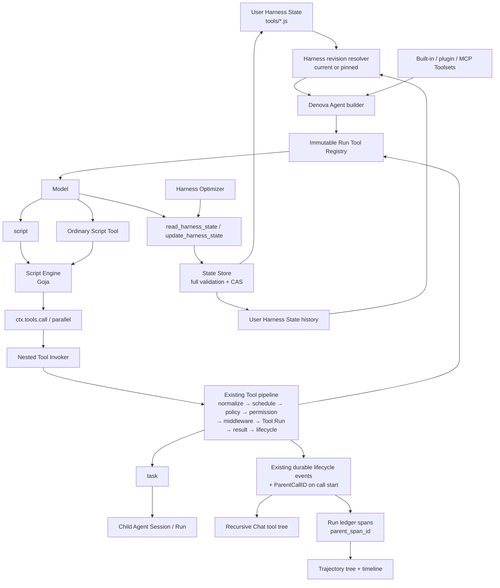
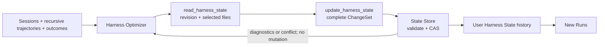

# Denova Script 工具、动态编排与递归轨迹设计

- 状态：Proposed
- 范围：`agent` package、Denova Agent 组装、Harness State、持续学习、Chat UI、Trajectory UI
- 目标版本：Beta；直接采用新协议，不保留旧命名或兼容入口

## 1. 结论

Denova 在脚本执行侧只增加一个小而完整的 Script Engine，并在其上提供两个入口：

| 入口 | 生命周期 | 模型可见形态 | 用途 |
| --- | --- | --- | --- |
| `script` | 单次工具调用，即时执行，不持久化 | 一个稳定的内置工具 | 临时组合当前 Agent 已有工具 |
| `tools/<tool-name>.js` | User 级 Harness State，跨 Session 生效 | 独立、普通的 `ToolDefinition` | 固化可复用的工具编排 |

管理侧不增加 Script Tool 专用 CRUD。支持的根 Agent 通过通用 `read_harness_state` / `update_harness_state` 直接管理整个 User Harness State；Harness Optimizer 和 UI 复用同一 State Store。

核心决定：

1. 产品和模型可见名称统一使用 `script`；运行模块称为 Script Engine，Go package 为 `agent/script`，具体类型为 `script.Engine`。
2. JavaScript 使用同步 function-body 协议：源码直接写语句并 `return`，`ctx` 与 `input` 由 Script Engine 注入；工具调用只提供 `ctx.tools.call(name, input)` 与 `ctx.tools.parallel(calls)`。V1 不实现 Promise、async/await 或宿主 event loop。
3. `script` 可以调用当前 Run 不可变 Registry 中除自身与 `harness_state` 管理 capability 外的所有工具，包括其他 Script Tool 和 `task`。
4. `task` 是脚本编排子 Agent 的唯一入口，不再增加 `workflow`、`agent()` 或第二套子 Agent runtime。
5. 每个内部调用都重新进入现有完整 Tool pipeline；禁止直接调用 `Tool.Run`。
6. User Script Tool 与内置、插件和 MCP 工具共用同一个 Registry、名称空间、ToolDefinition 和 UI，不增加 Script Tool 专用 CRUD 或 dispatcher。
7. `script` capability 只控制即时 `script` 工具；User Script Tool 不属于这个 capability，由其 `enabled`、目标 Agent 和当前 Run Registry 决定是否存在。
8. 提供一个通用 `harness_state` 管理 capability，下含只读 `read_harness_state` 与原子变更 `update_harness_state`；它管理整个 User Harness State，不是 Script Tool 专用管理协议。
9. General、IDE/写作和 Interactive Story/游戏根 Agent 可在用户明确要求时直接创建、修改或删除 `tools/*.js`。`update_harness_state` 始终构造完整 candidate、返回全部诊断并经 CAS 原子发布；不向 Agent 暴露 live State 文件系统。
10. Harness Optimizer 复用完全相同的 read/update 工具和 State Store，不再维护 isolated draft 或第二套发布流程。
11. 不提供 Session 级脚本、Session 级工具注册或 active Run 热更新。Harness State 发布只影响后续新 Run。
12. 嵌套工具调用复用现有 `ToolInputStarted`、`ToolStarted`、`ToolProgress`、`ToolFinished` 生命周期，仅增加可选父子身份，不新增一套 script 专用事件协议。
13. Chat 和 Trajectory 使用现有 `callId`、`Index` 与调用起始时记录的 `parentCallId` 重建任意深度的真实调用树；root 是投影结果，不再持久化第二份事实。
14. 只有外层 `script` 或 Script Tool 的最终结果进入调用方模型历史；内部工具调用仍完整进入权限、审计、Chat 和 trajectory。
15. Script Tool 展示固定源码 revision 和本次真实执行分支，不预画可能与运行事实不符的静态流程图。

## 2. 设计原则：在可观察正确的前提下优先简单

“Worse is Better” 对本设计最有价值的启发，是优先缩小实现和演进表面：当少见能力会迫使系统引入第二套执行、事件或状态抽象时，V1 应直接不支持该能力，而不是先建立一个理论上完整的框架。

这不是允许权限、恢复或持久化不正确。Denova 必须保持以下用户可观察事实正确：

- 每个真实副作用都经过目标工具自己的权限和执行门禁。
- 模型 transcript 始终满足 provider 的 tool call/result 配对协议。
- 外层脚本结束时不存在仍归属于它的未完成内部调用。
- active Run 的 Registry、工具实现和 Harness State revision 不会中途变化。
- Chat、Trajectory、审计和恢复使用同一调用身份，不产生相互矛盾的执行事实。
- State 校验或 CAS 失败时，live Harness State 不发生部分更新。
- 一个已发布 State revision 只有在已进入 history、或它是可确定重建的 canonical empty revision 时，才能被后续 revision 覆盖，保证旧 Run 固定的 Harness source 始终可恢复。

在这些边界内，设计主动放弃完整性来换取简单性：

| 复杂方案 | V1 选择 | 简化结果 |
| --- | --- | --- |
| Runtime interface + Goja provider | 一个具体的 `script.Engine` | 不为唯一实现创建假想替换点 |
| Promise、async/await、宿主 event loop | 同步 `call` 与批量 `parallel` | 没有跨 goroutine Promise settle、pending job 和专用 drain 状态机；取消直接复用现有 batch scheduler 的 join |
| 每个工具成为 JS 对象方法 | `ctx.tools.call(name, input)` | 工具名、动态 Registry 和错误处理都走一个稳定入口 |
| script 专用 dispatch queue 与 durable events | 复用 Tool batch scheduler 和现有 lifecycle | 只有一套调度和执行事实 |
| 单独 workflow/agent API | 复用 `task` | 只有一套子 Agent 身份、交互、恢复和取消协议 |
| Script Tool CRUD、Agent 文件草稿与 UI 发布三套路径 | `read_harness_state` / `update_harness_state` 复用同一个 State Store | Agent、Optimizer 和 UI 共享完整校验、CAS 与历史语义 |
| 预计算静态工作流图 | 固定 revision + 真实调用树 | 条件、循环和失败分支不会被错误展示 |

同步 JavaScript 不是最完整或最“标准库式”的 JS 宿主，但更适合 Denova V1：模型只需理解两个显式原语，Goja 始终由一个 goroutine 持有，执行完成天然意味着所有非 detached 子调用已经完成。

## 3. 命名与产品边界

### 3.1 最终命名

| 概念 | 最终命名 | 说明 |
| --- | --- | --- |
| 即时脚本工具 | `script` | 模型可见工具名与 capability 名相同 |
| 运行模块 | Script Engine | Go package 为 `agent/script`，类型为 `script.Engine` |
| 单个工具调用 | `ctx.tools.call(name, input)` | 返回结构化 outcome，不抛普通工具错误 |
| 批量工具调用 | `ctx.tools.parallel(calls)` | 返回与输入同序的逐项 outcome |
| 持久化用户工具 | Script Tool / 脚本工具 | Harness State 中的普通 ToolDefinition |
| User State 管理 capability | `harness_state` | 只控制管理入口，不控制 User Script Tool 是否可用 |
| User State 读取 | `read_harness_state` | 返回 revision、文件 manifest 或指定文件内容 |
| User State 原子变更 | `update_harness_state` | 对完整 candidate 校验并以 CAS 发布一个 ChangeSet |
| 通用内部调用 seam | Nested Tool Call / 嵌套工具调用 | 不把 Agent package 与 JavaScript 绑定 |
| 父子调用身份 | `ParentCallID` + existing `Index` | 只新增直接 parent；兄弟顺序复用现有字段 |

Go 类型避免 package stutter：使用 `script.Engine`、`script.Program`、`script.RunResult`，而不是 `script.ScriptEngine`。模型可见的工具名、描述、Schema、错误和反馈统一为英文；双语名称只存在于 UI。

### 3.2 吸收外部设计思想，但不复制词汇

对 sibling repository 的研究只保留以下结构性结论：

1. 脚本运行模块不应认识 Tool Registry、Session、权限或 UI。
2. 内部调用必须重入完整 Tool pipeline，并拥有独立、稳定的调用身份。
3. 内部调用不应成为调用方模型 transcript 中额外的 provider tool messages。
4. Chat 与 trajectory 应呈现真实的递归调用树。
5. 持久工具的 metadata 应是可静态校验的数据，而不是执行脚本后发现的注册结果。

Denova 不复制对方的工具名、runtime 名、Promise API、专用 dispatch event 或 workflow seam。对照研究只存在于本设计文档；Denova 内置 prompt、工具描述和运行时反馈保持产品中立。

## 4. 目标与非目标

### 4.1 支持核心

| 当前调用方 | 常见任务 | 可观察结果 | 失败合约 |
| --- | --- | --- | --- |
| 根 Agent | 用即时 `script` 组合已注册工具 | 一个外层 ToolResult，Chat/Trajectory 中有真实子调用树 | 脚本错误或子工具 outcome 结构化返回；未知副作用不得被掩盖 |
| 新 Run 的 Agent builder | 加载 User Script Tool | 独立普通 ToolDefinition，固定 State revision 与实现身份 | 整个 candidate 诊断或 Registry 冲突 fail closed |
| 用户明确授权的根 Agent / Harness Optimizer | 读取并原子修改 User Harness State | 完整校验、CAS、history，仅对新 Run 生效 | 诊断或 revision conflict 时零写入 |
| Chat / Trajectory | 展示脚本内部工具和 task 子 Agent | 从同一 append-only lifecycle 重建相同 parent/child edges | 损坏或中断历史 fail-visible，不伪造成功节点 |

为支持上述核心，本方案：

- 用 JavaScript 表达条件、循环、聚合、分支、失败恢复和批量调用。
- 让即时脚本和持久 Script Tool 共用同一个 Script Engine 与 Host API。
- 支持当前 Registry 内除 User Harness State 管理工具外的普通工具、其他 Script Tool，以及 `task` 的 start/observe/steer/respond/abort。
- 保留 Tool、Task、Permission、Interaction、Artifact、Mutation、Recovery 和 ResultProcessor 的现有语义。
- 在 Chat 与 Trajectory 中完整呈现内部工具、权限等待、错误和 task 子 Agent 事件。
- 将成熟流程固化到 User Harness State，而不是 Session 私有能力。
- 让用户在当前根 Agent 对话中明确要求后，直接创建、修改、禁用或删除 User Script Tool。
- 让普通 Agent、Harness Optimizer 和 UI 复用同一个 User Harness State 原子更新模块。
- 保持 provider-visible 前缀稳定：即时源码和持久工具源码都不注入稳定 prompt。
- 同时覆盖 General、IDE/写作和 Interactive Story/游戏模式。

### 4.2 非目标

- 不实现 Node.js、npm、CommonJS、ES Modules 或浏览器环境。
- 不支持 Promise、async/await、timer 或通用 event loop。
- 不向 JS 暴露 filesystem、network、process、environment 或任意 Go 对象。
- 不创建新的子 Agent runtime，也不绕过 `task` 的 Session/Run 生命周期。
- 不允许脚本注册、更新、禁用或删除 Tool。
- 不允许普通 Agent 在没有用户明确要求时自主固化 Harness State；自动优化只由用户启用的 Harness Optimizer 发起。
- 不在 active Run 中改变 Registry 或脚本版本。
- 不提供 Session 级脚本草稿或 Session 级工具。
- 不把 Tool 和 Task 压成一个缺少 Descriptor 语义的通用 Invokable。
- 不承诺进程内 Goja 能隔离恶意 CPU 或内存消耗。
- V1 不提供编辑器内执行未发布草稿的专用 eval API；即时执行统一通过正常 Agent 中的 `script` 工具完成。

## 5. 总体架构



Goja 是编排语言，不是权限边界。Registry、授权、执行 class、mutation receipt、task 交互和 trajectory 的事实源仍由 Go 侧拥有。

## 6. 深模块边界

| 模块 | 负责 | 明确不负责 |
| --- | --- | --- |
| `agent/script` | JavaScript 编译和执行、受限 `ctx`、JSON 值转换、日志、诊断、中断 | Tool、Registry、Session、权限、Harness State |
| 根 `agent` package | 当前调用上下文中的 Nested Tool Invoker、完整执行链重入、直接 parent 身份 | 解析 Script Tool 文件、Goja VM、UI |
| `agent/tools` | 即时 `script` Toolset、`script.Program` 到 ToolDefinition 的包装 | State 存储、版本、前端 |
| `internal/agents/scripttools` | frontmatter、文件解析、完整校验、identity、按 Agent 组装 Toolset | Session、Goja 生命周期、Git |
| `internal/agents/harnessstate` | 按显式 runtime config 校验并将一个明确 revision 的 User State snapshot 物化为不可变 Harness | Git revision 查找、live I/O、执行脚本 |
| `internal/agents/chat` | 将扁平 durable events 投影为可递归展示的数据 | 推断未记录的执行结果 |
| `internal/agents/run` | Tool span 父子关系、bounded attrs、trajectory ledger | Chat 布局、脚本解析 |
| `agent/state` | snapshot、ChangeSet、完整 candidate 校验、CAS 与原子目录替换 | Tool Schema、Git、Agent prompt |
| `internal/app/continuallearning` | Harness State 管理 ToolDefinition、权限来源、exact State snapshot 解析、trajectory 驱动优化 | Agent/Harness 物化语义、Script Engine |

依赖方向：

```text
agent/script                  # 独立，不导入根 agent package
      ↑
agent/tools                   # 导入 agent + agent/script
      ↑
internal/agents/scripttools   # 导入 agent/tools + agent/script
      ↑
internal/agents/harnessstate  # 纯物化：Snapshot + pinned config → immutable Harness
      ↑
internal/agents/builder       # 只消费已解析 Harness，不隐式读 live files

agent/state                   # concrete atomic Store
      ↑
internal/agents/harnessstate  # Store validator and immutable snapshot
      ↑
internal/app/continuallearning # read/update、exact Snapshot resolver 和 ToolDefinitions
      ↑
internal/app root assembly    # 解析 Snapshot，按本次 config 物化并注入 Harness + RootTools
```

根 `agent` package 不导入 `agent/tools` 或 `agent/script`，避免循环依赖。Script Engine 只有 Goja 一个实现，因此使用具体类型；测试通过小型 `script.Host` fake 隔离工具调用，不需要为 Engine 自身增加接口。

Harness State 管理同样不新增 `HarnessStateAccess` 之类的假想 port。`agent/state.Store` 是可用临时目录替代的本地依赖，`internal/app/continuallearning` 直接以具体 Service 形成深模块；HTTP handler 和两个 ToolDefinition 是它的 adapters，测试通过临时 Store 从同一外部接口验证。现有 host `RootTools` seam 已足以把 definitions 注入不同根 Agent。

现有 `continuallearning.Service.initialize()` 不得直接沿用：它把 Harness State Manager、Git History、Optimizer Session 和 Outcome Store 一次性初始化，会让下游故障阻断只需要 current files 的路径。实现保留同一个具体 Service，但使用三个私有、单向依赖的懒加载边界：

- `ensureState` 只打开 Harness State Manager。State GET、`read_harness_state`、current Snapshot 和“pinned revision 正好等于 live”只依赖它。
- `ensureHistory` 依赖 `ensureState`，再打开 Git repository/lock/intent。update、versions、diff、restore 和非 live 的 exact Snapshot lookup 依赖它。
- `ensureOptimizer` 依赖 `ensureHistory`，再打开 Session、Outcome Store 和运行调度状态。

三个边界都并发安全；只有成功后才标记 initialized，失败保持可重试且记录具体子系统。Git 故障时 current State 与使用 current revision 的新 Run 仍可读，但 mutation、history UI 和旧 revision recovery fail-visible；Optimizer 存储故障不影响前两层。这是失败域隔离，不是新的外部 interface；调用方仍只认识同一 Service。

依赖分类与 seam 选择：

| 依赖 | 分类 | 选择 |
| --- | --- | --- |
| Goja | in-process | 直接封装在具体 `script.Engine`，不增加 provider port |
| 当前 Agent 工具执行链 | in-process，但位于反向依赖 seam | `agent/script` 拥有单方法 `script.Host` port，Agent adapter 重入 prepared executor |
| `agent/state.Store` 与本地 Git history | local-substitutable | 直接依赖具体实现，用临时目录验证，不为测试新增 port |
| Provider、network、filesystem | 不属于 Script Engine 支持核心 | 只能经目标 ToolDefinition 的现有 seam 进入，不直接注入 Engine |

### 6.1 生存性与删除测试

| 检查 | 结果 |
| --- | --- |
| 常见变化：新增一个普通工具 | 只要进入当前 Registry，Script Host 自动可调用；Engine、Script Tool parser 和 UI 协议都不改 |
| 常见变化：Script Tool metadata/schema 演进 | 变化集中在 `internal/agents/scripttools` 的 parser/validator/identity，Agent Tool pipeline 不改 |
| 失败变化：Git 或 Optimizer 存储故障 | Git 故障不阻断 current Harness 读取，Optimizer Session/Outcome 故障不阻断 State/History；mutation 与旧 revision recovery 各自在所需层 fail-visible |
| 删除 `agent/script` | 包装、JSON 边界、诊断、中断和资源限制会在即时工具与 Script Tool 重复，因此模块有深度 |
| 删除 Nested Tool Invoker seam | 调用方必须重新知道 Registry、scheduler、permission、middleware、result 和 lifecycle，极易绕过不变量，因此 seam 必须保留 |
| 删除 Harness State 更新模块 | 完整 candidate、CAS、history pending 和 provenance 决策会在 HTTP、Agent tool 和 Optimizer 重复，因此共用具体 Service 有实际杠杆 |

反之，当前只有一个 Goja 实现，删除 runtime provider interface 不会让任何当前决策回流到调用方，所以不应建立该 seam。

## 7. 两类脚本入口

### 7.1 即时 `script` 工具

模型协议：

```json
{
  "source": "const result = ctx.tools.call(\"read\", {\"path\": \"README.md\"})\nreturn result",
  "input": {}
}
```

规则：

- `source` 是同步 JavaScript function body，可直接使用 `ctx`、`input` 和 `return`，不声明入口函数。
- `input` 可省略，省略时为 `{}`；它只属于本次调用。
- Script Engine 在内部把 source 包装为一个严格模式函数；用户源码中的变量、helper 和 closure 都只属于本次调用。
- 返回 Promise 或 thenable 会得到 `script_result_invalid`。
- source 和 input 不写入 Harness State，也不改变 active Registry。
- `script` 的工具名、描述和 Schema 固定，因此不同源码不会破坏工具前缀缓存。
- `script` 自身以及 capability 为 `harness_state` 的管理工具不能从脚本中调用。

推荐模型可见描述：

```text
Execute a synchronous JavaScript function body to orchestrate the tools currently available to this Agent.
Use ctx.tools.call(name, arguments) for one call and ctx.tools.parallel(calls) for an ordered batch.
Each call returns {ok, status, content, contentComplete, artifacts, syntheticReason}; a complete successful Script Tool result also has value.
Return one JSON-compatible value. Script and Harness State management tools are unavailable inside scripts.
```

示例：工具与子 Agent 混合编排：

```javascript
const evidence = ctx.tools.parallel([
  {
    tool: "web_search",
    input: { query: input.topic + " official overview" }
  },
  {
    tool: "read",
    input: { path: "README.md" }
  }
])

const review = ctx.tools.call("task", {
  action: "start",
  starts: [
    {
      agent: "reviewer",
      prompt: "Review the collected evidence and identify concrete risks."
    },
    {
      agent: "researcher",
      prompt: "Find relevant prior decisions and summarize them."
    }
  ]
})

return { evidence: evidence, review: review }
```

多个子 Agent 优先使用一次 `task.start` 的 `starts` batch。`task` 负责有界并发、逐项结果和 TaskRef；脚本层不复制子 Agent 调度规则。

### 7.2 `script` Descriptor

| 字段 | 值 | 原因 |
| --- | --- | --- |
| `Source` | `other` | 编排 transport，不伪装成 read/write/shell |
| `Capability` | `script` | 只控制即时入口 |
| `Execution` | `child` | 外层会等待内部工具，不能持有 workspace exclusive gate |
| `MutationScope` | `none` | 外层不直接修改状态；内部工具声明真实 scope |
| `PostCheck` | `none` | mutation receipt 来自内部工具 |
| `Recovery` | `non_idempotent` | 任意组合不能笼统声明为可安全自动重跑 |
| `ResultProjection` | `bounded_model_context` | 复用现有结果处理 |
| `ResultRetention` | `protected` | 保留最终编排结果和失败证据 |
| `Steering` | `finish_current` | 任意内部调用可能具有不可重放副作用 |
| `Presentation` | `generic` | JavaScript 不是 terminal command |

即时 `script` 的 permission 不替内部工具预授权。它本身不产生副作用；每个内部调用按真实工具名、参数和 target 独立执行策略与权限。

### 7.3 User Harness State 中的 Script Tool

每个持久化工具是一个文件：

```text
<DenovaDir>/state/tools/<tool-name>.js
```

文件使用 strict YAML frontmatter；metadata 是数据，不通过执行 `defineTool(...)` 获取：

```javascript
---
name: research_company
description: Research a company and return a concise evidence-backed brief.
agents:
  - general
  - ide
enabled: true
input_schema:
  type: object
  additionalProperties: false
  required:
    - company
  properties:
    company:
      type: string
      minLength: 1
---
const results = ctx.tools.parallel([
  {
    tool: "web_search",
    input: { query: input.company + " official overview" }
  },
  {
    tool: "web_search",
    input: { query: input.company + " latest financial results" }
  }
])

return {
  company: input.company,
  evidence: results
}
```

frontmatter 被替换为等行数空行后再交给 Script Engine；Engine 再应用不可见包装并映射 diagnostic，最终 path、line、column 始终指向用户看到的原文件。

Metadata 规则：

- 路径必须是 `tools/<name>.js` 的直接子项，不支持子目录、隐藏文件或 symlink；整个文件必须是有效 UTF-8 并满足 source budget。
- `name` 必须与文件名完全一致，并符合现有 Tool 名称规范。
- 不要求 `user_` 前缀。内置、插件、MCP 和 Script Tool 共用一个名称空间。
- 顶层 `description` 与 `input_schema` 内所有模型可见 description 必须为英文；中英文标签只由 UI 本地化，不复制进 ToolInfo。
- `agents` 至少包含一个允许拥有 Script Tool 的根 Agent kind；V1 为 `general`、`ide`、`interactive_story`。
- `enabled` 缺省为 `true`；为 `false` 时保留文件和历史，但不进入 Registry。
- `input_schema` 必须是 JSON Schema object root；拒绝未知关键字、外部 `$ref` 和远程引用。
- object schema 省略 `additionalProperties` 时 canonicalize 为 `false`，避免 Agent 的多余参数意外进入脚本；确实需要开放字段的工具必须显式写 `true` 或具体 schema。
- description、canonical schema 和最终 ToolInfo 必须满足目标 Agent 的 metadata、fragment 和 provider input budgets。
- 不允许用户填写 capability、mutation scope、recovery、permission 或 presentation。
- 一个文件只定义一个工具；frontmatter 后的全部内容是同一个 function body，允许在其中声明 helper。
- Validator 不静态推断 `ctx.tools.call` 的调用图，也不要求源码中的字符串名称当前存在；分支和计算名称由当前 Run Registry 在执行时判断。
- `tools.toml` 不得覆盖 Script Tool，frontmatter 是其模型契约唯一来源；也不得覆盖 `read_harness_state` / `update_harness_state`，避免 User State 改写自身管理协议。完整 validator 对这些 key 返回 diagnostic，`Harness.ApplyToolDescriptions` 仍按现有 implementation identity / `harness_state` capability 防御性跳过，不能依赖“validator 一定先跑”维持安全。

Script Tool 被物化为独立普通 `ToolDefinition`：

- name、description、schema 来自 metadata。
- Descriptor 的 `Capability` 为空；当前 Registry 是否包含该 definition 是外层授权上限。
- Descriptor 其他字段与即时 `script` 相同。
- 内部调用继续使用目标工具自己的 capability、mode policy、permission、execution gate 和 result policy。
- Script Tool 不依赖 `script` capability。关闭即时 eval 不会使已启用的用户工具失效。

Harness State 的 `agents` 控制根 Agent。Delegated subagent 若要使用某个 Script Tool，必须在自己的 `tools` 中显式列出该具体名称，并且其 parent 必须位于该 Script Tool 的 `agents` 中。Harness parser 先收集 Script Tools，再校验 subagent tools，避免文件顺序影响结果。

### 7.4 名称冲突和调用环

State validator 先检查 Script Tool 之间及当前已知工具 catalog 的冲突。最终 Agent builder 再对“内置 + host root + plugin/MCP + 即时 `script` + Script Tools”做权威 Registry 校验。

任意重复名称都 fail closed，不静默覆盖、不依赖注册顺序。若运行时注入的新 host tool 与已发布 Script Tool 冲突，受影响的新 Run 构建失败并返回明确诊断；active Run 不受影响。

执行上下文维护 Script Tool 调用栈：

```text
research_company → summarize_sources → research_company
```

第二次进入 `research_company` 时返回带 `tool_call_cycle` synthetic reason 的 outcome。即时 `script` 和 capability 为 `harness_state` 的管理工具不在可调用集合中。有限的已注册 Script Tool 集合与环检测共同约束递归，不增加武断的默认最大深度。

## 8. JavaScript Host API

### 8.1 可用对象

脚本只获得：

```javascript
ctx.tools.call(name, input)
ctx.tools.parallel(calls)

ctx.log.info(message, fields)
ctx.log.warn(message, fields)
ctx.log.error(message, fields)
```

不提供全局 `tools`、`console`、`require`、`module`、`process`、`fetch`、WebSocket、filesystem、environment 或 timers。

`ctx`、`ctx.tools` 和 `ctx.log` 使用 null-prototype object；宿主方法是不可写、不可配置的 own properties，构造完成后 freeze。`input` 先经过 JSON clone，再 deep-freeze。任何 Go pointer、Registry 或 Session handle 都不能进入 VM。

### 8.2 `ctx.tools.call`

```javascript
const result = ctx.tools.call("read", {
  path: "README.md"
})
```

返回结构：

```json
{
  "ok": true,
  "status": "success",
  "content": "README content...",
  "contentComplete": true,
  "artifacts": [],
  "syntheticReason": ""
}
```

规则：

- `status` 与 `syntheticReason` 直接投影现有 ToolResult，不建立第二套 script 子调用状态或错误枚举。
- 普通工具失败、参数错误、权限拒绝、unknown tool 和 Script Tool cycle 都返回 `ok: false` 的结构化 outcome，不抛 JavaScript exception。
- context 取消、Goja interrupt 或执行基础设施损坏会终止整个脚本。
- name 为空或 input 不能跨 JSON 边界时，请求尚未形成一个可执行 Tool Call：Engine 直接返回 `invalid_call` / `invalid_arguments` outcome，不调用 Host，也不伪造 child lifecycle。unknown tool、目标 schema 不匹配和 permission deny 已经进入 Agent Host，因此仍有完整的 input-start/finished 记录。
- `content` 只使用已经过现有 ResultProcessor 和大小限制的 `ModelContent`。
- `contentComplete` 由 processed ToolResult 的完整性 metadata 投影；为 `false` 时 `content` 只是 bounded projection，脚本必须使用 artifact reference、显式恢复工具或降级，不能把它当作完整值。
- 不启发式解析普通工具的 `ModelContent`。文本 `123`、`true` 或看起来像 JSON 的日志仍是 string；V1 没有通用 output schema，宿主不能安全猜测语义。
- 只有目标 definition 的 ImplementationIdentity 明确标识为 Script Tool、status 成功且 `contentComplete=true` 时，Host 才将 canonical JSON 解码为额外的 deep-frozen `value`。这让 Script Tool 调另一个 Script Tool 时直接消费逻辑值，而不改变其他工具的既有 contract；缺少 `value` 本身就是必须处理的结果状态。JSON number 按 ECMAScript `Number` 语义转换；需要精确保留的大整数 ID 必须由 Script Tool 以 string 返回。
- `DisplayContent`、`Details`、未裁剪输出、permission 内部信息、Effects 和宿主私有 receipt 不暴露给 JavaScript。`value` 只来自已安全投影的 `ModelContent`，不把 `Details` 变成第二个程序数据源。
- `artifacts` 只包含允许模型看到的稳定引用，不包含绝对宿主路径。
- input 从 JS 导出为 JSON 后，仍进入目标工具现有参数修复、标准化和 Schema 校验。

Script Tool 组合示例：

```javascript
const summary = ctx.tools.call("summarize_sources", { sources: input.sources })
if (!summary.ok || !("value" in summary)) {
  return {
    status: "partial",
    error: summary.content,
    artifacts: summary.artifacts
  }
}
return { status: "complete", summary: summary.value }
```

### 8.3 `ctx.tools.parallel`

```javascript
const results = ctx.tools.parallel([
  { tool: "read", input: { path: "a.md" } },
  { tool: "read", input: { path: "b.md" } }
])
```

返回顺序与输入顺序一致，每项都有 terminal outcome：

```json
[
  {
    "index": 0,
    "tool": "read",
    "result": { "ok": true, "status": "success", "content": "..." }
  },
  {
    "index": 1,
    "tool": "read",
    "result": { "ok": false, "status": "blocked", "content": "..." }
  }
]
```

`parallel` 表达“把这一批交给现有调度器”，不承诺所有项物理并行：

- 顶层参数不是数组或无法跨 JSON 边界时，当前 `parallel` 调用失败且不启动任何项。
- Engine 先逐项做 Host 边界校验。单项缺少 tool、名称无效或 input 不能编码为 JSON 时，只在原 index 生成没有 lifecycle 的 `invalid_call`/`invalid_arguments` outcome；其余合法项按源顺序组成一个 Host batch，Host outcomes 再映射回原 index。目标 Tool schema 校验属于 Host pipeline，并产生正常 child lifecycle。
- 相邻 `parallel_read` 最多并发到现有 `agent_tool_parallelism`。
- workspace/session/config exclusive、interactive wait 和 child 是 source-order barrier。
- 策略、取消或 steering 阻止尚未开始的项时，对应位置返回 `blocked` 或 `skipped`，不会丢失数组位置。
- context 取消时 batch 停止接纳新项，把同一 context 传给已开始项并 join 它们的 worker；未开始项按原 index 返回 skipped。不为快速返回而遗留属于外层脚本的 goroutine。
- Go worker 只处理纯 Go/JSON 值，完成后由持有 Goja Runtime 的 goroutine 一次性转换结果。
- `task.start` batch 在 task 内按同一并行上限处理独立 starts；每项 panic 被 recover 为该项英文错误。

### 8.4 返回值

脚本体的返回值必须是 JSON-compatible value：

- string、object、array、number、boolean 和 null 均可。
- `undefined` 规范化为 null。
- function、Symbol、循环引用、NaN、Infinity、BigInt、Promise 和 thenable 返回 `script_result_invalid`。
- 最终值序列化为 canonical JSON，再由外层 ToolResultProcessor 执行大小限制和 artifact 策略。

## 9. Script Engine 与 Goja

### 9.1 具体 API

`agent/script` 是一个具体深模块，不暴露 runtime provider 接口：

```go
package script

type Engine struct {
    // private Goja compiler and runtime policy
}

type Source struct {
    Name string
    Code string
}

type Program struct {
    // opaque compiled wrapper program, digest and contract version
}

type Host interface {
    CallTools(context.Context, []Call) ([]Outcome, error)
}

func NewEngine(Config) (*Engine, error)
func (e *Engine) Compile(context.Context, Source) (Program, []Diagnostic)
func (e *Engine) Run(context.Context, Program, Host, json.RawMessage) (RunResult, error)
```

`NewEngine` 规范化并校验 source budget、可选 timeout、stack policy 与日志预算；成功构造的 Engine 始终满足运行 invariant，Compile/Run 不再反复处理无效配置。

`error` 只表示 Engine 无法建立或 Host 违反基础 contract；用户脚本错误放在 `RunResult.Failure`，便于稳定投影为模型和 UI 能理解的错误码。

`Host` 只暴露一个 batch 方法：`ctx.tools.call` 传入单元素数组，`ctx.tools.parallel` 传入整批。Host 必须返回与输入等长、同序的 terminal outcomes；长度或顺序违约是 Host contract error。这使单调用和批量调用必然共用同一 Agent batch scheduler，不在 Engine interface 里重复一次执行语义。

`Compile` 不扫描 AST 寻找用户入口。Engine 生成唯一的内部包装：

```javascript
(function (ctx, input) { "use strict";
// user source
})
```

随后使用 Goja parser/compiler 编译包装后的 Program。包装只属于 Engine contract，不写入 Harness State、不显示在编辑器，也不进入模型上下文。Program 记录一行 wrapper offset；compile/runtime diagnostics 和清理后的 stack 在返回前减去该 offset。持久脚本先保留 frontmatter 的等行数占位，再应用相同映射，因此即时 source 和 `tools/*.js` 使用同一执行协议，错误仍精确指向用户源码。

所有用户声明都位于包装函数内部，只在本次调用求值。不存在“先执行顶层代码、再寻找入口”的第二阶段，也不执行源码来发现 Script Tool metadata。

### 9.2 同步执行模型

每次运行：

1. 在当前带 recover 的 Tool execution goroutine 中创建全新的 `goja.Runtime`。
2. 在同一 goroutine 中执行不可变包装 Program，取得本次 Runtime 内的 callable。
3. 构造冻结的 `ctx` 和只读 input，并作为参数调用该 callable。
4. 执行用户 function body。
5. `ctx.tools.call/parallel` 同步阻塞，直到对应 nested batch 得到全部 terminal results。
6. 导出最终 JSON value、bounded logs 和 diagnostics。
7. 丢弃 Runtime；Program 可由当前 Harness revision 复用。

不需要 Promise job queue、completion channel、pending Promise registry 或 quiescence 状态机。由于 Host API 同步，脚本体返回时所有非 detached nested calls 已完成。唯一例外是用户显式使用 `task` 的 `detached: true`：task 在 child Run 被接纳并返回 TaskRef 后已合法完成，child Run 随后拥有自己的生命周期。

### 9.3 Runtime 约束

- `goja.Runtime` 只由当前 Tool execution goroutine 访问；唯一跨 goroutine 操作是 Goja 明确支持的 `Interrupt`。
- `goja.Program` 可在多个全新 Runtime 中复用；JS Object 和 closure 不跨 Runtime。
- Host 调用前将参数导出为 JSON；工具 goroutine 永远不持有 Goja value。
- context 取消时调用 `Runtime.Interrupt`，并把同一 context 传给所有内部工具。
- 使用 Goja 的最大调用栈保护，防止 JavaScript 递归耗尽 Go 栈；该值来自 Engine policy，不作为 LLM 总运行超时。
- 所有新增 goroutine 入口都 recover，并转换成英文结构化错误与日志。
- 每次即时 source 只编译本次调用，不进入无界全局 cache。
- Harness snapshot 持有其 Script Tool Programs；active Run 持有旧 snapshot 引用，释放后由 Go GC 回收。

### 9.4 配置与资源限制

新增 user-level 设置：

| Key | 默认值 | 作用 |
| --- | --- | --- |
| `agent_script_max_source_kb` | `1024` | 即时和持久脚本源码上限 |
| `agent_script_timeout_seconds` | `0` | `0` 表示不限时；正数才建立 deadline |

最大允许配置为 16384 KiB。工具 Schema 使用固定 16384 KiB hard maximum，运行时再应用用户配置，因此只调整默认 source budget 不改变 provider-visible Schema 或前缀。

最终 JSON 只走现有 `ToolResultProcessor` 与 `agent_tool_result_limit_kb`：inline 过大时沿用现有 artifact/materialization 和 protected-result 语义，不在 Engine 前面再设一套 script result policy。源码超过 source budget 直接返回诊断，不静默截断；日志使用独立 bounded ledger，超限后保留单个截断标记而不改变程序返回值。日志进入外层 DisplayContent 和 trace；程序希望下游使用的数据必须显式 return，日志不是第二个数据通道。

进程内 Goja 没有可靠的独立 heap ceiling。即时源码由模型生成，持久源码由用户或 Optimizer 管理；两者虽然没有直接 OS 能力，错误代码仍可能在用户取消前消耗宿主进程内存。V1 必须在设置与调用详情中标明“受限宿主 / in-process”，不能称为安全沙箱，也不能接受插件、网页或其他第三方提供的未审查脚本。未来若产品要求执行第三方不可信代码，必须新增进程或容器级实现；在实际出现该需求和第二个实现前，不提前抽象 provider 接口。

## 10. Nested Tool Call：重入现有执行链

### 10.1 Agent package seam

根 `agent` package 提供一个窄入口：

```go
type NestedToolCall struct {
    Name      string
    Arguments json.RawMessage
}

type NestedToolOutcome struct {
    Name                   string
    ImplementationIdentity CapabilityIdentity
    Status                 ToolResultStatus
    SyntheticReason        ToolSyntheticReason
    ModelContent           string
    ContentComplete        bool
    Artifacts              []ToolArtifactRef
}

func CallNestedTools(
    context.Context,
    []NestedToolCall,
) ([]NestedToolOutcome, error)
```

真实 invoker 由 `modelToolLoop` 在每个具体 Tool execution context 中绑定。公开函数不接受 Registry、Middleware、PermissionPolicy、Descriptor 或 ResultProcessor，避免调用方组装一条不完整的执行链。

离开 Agent Tool execution context 调用时返回 `ErrNestedToolInvokerUnavailable`。`agent/tools` 的 Script Host 只负责将 `[]script.Call` 适配为 `[]agent.NestedToolCall`，不持有 Registry。outcome 的 ImplementationIdentity 来自本次 prepared definition；unknown/preflight 无 definition 时为零值。Script Host 用它识别 canonical Script Tool 返回，不能通过猜测 `ModelContent` 决定 `value` 类型。

`NestedToolOutcome` 有意不是 `ToolResult`：CallID 已由 lifecycle 持有，不作为脚本业务数据返回；Effects、mutation receipts、ContextHints、DisplayContent、Details 和 artifact lifecycle ownership 在类型上也不能跨出 child executor。`ContentComplete` 是调用方正确消费 bounded ModelContent 所必需的语义投影，`Artifacts` 只是已发布后的稳定引用。status 与 synthetic reason 足以表达 success/error/blocked/skipped/effect_unknown，调用方没有理由重新提交 child result。

当 invoker 绑定给即时 `script` 或 Script Tool 时，它固定拒绝目标工具自身以及 Descriptor capability 为 `harness_state` 的 definition，并返回现有 blocked outcome。这样 User Script Tool 不能隐藏持久化自修改；普通根 Agent 仍可直接调用管理工具。该限制属于 script Host policy，不改变 Registry，也不新增通用 `Composable` 抽象。

### 10.2 必须复用的阶段

顶层 model tool batch 和 nested batch 调用同一个私有 prepared executor：

```text
Registry lookup
→ script host target policy
→ JSON/schema normalization and repair
→ descriptor-aware staging
→ product mode/access policy
→ permission and interaction fence
→ middleware
→ Tool.Run with panic recovery
→ ToolResultProcessor and artifact persistence
→ mutation/effect receipt
→ lifecycle and execution ledger
→ nested terminal acknowledgement
```

唯一差异是调用来源和 transcript 投影。prepared executor 的私有 request 使用穷尽枚举 `model | nested` 表达来源，并让 nested variant 必须携带 parent identity；不使用 `writeTranscript bool` 或含义不清的 nil。`model` 路径维持现有 provider call/result 投影；`nested` 路径连 `ToolMessage` 都不构造，只产生 lifecycle、effect、artifact、窄 outcome 和 finish acknowledgement，从类型路径上避免误写调用方 transcript。任何新增来源都必须在 exhaustive switch 中明确选择投影语义。

禁止 Script Host 直接调用 `Registry.Lookup(...).Tool.Run(...)`，也禁止暴露通用 `ToolCallEndpoint` 给 JavaScript。

### 10.3 调度与死锁约束

- 外层 `script` 和 Script Tool 的 Execution class 固定为 `child`，不占用 workspace shared/exclusive gate。
- `ctx.tools.parallel` 直接把一个 batch 交给现有 descriptor scheduler。
- nested Script Tool 建立自己的子 batch；父调用同步等待，但不持有并发 token 或 workspace gate。
- `task` 同样使用 `child`，其内部 Agent 工具按 child Run 自己的 scheduler 执行。
- 每个 concrete parent execution 拥有一个 scoped invoker。完整 permission/middleware-wrapped endpoint 返回时，prepared executor 先原子关闭新 admission，再等待已经接纳的 nested batch 终结，之后才处理 parent ToolResult；这样 middleware 在 endpoint 调用期间仍处于同一合法 scope，而复制到迟到 goroutine 的 context 调用会 fail closed。因而即使未来非 Script 工具复用该通用 seam，也不能在 parent terminal 后追加 child lifecycle。
- 不为 script 创建第二套 admission queue、barrier 或 parallelism 配置。

### 10.4 安全结果聚合

Script Engine 只看到安全的 outcome projection；完整 child ToolResult 不离开 prepared executor，Nested Tool Invoker 在 finish acknowledgement 后构造窄 `NestedToolOutcome`，Script Host 再按 nested `Index` 映射为 JavaScript 结果：

- child `ToolFinished` 只有在现有 Definition Engine 已应用该 child 的 canonical Effects、发布 artifacts 并持久化 terminal lifecycle 后，才对 Nested Tool Invoker 成为 terminal。实现复用现有 start receipt 思路，只在 nested 执行路径内部增加容量为 1、只 acknowledge 一次的 finish receipt，不暴露新 public event。
- child Effects、mutation receipts、artifact lifecycle、Details 和 DisplayContent 保留在 child CallID 下，并且不属于 `NestedToolOutcome`。外层 ToolResult 无字段可直接复制这些值；否则 Definition Engine 会以外层 CallID 再次应用同一 Effect，并产生伪造的 artifact 归属。
- child `ContextHints` 描述的是“对应 transcript ToolMessage 如何被清理和恢复”。nested child 本来就没有 provider ToolMessage，因此这些 hints 没有可归属的模型上下文节点，也不复制或合并到外层。外层 Script Tool 的最终 ToolResult 继续经过现有 ResultProcessor，并只为自己的 transcript message 生成 ContextHints。
- Script Host outcome 只暴露 bounded `content` / `value` 与模型可见 artifact refs。脚本选择返回这些引用时，它们是外层 JSON 的普通数据，不会在外层重新发布 artifact lifecycle。
- 任意 child 进入 `effect_unknown` 时，即使 JavaScript 忽略其 outcome，外层结果也必须强制为 blocked/effect_unknown。
- 普通 error、blocked 或 skipped 可由脚本检查并降级；它们不会自动把 Engine 变成 runtime failure。

若 finish acknowledgement 返回 effect/application 或 journal 错误，Host 将其视为基础设施失败并终止脚本，不把未持久化的 child 伪装成成功 outcome。Run context 取消会关闭 scoped invoker admission并解除 acknowledgement 等待，但 batch 仍先 join 已开始 worker，Definition Engine 在 Run settle 时把未完成 lifecycle 投影为 interrupted；外层不得返回 success。全程不增加写死的内部超时。

这部分是不可简化的正确性边界：脚本可以决定业务降级，不能掩盖未知副作用。

### 10.5 恢复边界

V1 不做 JavaScript 指令级 checkpoint，也不从中间 child 结果恢复 VM。外层 Descriptor 为 non-idempotent：进程在可能产生副作用后中断时，不自动重放整个脚本。

Nested Call ID 主要用于审计、task 本次调用幂等和 UI，不承担跨源码变化的语义匹配。active Run 固定实现版本；若效果是否发生不明确，沿用现有 effect_unknown/receipt 流程要求用户决策。这个边界避免为罕见 crash replay 引入复杂的程序状态机。

## 11. 调用身份与现有 lifecycle

### 11.1 只新增直接 parent

现有 lifecycle 已经有 `Index`，因此不再增加一份 `Sequence` 或公开 `ToolCallParent` 类型：

- 顶层模型工具调用的 `ParentCallID` 为空，`Index` 保持现有 model batch ordinal 语义。
- 每个 scoped Nested Tool Invoker 在父调用内维护从 0 开始的 `nextIndex`。`call` 预留一个 ordinal，`parallel` 在启动任何项前按输入顺序一次预留连续 ordinals；完成乱序不改变 sibling 顺序。
- nested executor 的私有 batch index 仍只服务结果数组；lifecycle `Index` 使用上述 parent-global source ordinal。`ctx.tools.parallel` outcome 内的 `index` 仍是该次 batch 的局部数组位置，两者不混作同一 API 字段；未通过 Engine Host 边界校验的本地 invalid item 没有 lifecycle，也不消耗 parent-global ordinal。
- nested `CallID` 由 parent execution ID 和 lifecycle `Index` 通过 Agent 现有稳定身份派生机制生成，是有界 opaque ID；前端、trace 和恢复不解析字符串格式。
- nested lifecycle 的 `ProviderCallID` 为空；内部 `CallID` 是权威 execution identity，public projector 与 trace 对 `ParentCallID` 非空的调用不得执行 provider-ID fallback。
- root call ID 通过 parent links 投影得出，可以在 Chat/trace 索引中缓存，但不写入 durable lifecycle。这避免 root 和 parent 成为两份可互相矛盾的事实。

示例中 ID 是不可解析的示意值：

```text
call_42        script
└── call_a7    research_company  (parent=call_42, index=0)
    ├── call_b2 web_search        (parent=call_a7, index=0)
    └── call_f9 task              (parent=call_a7, index=1)
        └── NestedEvent          child Agent lifecycle
```

### 11.2 只扩展调用起始事件

`ToolInputStarted` 增加两个可选字段：

```go
ParentCallID            string
ImplementationIdentity CapabilityIdentity
```

`ToolInputStarted` 的注释同步从“模型识别到调用”泛化为“调用输入开始进入当前 Run”。`ParentCallID` 为空时仍表示现有顶层模型调用，非空时表示父工具发起的 nested call。`ImplementationIdentity` 投影已有 `ToolDefinition.ImplementationIdentity`，并沿用该类型既有的 zero-value-means-unidentified 语义，不增加另一种 nil 状态；Chat 结合它与 Run 固定的 Harness revision 识别即时脚本或 `tools/<name>.js`，不解析 source 猜测类型。

`ToolInputDelta`、`ToolStarted`、`ToolProgress`、`ToolFinished` 和 `ArtifactProduced` 不重复 parent 或 implementation identity；它们通过已有 `CallID` 关联起始事件，并沿用相同 `Index`。层级是一个 call 的属性，不是每个 phase 各自维护的属性。public projector 在 input start 时将 CallID 标记为 nested；后续 phase 即使自身没有 ParentCallID，也不得将空 `ProviderCallID` fallback 为 CallID。

对 nested call：

1. JS 参数无损编码为 JSON、分配 parent-global `Index` 并派生 call identity 后，先发一条携带 `ParentCallID` 的 `ToolInputStarted` 和一次 bounded raw-arguments `ToolInputDelta`，使 UI 能在 lookup、validation 和 permission 前建立卡片。
2. Registry lookup、参数规范化和 preflight 通过后，发携带 canonical arguments 的正常 `ToolStarted`、`ToolProgress`。
3. terminal 时发正常 `ToolFinished`。
4. unknown tool、invalid arguments 或 policy blocked 等 synthetic failure 仍有 input start/delta 和 finished，但没有伪造 `ToolStarted`。

现有 public event 类型不新增 script 专用 variant，普通模型调用行为不变，也不增加 `script-dispatch-start`、`script-dispatch-finished` 或第二套 journal record。

`NestedEvent` 增加 `OwnerCallID`。当 nested `task` 转发 child Agent lifecycle 时，Chat 和 Trajectory 将其挂到真实 task child，而不是最外层 Script Tool。

### 11.3 持久化 invariant

Session journal 写入和历史加载都校验：

- 同一 callId 最多一条 input start 和一条 terminal finish。
- nested call 的 parent 必须是当前 Run 内已知的调用，且不能形成环；缺失 parent 时 fail-visible。
- 对 `ParentCallID` 非空的 nested calls，同一直接 parent 下的 `Index` 从 0 连续且唯一；sibling 按 `Index` 而非 finish 时间展示。顶层调用保留现有“每个 model batch 从 0 开始”的语义，跨 batch 顺序使用既有 cycle/journal order，不能把空 parent 当作一个全 Run sibling namespace。所有后续 phase 的 Index 与各自 input start 不一致时投影为损坏历史。
- closed Run 中已开始但缺少 finish 的 call 投影为 interrupted。
- parent tool finish 后不能再追加属于它的 nested tool lifecycle。
- detached task 的 child Run 可以继续写自己的 trace，但不能伪装成已结束 task call 的新 nested tool event。
- 损坏历史使用有限投影深度并显示 diagnostic，不能无限递归或静默丢节点。

## 12. 模型 transcript、缓存与身份

### 12.1 只有外层结果进入调用方模型

Provider transcript 保持：

```text
assistant tool_call(script | script_tool)
tool outer_result
```

内部 read、web、task 和其他 Script Tool 不在调用方 Agent transcript 中产生额外 provider tool messages。`task` 启动的 child Agent 仍有自己正常且隔离的模型历史。

内部调用不进入 transcript，不代表不审计：权限、artifact、effects、nested lifecycle 和 trajectory 全部在 child CallID 下持久化。child ContextHints 不复制到外层，因为不存在相应的 child transcript message；provider 只接收脚本最终 ToolResult及其自身 hints，继续满足 call/result 相邻要求。

### 12.2 复用现有契约与行为身份

不为 Script Tool 增加一套 `contract_digest`。name、description、canonical schema 和 Descriptor 已经由现有 `ToolDefinitionSnapshot` 表达，并进入 Agent 现有的 Toolset identity 与 provider prefix fingerprint；再计算一份 contract digest 只会产生可能漂移的第二事实。

Script Tool 只额外计算实现 hash，用来构造现有 `ToolDefinition.ImplementationIdentity`：

```text
kind = denova.script_tool
version = Script Engine contract version
config_hash = hash(function body + Engine execution policy identity)
```

下文 UI/trace 字段名 `implementationDigest` 只是这个 `ImplementationIdentity.ConfigHash` 的只读投影，不计算或持久化第三份 digest。

源码或未在 Descriptor 中表达的 Engine policy 更新必须改变 implementation identity，防止 active/recovered Run 执行错误版本；该 identity 不注入模型 prompt，所以只改 function body 不会改变真实 provider-visible 前缀字节。name、description、schema 或 Descriptor 改变时，现有 ToolDefinition snapshot 和前缀指纹自然变化，不需要 Script Tool 自己维护另一套契约身份。`agents`、`enabled`、frontmatter 排版和 State revision 不重复进入 implementation hash：它们只决定 definition 是否出现或属于 source provenance，在当前 Registry 已包含同一 definition 时不改变执行行为。

即时工具使用 `kind=denova.script`，identity 包含 Engine contract version 和影响执行的 limit policy，但本次 source 参数不进入 Definition identity。

`read_harness_state` 与 `update_harness_state` 的 implementation identity 只包含固定 schema/State Service contract version，不包含当前 State revision、Git HEAD、数据目录或 Service pointer。State 是工具读写的动态数据，不是 provider-visible definition；普通 State 发布不应让管理工具的前缀身份每次变化。

Run pinned Harness revision 也只是完整 Snapshot 的恢复 locator 与 provenance，不直接进入 Definition behavior key 或 provider prefix。实际选中的 prompt/context bytes、ToolDefinition snapshots、Script Tool ImplementationIdentity 和 subagent catalog 继续通过现有身份链决定 behavior/prefix；因此只修改另一个 Agent 的无关 State 文件不会让本 Agent 的模型前缀失效。

现有 built-in/host/plugin Toolset 保持自身稳定顺序；即时 `script` 放在固定位置，Script Tools 按标准化名称排序。Schema canonicalize。Harness revision、mtime、Git metadata、绝对路径和源码不进入模型可见 ToolInfo。

## 13. Chat UI：递归工具树

### 13.1 数据折叠

后端继续持久化扁平 append-only events。前端用一个纯函数同时处理历史 hydration 和 live SSE：

```ts
interface ToolCallNode {
  callId: string
  rootCallId: string // derived by walking parent links
  parentCallId?: string
  index: number // existing lifecycle Index; nested is parent-global source ordinal
  name: string
  args: unknown
  status:
    | 'queued'
    | 'waiting_permission'
    | 'running'
    | 'success'
    | 'error'
    | 'blocked'
    | 'skipped'
    | 'interrupted'
  result?: ToolResultProjection
  children: ToolCallNode[]
  nestedAgentEvents?: NestedAgentEvent[]
  script?: {
    kind: 'immediate' | 'saved'
    resource?: string
    stateRevision?: string
    implementationDigest?: string
  }
}
```

`rootCallId` 是 tree builder 沿 parent links 计算的便利投影，不是第二个 durable 字段。`script` 字段由调用起始事件中的 ImplementationIdentity、工具名和 Run 固定的 Harness revision 投影。Session journal 是事实源；树始终可从 events 重建，不把一棵可变树反复覆盖写入 Session。

### 13.2 展示规则

- 外层即时 `script` 卡显示状态、耗时和默认折叠的 source。
- 外层 Script Tool 使用普通工具卡，只增加“Script Tool / 脚本工具”来源 badge 与固定 revision 摘要。
- child 复用真实工具 renderer：read 仍显示文件卡，web 仍显示网页卡，task 仍显示 delegation 卡。
- task 节点内部继续显示 child Agent 的 assistant/tool/interaction events。
- `task` 以 `detached: true` 接纳 child Run 后，当前 task 节点按真实 ToolResult 保持 `success` terminal status，由既有 delegation renderer 额外显示“Detached / 后台运行”、TaskRef 与 child Run 链接，不保持 loading；后续 child lifecycle 只属于该 child Run 页面，不能继续追加为已结束 task call 的内联事件。
- 稳定成功分支默认折叠；running、waiting permission、blocked、error 和 interrupted 分支强制展开。
- permission 弹窗显示真实 child 工具、标准化参数和 target，不只显示外层脚本。
- closed Run 中缺 finish 的节点显示“Interrupted / 已中断”，不能永久 loading。
- 深层节点使用连接线和 depth badge；窄屏达到视觉阈值后改为面包屑标题与全宽卡片，不无限压缩正文。

### 13.3 固定流程的表达

Script Tool 固定的是源码 revision，不是每次都相同的调用图。条件、循环、工具失败和 task 输出都可能改变实际分支。因此 UI：

- 显示 `resource + stateRevision + implementationDigest`，说明本次运行固定到哪个实现。
- 只展示本次真实发生的递归调用树。
- trajectory 历史可按同一 implementation digest 聚合常见 branch signature，但不把未执行分支画成事实。

## 14. Trajectory 设计

### 14.1 Span 父子关系

`internal/agents/run.Observer` 已使用 `TraceSpanRecord.parent_span_id`。实现时增加 `executionID → spanID` 索引：

- 顶层 script/tool span 的 parent 仍是当前 LLM span。
- `ToolInputStarted.ParentCallID` 非空时，以该 CallID 对应的 tool span 为 parent。
- nested call 在 `ToolInputStarted` 打开 queued span，`ToolStarted` 只把它推进为 running 并记录 `queue_wait_ms`，`ToolFinished` 关闭同一 span；synthetic preflight failure 即使没有 `ToolStarted` 也保留完整 span。
- Run settle 时尚未关闭的 queued/running spans 以 interrupted 结束，并保留最后已知 phase。
- nested Script Tool 继续按直接 parent 连接。
- 找不到 parent 时 fail-visible：挂到 LLM span，并记录 `orphaned_parent_call_id`，不伪造正常树。

Script Tool span attrs 至少包含：

```text
tool_name
execution_id
parent_call_id
tool_index
script_kind = immediate | saved
script_resource (relative path only)
harness_state_revision
implementation_digest
runtime_language = javascript
runtime_isolation = in_process
```

`root_call_id` 若用于 trace 检索，由 Observer 沿 parent span 索引当场派生，不从 lifecycle 复制读取。源码和完整参数只进入现有 opt-in debug content capture；summary trace 只保留 bounded metadata。

### 14.2 Tree 与 timeline

Ledger Tree：

```text
LLM
└── research_company · Script Tool
    ├── web_search
    ├── web_search
    └── task
        └── reviewer Agent Run
```

Timeline：

- 外层 script span 是 container band。
- child 按 depth 建立缩进 lane，并保留真实 start/end。
- 并行 read 显示重叠；exclusive/child barrier 显示 source-order 等待。
- 选中 parent 时高亮整个 root；选中 child 时高亮自身和祖先路径。
- Inspector 展示 call identity、index、permission、status、script revision 和 duration。

“Model-visible content”只列外层 tool call/result。内部调用放在“Execution tree / 执行树”和 timeline，并标记“Not sent as a separate model message / 未作为独立模型消息发送”。

### 14.3 Chat 与 Trajectory 共用 contract

两者可以有不同展示，但必须通过共享 fixture 验证：

- 相同 parent/child edges。
- 相同 sibling `Index` 顺序。
- 任意深度 Script Tool 调 Script Tool 不丢节点。
- task NestedEvent 归属同一个 task call。
- permission deny、synthetic failure、cancel 和 interruption 状态一致。

## 15. Harness State、Agent 直接管理与持续学习

### 15.1 Snapshot 物化与发布可见性

Harness State 接受：

```text
prompts/*.md
context/*.md
subagents/*.md
tools.toml
tools/*.js
```

解析分两遍：

1. 收集 prompts、contexts、subagents、Script Tool metadata 和源码。
2. 在完整 candidate 上校验 agent targets、subagent concrete tool references、全局名称冲突、Schema、source budget 和 Goja compile diagnostics。

互不依赖的 diagnostics 一次返回，包含稳定 code、relative path、line、column 和英文 message，避免用户或 Agent 为单个错误反复保存。

管理读取与运行物化是两个不同结果：State GET / `read_harness_state` 直接从 `agent/state.Store.Current` 返回 immutable raw files，并附加能完成的 parser diagnostics 与 summaries；即使 current files 无法物化为 Harness，用户仍能读取并提交修复。会消费 User State 的 Agent build 与 cold recovery 才要求所选 Snapshot `Materialize` 零 diagnostics；Optimizer 自身仍使用 canonical empty Harness，并可通过管理工具修复无效 current State。修复 update 以 raw current revision 做 CAS、只发布 valid complete candidate，并在覆盖前把 raw base 精确记录为 history baseline；不能因为 base 已无效而让用户失去诊断、Diff 和手工修复来源。Restore 仍重新验证 candidate，不把无效历史强行发布回 live State。

可见性规则：

- active Run 固定 State revision、Definition、Program 和 Registry。
- Run 的 host-only `TurnHostData` 只持久化该 Harness content revision，供恢复、Chat source link 和 trajectory 使用；不复制 Harness 文件，也不进入模型上下文。
- UI、普通 Agent 或 Optimizer 发布后，同一 Session 的后续新 Run 及新 Session 使用最新 State。
- 删除、禁用和回滚同样只影响后续新 Run。
- candidate 无效或 CAS 冲突时，旧 live State 保持不变。
- 不存在 Session override、active Run fallback Registry 或热替换。

Cold recovery 必须重建同一个完整 Harness，而不只是验证一个 digest：

1. `harnessstate.Harness` 增加只读 `Revision()`；`harnessstate.Materialize(ctx, snapshot, runtimeConfig)` 是 current 与 historical State 共用的纯校验/解析入口。Manager 的 live validator 与 Run composition 都显式传入调用方已经解析的 config；Harness 模块不读取全局 config，也不自行持久化另一份 runtime config。
2. `agent/state` 只补一个 `SnapshotFromFiles([]File) (Snapshot, error)` constructor：标准化并校验路径、拒绝重复项、defensive clone 内容，供历史 commit 的文件重新形成合法 immutable Snapshot，不让 Harness parser 接触 Git。
3. application 层只提供两个无歧义的 Snapshot 入口：`CurrentStateSnapshot(ctx)` 返回 live Snapshot，`StateSnapshotAtRevision(ctx, revision)` 精确恢复指定 content revision，先匹配 live，否则从现有 Git history 读取文件并调用 `SnapshotFromFiles`。不使用“空 revision 表示 current”的重载，也不在 history 层解释 prompt、schema 或 Agent target。
4. `StateSnapshotAtRevision` 只依赖 `ensureState`，仅在 revision 不是 live 时依赖 `ensureHistory`，并且不经过 user-facing Lab enabled gate。Lab 关闭的新 Run 直接物化 canonical empty Snapshot；已接纳 Run 仍能按 pinned revision 冷恢复，符合“不热改 active Run”。空-State hash 可直接构造，不要求 Git 必须存在一个空 commit。
5. application composition root 在新 Run admission 前解析一次 Snapshot，用本次 runtime config 物化 Harness，并通过具名 `AgentBuildInputs.Harness` 传给 builder；builder 不再调用 `harnessstate.Load`、接收原始 Snapshot 或读取 live 目录。`AgentBuildInputs` 统一承载现有 Interactive、RootTools、ReadAdapters、CompletionGuard 与必填 immutable `harnessstate.Harness`；zero revision 直接报错。General、IDE/写作和游戏 root 传入所选 current/pinned Harness，delegated child 复用父 Harness，明确不消费 User State 的 Optimizer、Config Manager、Director、Image 等内部 Agent 传入由 canonical empty Snapshot 物化的非零-revision Harness，禁止用 nil/零值暗示“关闭”。成功 build 后，application 直接把同一 `Harness.Revision()` 写入本次 `TurnHostData`，Build result 仍保持现有 Definition + Composition，不重复返回 revision。同一 active Run 的 steer/follow-up/deferred cycle 复用已经 pinned 的 revision；只有新 Run 的首次 admission 选择 current 或 empty。
6. cold recovery 从 durable `TurnHostData` 取出必填 revision，走 `StateSnapshotAtRevision`、同一 `Materialize` 和同一个 builder。resolved runtime config 继续由 Denova 现有 Definition recovery seam 提供；本功能不复制一份逐 Run 全局配置。找不到 revision、内容 hash 不匹配，或旧 State 与恢复时被授权的 runtime config 已不兼容时 fail closed，绝不退回 live State。
7. 同一 Harness 对象同时提供 prompts、context、tool descriptions、subagents 和 Script Tools，因此这些贡献不会在一个恢复 Run 中来自不同 revision。

history pending 的当前 revision 仍可直接从 live Snapshot 解析；写屏障保证它在进入下一个 revision 前先写入 Git。因而旧 revision 必然可从 history 恢复，当前 pending revision 也不会因进程重启丢失。`TurnHostData` 协议直接升级版本并要求 revision 存在，不为缺字段的旧记录增加“回退 current”兼容路径。该设计只在 HostData 中增加一个固定长度 revision，不形成 Session 级工具源码、capability state 或第二份 runtime config。它保证 Harness source 不被偷换，不扩张为“任意应用设置或插件版本变化后都能重建旧 Denova Definition”的承诺。

Script Tool 属于 User Harness State。Continual Learning Lab 关闭时，文件和历史保留但不注入 Agent，`harness_state` 管理 capability 也不注册；重新开启后从后续新 Run 生效。即时 `script` 与 Lab 无关，只由 Agent 的 `script` capability 控制。

### 15.2 通用 Harness State 管理工具

产品上只有一个 `harness_state` 管理 capability，但模型看到两个窄工具：

| 工具 | Descriptor | 用途 |
| --- | --- | --- |
| `read_harness_state` | `parallel_read`、`MutationScope=none`、`Recovery=read_only` | 读取当前 revision、文件 manifest 或一个文件片段 |
| `update_harness_state` | `config_exclusive`、`MutationScope=config`、`PostCheck=config_revision`、`Recovery=reconcilable` | 原子应用一个完整 ChangeSet |

两者均使用 `Source=other`、`Capability=harness_state`、bounded model context 和 generic presentation。read 使用 `PostCheck=none`、`ResultRetention=eager_candidate` 与 `ResultRecoveryKind=rerun`：它不是 workspace read，但能用已保存的普通工具参数和 `expected_revision` 精确重读；这也满足现有 Descriptor 对 eager result 必须可恢复的校验。update 使用 `ResultRetention=protected` 与 `Steering=finish_current`，确保 published revision、diagnostics 与 history warning 不被压力清理掉。

不把两者合并成带 action 的单工具：现有 `ToolDescriptor` 是 definition 级静态执行契约，读和写分开才能让 scheduler、permission、恢复和 trace 如实工作。两个工具共享一个 capability、State Store 和 UI 来源，不构成 Script Tool CRUD。

推荐模型可见描述：

```text
read_harness_state:
Read the current user-level Harness State revision, manifest, or one bounded file fragment. Use the returned revision unchanged for updates.

update_harness_state:
Atomically replace or delete user-level Harness State files against an explicit base revision. The complete candidate is validated before commit, and successful changes apply only to new runs.
```

`read_harness_state` 输入：

```json
{
  "path": "tools/research_company.js",
  "expected_revision": "4d967b...",
  "cursor": "",
  "offset": 1,
  "byte_offset": 0,
  "limit": 2000
}
```

- `path` 省略时返回当前 revision、稳定排序且可分页的文件 manifest 和对应的后端 Script Tool summaries，不返回全部正文。`cursor` 是后端返回的 opaque manifest cursor；`limit` 在该模式表示最多条目数，响应包含 `next_cursor` 与 `eof`。响应 byte budget 可以让当前页早于 limit 结束，但不能截断单个 entry。cursor 已绑定 revision，调用方仍显式回传同一个 `expected_revision`；State 改变时返回 conflict。
- 普通根 Agent 读取 manifest/summary 不要求交互确认；一旦指定 `path` 读取文件正文，则进入专用 User State permission fence，确认卡显示 User 级跨项目作用域与相对路径。该 decision 只对当前明确命令生效，不能被 workspace read、shell 或先前会话的 allow decision 继承。Harness Optimizer 的固定自动学习 profile 可非交互读取。
- 每次结果包含 `history_pending`。它只读取 State root 外的 intent marker，不打开或探测 Git；为 `true` 时说明下一次 mutation 会先尝试 reconcile。Git 是否可用不能由只读调用可靠预判，由真正的 version/mutation 请求 fail-visible 返回。
- 指定 `path` 时 `cursor` 必须省略，返回该相对路径的 bounded 内容；复用现有 read 的一基行号 `offset`、行内 `byte_offset` 和行数 `limit` 语义，并返回 `next_offset`、`next_byte_offset` 与 `eof`。
- `expected_revision` 可选；取得 manifest 后的相关文件和续页读取必须传入同一值。若 State 已变化，读取返回 conflict 而不是把不同 snapshot 的片段拼在一起。
- 路径必须属于 Harness State allowlist；绝对路径、隐藏 runtime 路径和 `.git` 被拒绝。
- 每次结果都携带读取时的 revision，供后续 CAS；不存在的路径返回可修正的 `not_found`，不伪造空文件。
- 成功 ToolResult 显式设置 `ContextHints.Recovery={kind: rerun, reference: <normalized args + expected_revision=actual revision>}`。即使首次 manifest 调用省略了 `expected_revision`，压力清理后的恢复也只能重读同一 Snapshot；若该 revision 已不可用则 fail-visible，不能悄悄读最新 State。现有 ResultProcessor 看到已提供的精确 hint 后不得用原始未 pin 参数覆盖它。

`update_harness_state` 输入：

```json
{
  "base_revision": "4d967b...",
  "summary": "Add a reusable company research tool",
  "changes": [
    {
      "path": "tools/research_company.js",
      "content": "---\nname: research_company\n..."
    }
  ]
}
```

- `base_revision` 是 opaque 必填值，必须原样使用 `read_harness_state` 的结果；不允许“使用当前最新版本”的隐式覆盖。
- `summary` 是 bounded 英文历史标题。后端先做 UTF-8、单行、长度和敏感材料规范化，缺省、非法或疑似携带凭证时使用稳定通用标题，不因可修正遗漏让整个昂贵调用失败。规范化后的同一个值同时写入 intent 与最终 Git commit subject，恢复路径不重新解释模型文本。
- 每个 change 必须且只能选择完整 `content` replacement 或 `delete: true`；重复路径、未知字段和路径越界作为 diagnostics 返回。
- `changes` 不设置武断的低 `maxItems`；总参数字节、单文件预算和完整 State budget 提供资源上限。
- `changes` 作为一个事务处理。后端在内存中构造完整 candidate，执行全部 Harness/Script Tool 校验，再调用现有 `agent/state.Store.Update` CAS。
- mutation list 有意不做部分成功：任一无效 change、完整 State diagnostic 或 revision conflict 都不会修改任何文件。响应一次返回全部独立 diagnostics，避免昂贵的逐错重试。
- revision conflict 响应返回 current revision，Agent 必须重新读取受影响文件并重新形成 ChangeSet，不能只替换 revision 后盲重试。
- 成功结果包含 `changed`、published revision、受影响路径和 `applies_to: "new_runs"`；Git 已记录时再包含 history version。Git history 补记失败时 version 为空并返回成功加 `state_history_pending` warning，不能把已提交的 State 误报为失败；但该 warning 同时建立后续 State mutation 的写屏障。
- 工具参数、结果和诊断受现有模型上下文预算约束；源码不进入稳定 prompt，工具 definition 保持固定，因此普通内容更新不破坏 provider 前缀。

UI 的 State GET/PUT 和两个 Agent 工具调用同一个应用层读取/更新模块；HTTP handler、ToolDefinition 和 Optimizer 只是 adapters。完整校验、CAS、history pending 与版本身份只实现一次。

更新模块接收宿主构造的具名 provenance，而不是布尔值或模型字段：

```go
type StateUpdateOriginKind string

const (
    StateUpdateFromUI        StateUpdateOriginKind = "user_ui"
    StateUpdateFromAgent     StateUpdateOriginKind = "user_agent"
    StateUpdateFromOptimizer StateUpdateOriginKind = "harness_optimizer"
)

type StateUpdateOrigin struct {
    Kind        StateUpdateOriginKind
    RunID       string
    Trigger     string
    EvidenceIDs []string
}

func (service *Service) UpdateState(
    context.Context,
    StateUpdateRequest,
    StateUpdateOrigin,
) (StateUpdateResult, error)
```

`StateUpdateOrigin.Kind` 必填并穷尽处理；Tool schema 不含这些字段。UI、普通 Agent 和 Optimizer 只负责建立各自 adapter，不能各自实现验证或历史写入。

### 15.3 普通 Agent 的直接修改

普通根 Agent 的用户指令链路：

```text
User explicitly asks to persist a reusable change
→ read_harness_state
→ Agent abstracts stable metadata, schema and source
→ update_harness_state with one ChangeSet
→ user-level permission confirmation
→ full validation + CAS + history
→ available to new Runs
```

规则：

- General、IDE/写作和 Interactive Story/游戏只在用户明确要求检查、保存、修改、禁用或删除可复用 User State 时调用这两个管理工具；`read_harness_state` 可用于准备同一次 update。历史 restore 继续由现有 Harness State UI 完成；普通任务中的“以后可能有用”不是授权。
- 该约束写入启用 `harness_state` capability 时的稳定英文 Agent instruction；来源为 Denova built-in、用途为 user-directed persistent configuration，不随项目或 Session 变化。
- 普通 Agent 的文件正文 read 与每次 update 使用同一个专用 User State permission domain，但分别决策；二者都不继承 workspace read/write、shell 或先前会话的 allow decision。read 确认卡显示路径，update 确认卡展示 User 级跨项目作用域、文件 diff、目标 Agents 和“仅对新 Run 生效”。
- `read_harness_state` 与 `update_harness_state` 作为 host RootTools 注入，永远不进入 delegated subagent；即时脚本和 Script Tool 也不能通过 Nested Tool Call 调用它们。
- Agent 不获得 live State 根目录、普通文件写入适配器、Git handle 或 Registry mutation handle。所谓“直接修改”仅表示当前根 Agent 可以调用原子 State 工具，不表示绕过 State Store。
- 保存成功后当前 Run 仍使用旧 Registry。若即时 `script` capability 已启用，Agent 可以继续用它完成本次任务，但不能声称新 Script Tool 已在当前 Run 注册。

### 15.4 Harness Optimizer 复用同一入口

持续学习不会因为出现一次即时脚本就创建工具。候选至少满足：

- 用户明确要求固化，或多个高质量 trajectory/outcome 显示流程会复用。
- 输入能抽象成稳定 JSON Schema，而不是写死当前 Project、Session 或具体正文。
- 调用树中的权限和 side effects 都能由现有工具准确表达。
- 源码不包含凭证、绝对机器路径、模型 thinking、临时 TaskRef 或 Session ID。
- description 能用简短英文说明调用时机和返回内容。
- 已有单个工具或 Skill 能更简单解决时，不创建 Script Tool。



Harness Optimizer 不再使用普通文件工具或 isolated draft：

1. 读取 manifest、相关文件和 base revision。
2. 在模型输出中形成一次完整 ChangeSet；未提交的候选只存在于本次 tool arguments，不形成 Session capability 或磁盘草稿。
3. `update_harness_state` 在 Store 内构造、验证并 CAS 发布 candidate。
4. validation 失败时返回全部 diagnostics，live State 不变；Optimizer 修正参数后重试。
5. CAS 冲突时重新读取新 revision 并重新计算，不自动三方合并可执行代码。
6. 进程在 update 前中断时没有任何 State 变化；update 成功后的恢复通过 config revision receipt 和现有 history reconciliation 判断，不重放未知变更。

Optimizer capability ceiling 只包含 `read_harness_state`、`update_harness_state` 和只读 trajectory adapter。它不继承 workspace write、shell、browser、web、delegation、skills、即时 `script` 或 User Script Tools。启用自动持续学习就是其持久化授权；普通 Agent 的交互确认策略不套用到计划任务。

Tool adapter 从 host context 附加 `origin_kind`、Run ID、trigger 和 trajectory evidence IDs；这些 provenance 不能由模型参数伪造，也不进入 provider-visible Schema。

原有“结束时验证 live directory，失败后注入修复反馈”的 Optimizer completion guard 被删除。原子 update 保证 live State 始终有效；validation diagnostics 已作为普通 ToolResult 返回模型，额外 guard 只会形成重复状态机。Optimizer 没有足够证据时直接说明 no-op，不需要创建空 draft 或调用 update。

### 15.5 历史与失败

Live State directory 是事实源，Git history 是审计和回滚记录，不伪装成跨系统事务：

- 所有 update、restore 和 Optimizer 发布必须经过同一个 `continuallearning.Service` mutation path。该 path 在现有跨进程 `stateHistory.withLock` 内完成“reconcile pending → `Store.Update` → `history.record`”，锁顺序固定为 history lock 再进入 Store 自己的 lock；任何路径不得反向取锁。
- reconcile 完成后，Service 先从 Store 读取 raw current Snapshot 并校验请求的 base revision；冲突直接返回且不创建 intent。随后必须确保这个 base content revision 已有精确 Git commit；首次使用现有文件时可写一个固定 `system_baseline` 记录，即使该 raw base 按当前 Harness policy 已无效也原样保留，便于审计、Diff 与手工修复。canonical empty Snapshot 可由 `SnapshotFromFiles(nil)` 确定重建，是唯一无需 Git commit 的特例。其他 base 记录失败返回 `state_history_unavailable` 且当前请求零 State 变更，不能继续覆盖一个尚不可恢复的 revision。
- 只有 base 已匹配且可恢复时，才在 State root 外原子写入一个 service-owned history intent，记录该已观察 base、summary 和不可伪造 provenance。它不复制源码；同一 mutation lock 下最多存在一个 intent。
- `Store.Update` 仍是 live files 的唯一 CAS/原子发布者。成功后 Service 在仍持有 history lock 时把 published revision 写回 intent，并用返回的精确 Snapshot 记录 Git；Git 和 intent 清理成功后才释放写屏障。
- Git 记录失败时不回滚已经成功的 live State。服务返回成功加 `state_history_pending` warning，保留 intent；源码仍以当前 dirty live tree 为唯一副本。
- 进程在任意边界退出后，下一次 mutation（包括显式空 ChangeSet retry）先在同一 lock 内恢复：live revision 等于 intent base 时说明 State 尚未发布，可清除 intent；等于 published revision，或 intent 尚未来得及补写 published revision且 Git HEAD 仍对应 base（canonical empty base 可尚无 HEAD）时，说明完整 candidate 已发布，必须从当前 live Snapshot 补记；Git 已经包含当前 revision 时只清除 intent。任何其他组合 fail-visible，不猜测或覆盖文件。纯读取只报告 pending，不隐式写 Git 或清除 intent。
- pending 存在时，State read、已发布 Harness 加载和新 Run 继续可用；任何后续 update/restore 在改动 live State 前必须先完成上述 reconcile。补记失败则返回 `state_history_pending` 且当前请求零变更。
- 这一策略有意选择“罕见 history 故障时暂停继续编辑”，而不引入第二份 pending State snapshot、两阶段 Git ref 或伪跨系统事务。
- UI 在补记完成前显示双语警告和“Retry history / 重试记录”动作，不能宣称已有可回滚版本。该动作复用现有 PUT，以当前 revision 提交空 ChangeSet；现有 `agent/state.Store` 原生将空 ChangeSet 处理为 `Changed=false`，Service 只执行 reconcile，不需要扩展底层 API或增加专用 retry endpoint。Optimizer 的业务 no-op 仍不应调用 update。

History 的 commit subject 是上述 bounded normalized summary；structured metadata 只记录不能从 commit 内容推导的 provenance：唯一的 `origin_kind`（`user_ui | user_agent | harness_optimizer | system_baseline`）、base/published revision、Run ID、Optimizer trigger 和 trajectory evidence IDs。前三个值直接复用 `StateUpdateOrigin.Kind`；`system_baseline` 只由 Service 在首次保护已有 non-empty raw State 时内部生成，不能出现在 Tool/API 入参。不存在第二套 actor/source 枚举或映射。Script Tool function body 可从该 revision 的 source 推导，Engine policy 来自 Run config；history 不再重复存一份 implementation digest，也不复制原始用户正文、完整 tool arguments 或模型 reasoning。

### 15.6 可学习的结构化指标

递归 trajectory 允许 Optimizer 按 `tool name + implementation digest` 观察：

- 外层成功率和 script failure kind。
- 每个 child path 的 success、blocked、permission deny 和 interruption。
- 并行度、barrier wait 和慢节点。
- 相同 revision 的常见 branch signature。
- 用户 outcome 与具体失败 child 的对应关系。

这些指标按需从 trajectory resource 读取，不注入稳定 system prefix，也不另建一套 learning database。

branch signature 只由 implementation digest、tool name、parent/index 和 terminal status 组成，不包含 arguments、result content、用户正文或完整网址。需要具体证据时，Optimizer 再通过受限 trajectory read adapter 按需读取。

## 16. UI 交互设计

### 16.1 Agent Tools 设置

新增两个 capability：

| Capability | 中文 / English | 控制的工具 |
| --- | --- | --- |
| `script` | 脚本编排 / Script orchestration | 即时 `script` |
| `harness_state` | 用户状态管理 / User State management | `read_harness_state`、`update_harness_state` |

默认值：

| Agent | `script` | `harness_state` |
| --- | --- | --- |
| General | 开启 | Continual Learning Lab 开启时启用 |
| IDE / 写作 | 开启 | Continual Learning Lab 开启时启用 |
| Interactive Story / 游戏 | 关闭，可由用户开启 | 关闭，可由用户开启 |
| Harness Optimizer | 关闭 | 内部固定启用 |
| 其他专用内部 Agent | 关闭 | 关闭 |

两个开关都不控制 User Script Tool 是否可用：`script` 只控制即时编排，`harness_state` 只控制当前根 Agent 能否直接管理 User State。Harness Optimizer 的固定入口属于其运行 profile，不受普通 Agent toggle 影响。

`harness_state` toggle 持久化在现有 user-level `AgentToolSettings`，不写入 Project、Session 或 Harness State 自身；Continual Learning Lab 仍是总开关，因此不再增加第三个管理功能配置项。配置只在构建新 Run 时解析，不热改 active Registry。

resolved tool 列表中，Script Tool 与其他具体工具使用同一行组件和 availability/status 语义，只增加来源 badge 和“Edit in Harness State / 在 Harness State 中编辑”跳转。`read_harness_state` 和 `update_harness_state` 显示为 User State management 来源；后者注明“Requires confirmation / 需要确认”和“Applies to new runs / 仅对新运行生效”。

Agent Advanced Settings / Agent 高级设置复用现有 number-field 组件暴露 source limit 与可选 timeout；timeout 的 `0` 明确显示为“Unlimited / 不限时”，超出允许范围时前后端使用同一稳定错误码。`script` 开关旁显示“Runs in the Denova process; not a security sandbox / 在 Denova 进程内运行；不是安全沙箱”，但不把该 UI 警告注入模型 prompt。

一级 Agents 菜单与其他共享菜单行为一致；点击不能自动切换写作或游戏模式，模式只能由用户显式切换。

### 16.2 Harness State 信息架构

文件树按稳定顺序分组：

```text
Prompts / 提示词
Context / 上下文
Subagents / 子 Agent
Script Tools / 脚本工具
Tool Descriptions / 工具描述
```

交互规则：

- 点击整个分组父项展开或收起，不要求点小箭头。
- 任意时刻只选中一个文件。
- New 提供 Prompt、Context、Subagent、Script Tool。
- Script Tool 行显示 enabled、目标 Agent 和 validation 状态。
- 文件树和编辑器不触发模式切换。

### 16.3 新建 Script Tool

向导收集：

1. Tool name：实时校验标准化名称和当前冲突，不添加 `user_` 前缀。
2. Target Agents：General、Writing、Game 多选，默认 General + Writing。
3. Description：英文模型描述；UI 明示“Model-visible, write in English / 模型可见，请使用英文”。
4. Create：生成带空 object input schema 的 `tools/<name>.js` 英文模板并打开编辑器；需要的字段直接在 frontmatter 中编辑。

对话框、校验提示和错误提供中英文；description 与 schema description 本身只保存英文，不双语复制进模型上下文。

### 16.4 编辑器

复用现有 `DenovaMonaco`，不新增编辑器依赖：

- 复用 Monaco 的 embedded-language 能力展示 YAML frontmatter + JavaScript body；frontmatter 分隔位置由同一个轻量 scanner 产生，不引入另一套 metadata parser。
- Monaco 的 JavaScript language service 使用与 Engine 等价的 padded-frontmatter + 虚拟函数包装做括号、语法和基础格式化，但 formatter 只修改 JavaScript body，永远不跨过 frontmatter 边界；编辑器只展示原始文件，包装偏移不得出现在 marker、Problems 或用户可见 stack 中。YAML/schema/跨文件语义仍以后端 diagnostics 为权威。
- 文件是唯一可编辑表面；保存后只读 metadata panel 展示后端实际解析的 contract，不做双向表单同步。
- Cmd/Ctrl+S 使用现有 State PUT：后端构造并完整校验 candidate，成功后 CAS 保存。
- 422 diagnostics 映射为 Monaco markers，并在 Problems 面板一次展示全部问题。
- 点击问题跳转到 path/line/column。
- 顶栏状态为 Valid、Invalid、Saving、Conflict、Saved。
- Git history 不可用时仍展示 current files，并把 Save/Restore 区域置为“History unavailable / 历史不可用”；编辑草稿保留但不能发布，不能让版本面板错误替换整个页面。
- 保存成功后显示“Available to new runs; active runs keep the previous version / 对新运行生效；当前运行继续使用旧版本”。
- 离开有未保存改动的文件时显示双语确认。
- 删除前显示目标 Agent、影响范围和可从 History 恢复的说明。
- light/dark 主题复用现有 token，不增加独立配色系统。

V1 不在编辑器中执行未发布 source。用户需要即时试验时，在正常 Agent 中使用 `script`；需要测试持久工具时，保存后开启新 Run。这样所有执行天然复用正常 permission、cancel、Chat 和 trajectory，避免第二个 execution API。

### 16.5 自适应布局

桌面：

```text
┌──────────────────────┬──────────────────────────────────────────────┐
│ Harness State tree   │ tools/research_company.js       Saved       │
│                      ├──────────────────────────────────────────────┤
│ ▾ Script Tools       │                                              │
│   research_company   │              Monaco editor                   │
│   summarize_sources  │                                              │
│                      ├──────────────────────────────────────────────┤
│                      │ Problems · metadata · next-run notice        │
└──────────────────────┴──────────────────────────────────────────────┘
```

窄屏使用两个 adaptive panes；进入编辑器后提供返回文件列表按钮，未保存内容在 pane 切换时保留，不使用固定宽度。

### 16.6 Chat 与 Trajectory 联动

- Chat 外层卡可按 `runId + callId` 打开 Trajectory 对应 span。
- Trajectory child 可按相同 callId 在 Chat 中定位。
- Script Tool 卡可打开对应 Harness State revision；live 已变化时显示只读历史，不冒充当前源码。
- 用户在 Chat 中明确要求固化时，Agent 通过 `read_harness_state` 和 `update_harness_state` 完成，不跳转到隐藏 Agent 或第二个 Session。
- `update_harness_state` 确认卡显示按文件分组的 create/update/delete diff、User 级跨项目范围、目标 Agents 和 next-run 提示；拒绝后不产生任何 State 变化。
- 成功卡显示 published revision、history 状态和“Open Harness State / 打开用户状态”；若 history pending，使用双语 warning 而不是 error。
- 即时 `script` 卡可以提供“Save as Script Tool / 保存为脚本工具”动作，但该动作只发送一条明确的用户指令并进入相同 Agent 工具链，不直接写文件，也不自动把具体参数固化为 schema。

## 17. Package 与文件目录

### 17.1 `agent` module

```text
agent/
├── tool_nested_call.go                 # NestedToolCall、Invoker context、CallNestedTools
├── tool_nested_call_test.go
├── tool_loop.go                        # 顶层与 nested 共用 prepared executor
├── lifecycle_types.go                  # call parent + implementation identity 起始投影
├── nested_event.go                     # NestedEvent.OwnerCallID
├── script/
│   ├── engine.go                       # compile/run、每次调用新 Runtime
│   ├── program.go                      # Program、source digest、内部包装与行号映射
│   ├── host.go                         # 单方法 Host、Call、Outcome、日志类型
│   ├── value.go                        # JSON conversion、freeze、limits
│   ├── diagnostic.go                   # 稳定 failure kind、line/column/stack
│   └── engine_test.go
└── tools/
    ├── script_tool.go                  # 即时 script + saved Program definition builder
    └── script_tool_test.go
```

`agent/go.mod` 固定 `github.com/dop251/goja` 依赖。Denova 根模块不直接依赖 Goja。

现有文件调整：

| 文件 | 调整 |
| --- | --- |
| `agent/tool_loop.go` | 提取顶层与 nested 共用的 prepared executor；绑定 scoped invoker |
| `agent/loop_event.go` | 为 nested terminal 增加私有单次 finish acknowledgement，不改 public event union |
| `agent/internal/runstate/engine_protocol.go` | `EngineToolInputStarted` 透传直接 parent 与 ImplementationIdentity；其他 phase 不重复字段 |
| `agent/definition_engine_tool_input.go` | 顶层 streamed tool input 从固定 variant definition 投影 ImplementationIdentity |
| `agent/definition_engine_context.go` | 在 child Effects/artifacts/journal 全部完成后 acknowledge finish，失败也必须解除 Host 等待 |
| `agent/tool_contract.go` | 增加通用 `tool_call_cycle` synthetic reason |
| `agent/lifecycle_types.go` | `ToolInputStarted` 增加 `ParentCallID` 与可选 ImplementationIdentity；nested 复用 existing Index |
| `agent/lifecycle_run_engine.go` | 持久化/恢复调用起始时的直接 parent linkage |
| `agent/nested_event.go` | 增加 `OwnerCallID` 并保持递归编码 |
| `agent/tools/task_tool.go` | 独立 batch items 使用既有 parallelism，保持逐项结果和 goroutine recover |
| `agent/state/types.go` | 增加校验并 defensive clone 的 `SnapshotFromFiles`，让产品 history 可重新进入同一 immutable snapshot validator |

如果实现后 `agent/script` 单文件仍清晰，可以合并 `program.go` 或 `diagnostic.go`；目录表定义职责，不要求为了名字创建只使用一次的小文件。

### 17.2 Denova backend

```text
internal/agents/scripttools/
├── spec.go                              # immutable metadata + Program
├── parser.go                            # strict frontmatter + padded source
├── validator.go                         # name/schema/targets/source/compile
├── diagnostics.go                       # path/line/column diagnostics
├── identity.go                          # ImplementationIdentity hash
├── toolset.go                           # stable sorted ordinary definitions
└── scripttools_test.go

internal/agents/harnessstate/
├── schema.go                            # Harness revision + pure Materialize(snapshot, runtime config)
├── parser.go                            # accepts tools/*.js in full snapshot
└── script_tools.go                      # cross-file/subagent/collision validation

internal/app/continuallearning/
├── contracts.go                         # read/update DTOs and exhaustive origin kind
├── management_tools.go                  # read/update ToolDefinitions and schemas
├── management_tools_test.go             # tool interface-level contract tests
├── state_service.go                     # ensureState + read/update + exact State Snapshot resolver
├── state_history.go                     # versions, revision lookup, baseline, write-ahead intent and reconciliation
├── service.go                           # ensureOptimizer + existing task/session lifecycle
└── optimizer.go                         # trajectory consumer using the same tools
```

现有文件调整：

| 文件 | 调整 |
| --- | --- |
| `config/agent_tools.go` | 新增 `AgentToolScript = "script"`、`AgentToolHarnessState = "harness_state"` 与 defaults/ceiling |
| `config/agent_registry.go` | 注册两个 capability 及其双语 UI keys |
| `config/settings.go` | user-level source limit 和可选 timeout |
| `internal/agents/builder.go` | 用统一 `AgentBuildInputs` 消费必填 immutable `harnessstate.Harness` 与现有 host inputs，组装 prompt/context/subagents/Script Tools；不接收原始 State Snapshot，所有模式不再隐式加载 live State，不消费 User State 的内部 Agent 显式传 canonical empty Harness，RootTools 仍只属于 root |
| `internal/agents/delegation/catalog.go` | 解析 subagent 显式 Script Tool name，并应用 parent ceiling |
| `internal/agents/toolruntime/middleware.go` | 保持空 capability 工具由 Registry 授权；内部工具照常检查 |
| `internal/agents/prompts/*` | capability 启用时注入稳定英文的 explicit-user-request 持久化规则 |
| `internal/agents/prompts/assets/harness-optimizer.md` | 改为 trajectory + Harness State tools 工作模型，删除 live workspace/every edit takes effect 文案 |
| `internal/agents/run/observer.go` | executionID → spanID，按 ParentCallID 建树 |
| `internal/agents/run/tracing.go` | script attrs 和 bounded debug projection |
| `internal/agents/execution/public_backend_trace.go` | nested event 不伪造 provider call ID，按 parent linkage 记录 execution |
| `internal/agents/session/types.go` | durable call-start parent fields |
| `internal/agents/lifecycle/source.go` | `TurnHostData` 固定本次 Harness content revision，恢复时不携带源码 |
| `internal/agents/chat/public_events.go` | lifecycle parent linkage wire projection；nested provider ID 保持为空 |
| `internal/app/continuallearning/management_tools.go` | 包装现有 Service 为两个 host RootTools；附加不可伪造 origin/evidence provenance |
| `internal/app/continuallearning/state_service.go` | 按 current/live 或 Git content revision 返回 immutable State Snapshot；缺失时 fail closed，不解释 Harness 语义 |
| `internal/app/continuallearning/optimizer.go` | 删除 live workspace/draft 文件工具，改用 read/update definitions |
| `internal/app/continuallearning/optimizer_validation.go` | 删除；原子 update 的 ToolResult diagnostics 取代完成时 live-directory 修复循环 |
| `internal/app/agent_root_tools.go` | Root Agent 唯一 application-owned ToolDefinition 组装点；按 Agent kind、Lab 与 tool settings 返回稳定 definitions |
| `internal/app/{chat_turn_start.go,agent_turn_recovery.go,interactive_agent_cycle.go}` | 顶层写作/通用/游戏 Run 创建与恢复都经同一 helper 注入 RootTools |
| `internal/app/agentchat/{contracts.go,turns.go}` | project-scoped 根对话通过既有 Host seam 取得同一 RootTools，不自行组装 |
| `internal/app/{agent_child_definition.go,agentchat/child_definition.go}` | 明确使用无 host RootTools 的 base definition，并用集成测试锁定“子 Agent 不可见” |
| `internal/app/agentruntime/builders.go` | 所有写作/General/游戏 build path 都传同一具名 `AgentBuildInputs`；application 从 input Harness 读取 revision，删除含义不清的 variadic RootTools 传递 |
| `internal/api/handlers/handler_continual_learning.go` | 返回 Script Tool metadata 与结构化 diagnostics |

### 17.3 Frontend

```text
web/src/
├── components/Chat/
│   ├── message-tool.tsx                 # existing leaf renderer entry
│   ├── tool-call-tree.tsx               # recursive node renderer
│   ├── harness-state-update-card.tsx     # user-level diff, confirmation and result
│   └── tool-call-tree.test.tsx
├── features/agents/
│   ├── ContinualLearningPage.tsx         # 页面组装与请求
│   └── harness-state/
│       ├── HarnessStateTree.tsx
│       ├── HarnessStateEditor.tsx
│       ├── ScriptToolEditor.tsx
│       ├── ScriptToolMetadataPanel.tsx
│       ├── NewStateFileDialog.tsx
│       ├── StateProblemsPanel.tsx
│       └── script-tool-template.ts
├── features/trajectory/
│   ├── trajectory-analysis.ts            # parent/index projection
│   ├── TrajectoryLedger.tsx
│   ├── TrajectoryTimeline.tsx
│   └── TrajectoryInspector.tsx
├── lib/api-client/continual-learning.ts
└── i18n/locales/{zh-CN,en-US}/
```

具体组件按现有职责落位；接近 500 行的高频页面在引入 Script Tool UI 时按 tree/editor/problems 拆分，避免继续把职责堆入 `ContinualLearningPage.tsx`。

## 18. API、配置与错误

### 18.1 API

不增加 Script Tool CRUD、validate 或 eval endpoint。复用现有 State API：

```text
GET /api/continual-learning/state
PUT /api/continual-learning/state
```

GET 在现有 revision、files、source 上增加后端解析的只读 `script_tools` summary 与 diagnostics，供列表、修复和 metadata panel 使用；无效文件仍以 raw content 返回，summary 只包含成功解析的 contract，前端不自行决定真实 Tool contract。

PUT 继续接受 base revision 和 ChangeSet：

- 后端构造完整 candidate snapshot。
- 成功时 CAS 保存并返回新 revision/metadata。
- validation 失败返回 HTTP 422 与全部 diagnostics。
- revision 冲突返回 HTTP 409。
- history pending 时，PUT/restore 先尝试 reconcile；仍失败返回 HTTP 503 + `state_history_pending`，且不应用当前请求。history 在发布前即不可用时同样返回 HTTP 503 + `state_history_unavailable`。只有 revision/CAS conflict 使用 HTTP 409。空 ChangeSet 是 UI 重试 history 的安全方式，不更改 live files。
- 上述失败都不改变 live State。

`read_harness_state` 与 `update_harness_state` 不通过 HTTP 回调自己；它们直接调用与 handler 相同的 `internal/app/continuallearning` 读取/更新模块。由此 UI、普通 Agent 和 Optimizer 共享一个实现，HTTP 与 ToolResult 只是 adapters，测试使用临时 State Store 穿过同一接口。

版本列表、diff 和 restore 继续使用现有 Harness State history API，不为 `.js` 文件建立平行版本系统。State GET 与 `read_harness_state` 不打开 Git；version/diff GET 可以惰性打开已有 repository（首次空 history 可只初始化 repository metadata），但绝不提交 live State、reconcile intent 或清除写屏障。UI retry 使用上述空 ChangeSet PUT。

### 18.2 稳定错误码

| Code | 含义 |
| --- | --- |
| `script_compile_failed` | JavaScript 无法编译 |
| `script_schema_invalid` | input schema 无效 |
| `script_tool_name_mismatch` | 文件名与 name 不一致 |
| `script_tool_name_conflict` | 与任一 Registry definition 重名 |
| `script_agent_invalid` | target Agent 无效 |
| `script_runtime_failed` | 程序抛出未捕获异常 |
| `script_result_invalid` | 脚本体返回值不能安全转成 JSON |
| `script_interrupted` | Run cancel、应用关闭或 configured deadline 中断 |
| `tool_call_cycle` | Script Tool 形成直接或间接调用环的 Tool synthetic reason |
| `nested_tool_unavailable` | 当前上下文没有完整 nested invoker |
| `state_revision_conflict` | pinned read 或 CAS update 所依据的 revision 已变化 |
| `harness_state_revision_unavailable` | cold recovery 所需的完整 Harness content revision 不可恢复 |
| `state_history_unavailable` | Git history 无法打开或写入，且本次 State mutation 尚未发布 |
| `state_history_pending` | State 已发布，Git 历史等待补记 |

Unknown tool、invalid arguments、policy blocked 等继续使用现有 Tool synthetic reasons；只新增通用的 `tool_call_cycle`。普通 nested ToolResult 的 success/error/blocked/skipped 保留为 outcome，不转换成 `script_runtime_failed`。内部 message 使用英文并提供可修正信息；UI 按 code 映射中英文标题，不解析 message 文本。

### 18.3 权限与模式

1. 每个内部工具调用单独执行 PermissionPolicy。
2. Registry visibility 是脚本能力 ceiling；按名称不能访问未注册工具。
3. 即时 `script` 与 capability 为 `harness_state` 的管理工具永远不能从 Script Host 调用。
4. Script Tool 调用栈拒绝直接或间接环。
5. `read_harness_state` 的 manifest/summary 可直接读取，但指定 path 的正文读取与 `update_harness_state` 都进入专用 User State permission domain，并分别决策；它们不继承 workspace/config/shell 的既有 allow decision。Harness Optimizer 只通过用户启用的自动学习 profile 获得非交互授权。
6. Harness State 管理 tools 是 RootTools，不进入 delegated subagent、Script Tool 或 task child Registry。
7. Plan ReadOnly、Interactive Story 和写作模式限制按每个 child Descriptor 重新判断；游戏模式只有用户显式启用 `harness_state` 后才可直接管理 State。
8. `task` 不能将 root Agent 没有的 capability 委托给 child，沿用现有 delegation ceiling。
9. permission 按真实 child name、normalized args、target 和 workspace 生效。
10. Script source、State file content、args、logs 和 results 遵循现有 redaction/capture policy。
11. User configured timeout 默认无限；显式 Run cancel 和应用关闭始终可中断。

## 19. 测试与验证

### 19.1 `agent/script`

- function body 编译、显式 return、缺省 return 归一化为 null、helper function。
- 即时 source 与 frontmatter 文件的 wrapper diagnostic/stack 行号映射。
- JSON input/output、undefined、cycle、BigInt、NaN，以及 Promise/thenable 被拒绝。
- `ctx.tools.call` 的成功、失败、blocked 和 unknown outcome。
- Script Tool 的完整 canonical JSON 结果投影为 deep-frozen `value`；`contentComplete=false` 时不提供 `value`。普通工具即使返回 JSON-looking text 也只保留 `content`，且不暴露 `Details`。
- `ctx.tools.parallel` 的输入顺序、部分失败和 skipped tail。
- `parallel` 的本地 invalid item 保留原数组位置、没有 child lifecycle，也不消耗 parent-global Index；其余 valid items 仍以一个 Host batch 执行并正确映射结果。
- Runtime 只由一个 goroutine 使用；Host worker 不携带 Goja value。
- context cancel 能 Interrupt tight loop。
- Program 在多个新 Runtime 中复用且 global 不串扰。
- source budget、bounded log 截断，以及最终 JSON 只由外层 ResultProcessor 做 inline/artifact 投影。
- 所有 panic 恢复。

### 19.2 Agent integration

- nested 调用完整经过 normalization、middleware、permission、ResultProcessor、artifact 和 lifecycle。
- parallel-read stage 与 exclusive/child barrier。
- `script → read`、`script → mutation permission`、`script → task batch`。
- Script Tool → Script Tool → task 的三层调用树。
- 直接和间接 Script Tool cycle。
- `script → script` 被拒绝。
- `script → read_harness_state/update_harness_state` 返回 blocked，普通根 Agent 直接调用仍可用。
- child 不写入 provider transcript，也不把 ContextHints 复制到外层；只有脚本最终返回的外层 ToolResult 进入上下文，保持 call/result 相邻。
- child canonical Effect 只在 child CallID 下应用一次，外层 ToolResult 的 Effects/Artifacts/ContextHints 不复制 child 值。
- nested finish acknowledgement 在 effect/journal 失败时终止外层脚本；context cancel 关闭 admission、join 已开始 worker、将未完成 lifecycle 结束为 interrupted，且不泄漏 goroutine。
- parent 的完整 wrapped endpoint 返回会关闭 scoped invoker 并等待已接纳 batch；持有旧 context 的迟到 goroutine不能在 parent finish 后创建 child call。
- child effect_unknown 强制外层 blocked，即使 JS 忽略 outcome。
- 外层完成后没有残留 owned child lifecycle；detached task 按独立 Run 继续。
- nested IDs、parent 和 Index 稳定；并发 finish 乱序不改变顺序。

### 19.3 Denova integration

- Harness `tools/*.js` parse、padded line mapping、compile、Agent filter 和 stable sort。
- General、IDE/写作和 Interactive Story/游戏 builder 都要求同一个非零-revision `AgentBuildInputs.Harness`；缺失时 fail closed，测试证明没有隐式 live-State fallback 或二次 Snapshot 解析。
- delegated child 复用 parent Harness；Optimizer、Config Manager、Director 和 Image 等内部 Agent 显式传入 canonical empty Harness，既不会注入 User State，也不使用 nil/零值分支。
- Script Tool 与 built-in/plugin/MCP/host root 冲突时 fail closed。
- `tools.toml` 覆盖 Script Tool 或两个 `harness_state` 管理工具时完整校验失败；即使绕过 parser 构造 Harness，description wrapper 也防御性保持这些 definition 的原始 contract。
- 关闭 `script` 只移除即时工具，不移除目标 Agent 的 Script Tool。
- `enabled=false` 或 agents 不匹配时不注册。
- delegated subagent 只获得 tools 中显式列出的 Script Tool，且不能超过 parent ceiling。
- Plan ReadOnly 与游戏模式允许只读内部工具并阻止 write/shell。
- active Run 固定旧 revision，新 Run 使用新 revision。
- revision A 的 active Run 在发布 B 并重启后，以现有 recovery seam 提供的 resolved runtime config 从 history Snapshot 重建 A 的 prompt/context/descriptions/subagents/Script Tools；缺失 A 时 fail closed，不回退 B。若当前获授权 runtime config 已无法接受 A，则明确恢复失败，也不改用 B。
- 当前 revision 处于 history pending 时，冷恢复从 live Snapshot 精确重建；在它被下一 revision 覆盖前必须先完成 history 补记。
- source-only 更新改变 implementation identity，但 provider-visible prefix bytes 不变。
- 只修改另一个 Agent 的无关 State 文件会改变 Harness revision locator，但当前 Agent 的 Definition behavior/prefix 保持不变。
- 只给现有 IDE Script Tool 增加 game target 或调整 frontmatter 排版，不改变 IDE definition 的 implementation identity/prefix；修改 function body 才改变 implementation identity。
- schema/description 更新改变 provider tool contract。
- diagnostics 一次返回全部独立错误，行列与 Monaco 一致。
- `read_harness_state` manifest cursor 分页、bounded file chunk、同 revision 续读、stale expected revision、not-found 和路径边界。
- 普通根 Agent 的 manifest read 不弹确认，文件正文 read 进入 User State permission；拒绝后不返回正文，且 decision 不能被 workspace read 或先前 allow 复用。
- `update_harness_state` 多文件 ChangeSet 的成功、完整 diagnostics、重复路径、CAS conflict 与零部分写入。
- 普通 Agent update 进入独立 permission；拒绝后不改变 State，成功后当前 Run 仍固定旧 Registry。
- 管理 tools 只存在于 root，delegated subagent、task child 和 Script Host 均不可见。
- Continual Learning Lab 关闭时，新 Run 不注入 User Harness State 内容且不注册管理入口，但文件与历史不删除；仅关闭某 Agent 的 `harness_state` toggle 时，只移除该 Agent 的管理入口，已发布 Script Tool 仍按 Lab 和文件规则加载。

### 19.4 Chat 与 Trajectory

- 同一 event fixture 得到相同 tree edges 和 sibling order。
- live SSE 与 history hydration 投影一致。
- permission pending/denied、synthetic failure、cancel、skipped 和缺 finish interruption。
- task NestedEvent 挂在真实 task child 下。
- timeline 正确显示 read overlap 和 barrier wait。
- model-visible ledger 不把 nested call 标成 provider message。
- 深层或损坏 history 不导致递归崩溃。

### 19.5 持续学习与 UI

- Optimizer Registry 只有 Harness State read/update 和 trajectory read，不含普通文件写入、shell/browser/web/delegation/`script`/Script Tools。
- Optimizer 和普通 Agent 的 update 通过相同 State Store interface-level fixtures。
- Optimizer Session 或 Outcome Store 初始化失败不阻断 State read/update/version；Optimizer 入口仍应 fail-visible。
- Git history 初始化失败不阻断 State GET、`read_harness_state` 或基于 live revision 的新 Run；update/version/diff/restore 和非 live revision recovery 返回明确错误且零 State 写入。
- invalid JS、collision、schema error 和 CAS conflict 不改变 live State。
- current State 已无效时，GET/read 仍返回 raw files + 全部 diagnostics；以 raw revision 提交的 valid repair 可以发布，旧 raw base 先进入 baseline history，而直接 Restore 该无效 version 仍被 candidate validation 拒绝。
- 第一次覆盖已有 non-empty raw State 前先提交精确 `system_baseline`；baseline history 失败时 candidate 零写入，旧 source 仍可审计和读取；canonical empty 不要求 allow-empty Git commit。
- update 前中断无变更；在 intent 写入后、State 发布后、Git commit 后三个 crash point 恢复时，分别安全清理、补记精确 live revision、或只清理 intent，不重复发布。
- 并发 update/restore 在同一 history mutation lock 下串行；每个 Git commit 的 revision 必须等于对应 `Store.Update` 返回的 Snapshot，且不存在 Store-lock → history-lock 的反向路径。
- 有效 candidate 发布并记录不可伪造的 origin/evidence/revisions；history failure 后读取仍可用，后续 update/restore 先补记精确 dirty revision，补记仍失败时当前变更被写屏障拒绝；空 ChangeSet 能显式重试且返回 `Changed=false`。
- State/`read_harness_state` 不打开 Git；Versions/Diff 即使惰性打开 repository 也不创建 Git commit、不清除 intent、不承担隐式修复。
- Optimizer no-op 不调用 update；invalid ToolResult 不需要 completion guard 也不会污染 live State。
- UI 新建、保存、冲突、删除、历史打开和未保存离开保护。
- Chat 中直接保存、permission diff、拒绝、成功 next-run 提示和 history-pending warning。
- 中英文、light/dark、空状态、长名称、多 diagnostics、窄屏和宽屏。
- Chat 递归卡和 Trajectory 交叉定位。
- 写作与游戏模式核心链路按项目约定使用应用内浏览器回归。

所有单元测试拆成短小用例，单项不得超过 3 秒；长生命周期使用可控 fake，不使用 sleep 等待。

## 20. 分层实施顺序

### Phase A：即时脚本与可观察 nested call

- `agent/script.Engine`。
- `agent.CallNestedTools` 与共用 prepared executor。
- 即时 `script` tool、capability 和 settings。
- call-start `ParentCallID`、opaque nested execution ID、Chat tree 和 trace parent spans。
- read、permission mutation、task 集成测试。

完成标准：一次 `script` 调用可以经完整权限链调用普通工具和 task，Chat 与 Trajectory 呈现同一真实调用树。

### Phase B：User Script Tools

- `tools/*.js` frontmatter、parser、compile validation。
- ordinary Script Toolset、collision、cycle、identity 与 Run pin。
- current/pinned State Snapshot resolver、显式 Harness build input、TurnHostData revision、cold recovery，以及 baseline/intent/history write barrier。
- `read_harness_state`、`update_harness_state` 与 root-only `harness_state` capability。
- 普通 Agent 的 explicit-request instruction、permission diff 和原子 State Update。
- Harness State 文件树、创建、Monaco、诊断、保存、删除和 history。
- Script Tool 调 Script Tool 的多层 UI/trajectory。

完成标准：用户可在当前根 Agent 对话或 Harness State UI 中创建工具；它在后续新 Run 中以独立 ToolDefinition 出现，不依赖即时 `script` capability。

### Phase C：持续学习闭环

- trajectory resource 暴露递归 call tree 与 script revision facts。
- Harness Optimizer contract 支持 evidence-backed `tools/*.js`。
- Optimizer 复用 Harness State read/update、完整验证、CAS、Git evidence 和 revision recovery。
- 按 implementation digest 的 branch/outcome 分析。

完成标准：Optimizer 能从真实重复 trajectory 创建一个通过完整校验的 User Script Tool，发布后只影响新 Run。

每个 Phase 都必须形成可运行的端到端产品，不先落一个绕过权限、没有轨迹或以后再替换的临时执行路径。

## 21. 放弃的方案

| 方案 | 不采用原因 |
| --- | --- |
| 外部命名直接移植 | 外部词汇不比 Denova 已有 `script` 语义更清楚；只吸收结构思想 |
| Promise/async/await | 需要宿主 event loop、跨 goroutine settle 和 quiescence 状态机；`parallel` 已覆盖批量编排 |
| 要求用户声明 `function main(ctx, input)` | 重复样板、入口 AST 校验和顶层/入口两阶段语义都没有产品价值；Engine 内部包装即可提供同一执行边界 |
| 每个 Tool 注入为 JS 方法 | 动态名称、属性安全和类型生成更复杂；`call(name, input)` 更稳定 |
| Script Engine provider 接口 | 当前只有 Goja 一个实现，属于假想替换点 |
| 提前拆出 `internal/app/harnessstate` 新 package | 当前 State UI、管理 tools、revision resolver 和 Optimizer 已由同一具体 Service 以 `ensureState/ensureHistory/ensureOptimizer` 隔离失败域；新 package 只会增加 facade 和组装 |
| script 专用 dispatch events | 与现有 lifecycle 形成双重事实；调用起始时的 `ParentCallID` 与 existing Index 已足够 |
| 单独 workflow + agent API | 与现有 `task` 重叠，且不能统一编排所有工具 |
| Session 级脚本或工具 | 恢复和生命周期复杂，且需求明确不需要 |
| Script Tool capability CRUD | 增加第二套管理协议；User Tool 应是普通 ToolDefinition |
| 一个带 `list/read/apply` action 的 `harness_state` 工具 | 静态 ToolDescriptor 无法同时准确声明只读和 config mutation；两个窄工具共享一个 capability 更诚实也更容易恢复 |
| Agent 用普通文件工具写 live State 或 isolated draft | 前者绕过原子校验，后者增加草稿、恢复和发布状态机；直接提交 Store ChangeSet 更小且失败时天然无变更 |
| `defineTool({...})` | 必须执行代码发现 metadata，校验、审计和 line mapping 更差 |
| 强制 `user_` 前缀 | 让 User Tool 成为第二类工具；最终 Registry 冲突校验已足够 |
| JS 直接调用 `Tool.Run` | 绕过 permission、middleware、scheduler、result、events 和 trace |
| active Run 热注册 | 破坏不可变 Registry、Run pin、恢复和缓存身份 |
| 全局持久 Goja Runtime | 跨调用状态泄漏、并发安全和恢复语义差 |
| 编辑器专用 eval API | 复制 execution/permission/stream/cancel 协议；正常 `script` 工具已提供即时执行 |
| UI 预画静态流程 | 条件和失败分支会让图失真；应显示固定 revision 下的真实执行树 |
| Everything is Invokable | 抹平 ToolDescriptor 与 Task 的专有语义，形成浅模块 |

## 22. 验收标准

1. 即时工具名和 capability 均为 `script`，运行模块为 `agent/script.Engine`。
2. JS 使用同步 function body、`ctx.tools.call`、`ctx.tools.parallel` 和 bounded log；用户不声明入口函数。
3. 不存在 Promise event loop、runtime provider 接口或 script 专用 dispatch event。
4. 即时 `script` 能调用当前 Registry 中除自身与 `harness_state` 管理 capability 外的所有工具。
5. User Script Tool 是无专用 capability 的独立普通 ToolDefinition。
6. Script Tool 能通过 outcome `value` 直接消费其他 Script Tool 的 JSON 返回，并可靠拒绝直接或间接调用环。
7. `task` 是唯一子 Agent 编排入口，全部 action 和 batch per-item results 可用。
8. 每个内部调用都经过现有完整 Tool pipeline，只在 child effects/artifacts/lifecycle 终结后返回，且外层不重复应用 child Effects。
9. nested lifecycle 复用现有事件，只在调用起始新增 `ParentCallID` 并复用 existing Index；root 由投影计算。
10. Chat 与 Trajectory 呈现同一棵任意深度调用树，task child events 归属正确。
11. 只有外层结果进入调用方模型历史；内部调用仍完整审计。
12. Script Tool 显示固定 resource/revision，但 UI 只展示真实执行分支。
13. 不存在 Session 级能力固化或 active Run 热更新。
14. 每个 Run 的 HostData 只 pin Harness content revision；cold recovery 从 live 或 history 精确重建整个 Harness，缺失时不回退最新 State。
15. `harness_state` capability 只提供 root-only 的 `read_harness_state` 和 `update_harness_state`，不控制 User Script Tool availability。
16. 普通根 Agent 只在用户明确要求时直接修改 State；每次 update 经独立 User State permission，不获得 live 文件系统或 Registry mutation handle。
17. `update_harness_state` 对完整 ChangeSet 一次校验并 CAS：失败零写入，成功只影响新 Run。
18. 任一非 empty base revision 在被覆盖前已进入 history；canonical empty 可确定重建。history pending 时 State 仍可读且可供新 Run 加载，后续 update/restore 必须先补记精确 published revision，失败则写屏障保持零变更。
19. Harness Optimizer 复用相同两个工具和 State Store，不存在 isolated draft 或第二套发布协议。
20. source-only 更新不改变 provider-visible prefix bytes；contract 更新才改变 Tool Schema。
21. UI 支持中英文、light/dark、宽窄屏、permission diff、error、skipped、history unavailable/pending 和 interruption。
22. General、IDE/写作和 Interactive Story/游戏模式都有配置、测试和回归路径。

## 23. 参考与对照

设计原则参考：

- [The Rise of Worse is Better](https://www.jwz.org/doc/worse-is-better.html)
- [Richard P. Gabriel: Worse Is Better](https://www.dreamsongs.com/WorseIsBetter.html)

对照实现与设计：

- `../deepseek-harness/.agents/notes/implemented/feature/2026-06-15-code-mode.md`
- `../deepseek-harness/.agents/notes/implemented/feature/2026-07-05-dynamic-workflows.md`
- `../deepseek-harness/packages/code-runtime/code-runtime/`
- `../deepseek-harness/packages/core/tools/src/code-mode.ts`
- `../deepseek-harness/packages/client/runtime/src/client/sessions/tool-call-tree.ts`
- `../deepseek-harness/packages/client/ui-tool/src/client/tool/ToolCallTree.tsx`
- `../deepseek-harness/packages/client/ui-trajectory/`
- `../deepseek-harness/packages/workflow/`

这些对照仅用于设计审计。Denova 最终采用自己的 `script`、Script Engine、`ctx.tools.call/parallel`、现有 lifecycle 和 `task` 词汇。
