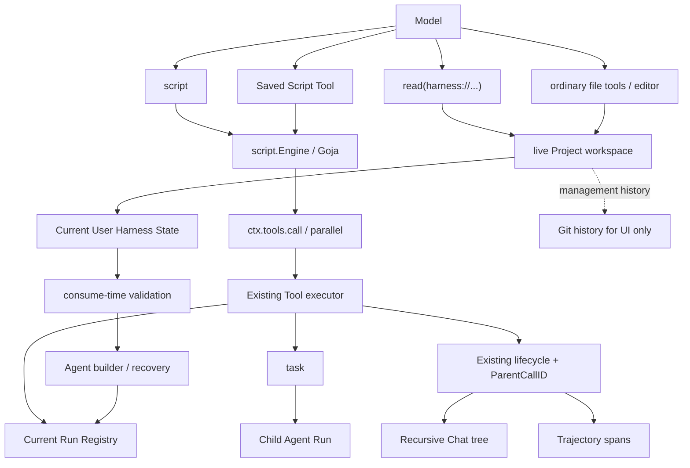

# Denova Script 工具与动态编排设计

- 状态：Implemented
- 范围：`agent` module、Denova Agent 组装、User Harness State、Chat、Trajectory、持续学习
- 目标版本：Beta；采用当前协议，不保留旧入口或兼容层

## 1. 结论

Denova 只提供两种脚本入口：

| 入口 | 生命周期 | 模型看到的形态 | 用途 |
| --- | --- | --- | --- |
| `script` | 单次调用 | 一个稳定的内置工具 | 即时组合当前 Agent 的工具 |
| `tools/<name>.js` | User Harness State | 一个独立的普通工具 | 保存可复用的编排 |

JavaScript 直接写 function body，不要求声明 `main`：

```javascript
const files = ctx.tools.parallel([
  { tool: "read", input: { path: "README.md" } },
  { tool: "read", input: { path: "CHANGELOG.md" } }
])

return { files }
```

脚本只有两个工具调用原语：

```javascript
ctx.tools.call(name, input)
ctx.tools.parallel(calls)
```

User Harness State 的管理也保持直接：

- 读取复用现有 `read`，路径为 `harness://state/...`。
- Harness 是特殊分类的真实 Project，其 workspace 就是可编辑 Draft 目录。
- Harness Agent 与普通 Project Agent 一样使用文件工具、shell 和多会话；UI 编辑器也直接保存文件。
- Draft 写入阶段不做完整 schema gate；用户显式整体发布时完整校验并原子替换 Published State。

核心规则：

1. `script` 可以调用当前 Registry 中除自身和 Harness State 管理入口外的工具，包括其他 Script Tool 与 `task`。
2. `task` 是唯一子 Agent 编排入口，不增加新的 workflow 或 Agent runtime。
3. 每个内部调用都重新进入现有完整 Tool pipeline，不能直接调用 `Tool.Run`。
4. User Script Tool 是普通 `ToolDefinition`，没有专用 capability、dispatcher 或 CRUD API。
5. Harness State 只有一份全局 Draft 和一份全局 Published snapshot；所有 Agent 一起发布，不提供按 Agent 独立发布或历史版本 pin。
6. 嵌套调用复用现有 lifecycle，只增加直接父调用字段 `ParentCallID`。
7. 只有外层脚本结果进入调用方模型 transcript；内部调用仍进入权限、Chat、Trajectory 和审计。
8. Draft 写入保持自由；发布前完整校验，任何 diagnostic 都阻止整体发布，原文件保留供诊断和修复。

### 1.1 用户可感知能力

用户可以：

- 让 Agent 即时用脚本完成条件、循环、批量调用、结果聚合和子 Agent 协作。
- 把稳定流程保存为有独立名称、描述和输入 Schema 的普通工具。
- 在 Harness State 页面创建、编辑、启停、删除、查看历史和恢复 Script Tool。
- 按目标 Agent 预览精确 Draft revision 会贡献的 Prompt、Context、Script Tool、SubAgent 和工具描述，再将完整 State 一起发布。
- 明确要求根 Agent 直接保存或修改 User Script Tool，并确认跨项目的 User State 修改。
- 在 Chat 中看到脚本内部真实发生的递归工具树。
- 在 Trajectory 中看到同样的父子关系与真实执行时间。
- 在轨迹侧栏显式调用 Harness Agent 做 Agent Health 诊断，并在独立会话中创建或改进 Script Tool。

不会提供 Session 级工具、active Run 热注册、脚本内工具管理、Node.js 环境或编辑器专用执行协议。

## 2. 简单性原则

本设计遵循“简单且正确优先于复杂且完整”：只为当前需求增加最小机制，把已有能力继续交给已有模块。

| 不采用 | 采用 |
| --- | --- |
| Script Runtime interface 与 provider factory | 一个具体的 `script.Engine` |
| Promise、async/await 与宿主 event loop | 同步 `call` 与批量 `parallel` |
| 为每个工具生成一个 JS 方法 | 稳定的 `call(name, input)` |
| Script 专用 scheduler、权限和事件 | 复用现有 Tool executor 与 lifecycle |
| Script 专用子 Agent API | 调用现有 `task` |
| 新建 `read_harness_state` | 复用 `read` 的 URI adapter |
| Script Tool CRUD API | Harness Project workspace 中的普通文件操作 |
| Run pin、revision archive 与 resolver | 全局 Draft / Published 边界；新 Run 读取 Published |
| 静态工作流图 | 固定脚本来源加本次真实调用树 |

必须保持的正确性只有几项：

- 每个真实副作用经过目标工具自己的 policy、permission 和 post-check。
- 同步脚本返回时，其非 detached 内部调用已经完成。
- provider transcript 始终保持外层 tool call/result 配对。
- Chat 与 Trajectory 使用同一个父子调用事实。
- 无效 Draft 不能替换 Published State；发布永远整体校验、整体替换，不会部分注入。

## 3. 总体架构



Goja 只是编排语言。Registry、权限、调度、mutation receipt、artifact、task 生命周期和 trajectory 事实仍由 Go 侧拥有。

### 3.1 模块边界

| 模块 | 负责 | 不负责 |
| --- | --- | --- |
| `agent/script` | 编译、执行、受限 `ctx`、JSON 边界、诊断、中断 | Tool、Registry、Session、State |
| 根 `agent` package | 嵌套 Tool seam、完整执行链重入、父子身份 | Goja、Harness 文件、UI |
| `agent/tools` | 即时与持久脚本的 `ToolDefinition` 包装 | State 存储和历史 |
| `internal/agents/harnessstate` | 当前 `tools/*.js` 的解析、校验与物化 | Git、Session、VM 执行 |
| `internal/agents/scripttools` | Denova 配置到 Script Tool definitions 的组装 | 文件解析、Goja 细节 |
| `agent/state` | current Snapshot、candidate 校验、CAS、原子替换 | Harness 语义、Git、prompt |
| `internal/app/continuallearning` | State API、read adapter、history、Harness Project 能力与计划维护 | Script Engine、Tool pipeline |
| Chat / Run | 树投影与 span 父子关系 | 推断未记录的执行事实 |

依赖保持单向：

```text
agent/script <- agent/tools <- internal/agents/harnessstate <- internal/agents/builder
agent/state  <- internal/agents/harnessstate <- internal/app/continuallearning
```

根 `agent` 不导入 `agent/tools` 或 `agent/script`。`script.Engine` 只有 Goja 一个实现，因此不建立 provider interface；测试只 fake 单方法 `script.Host`。

## 4. JavaScript 协议

### 4.1 即时 `script`

输入：

```json
{
  "source": "const result = ctx.tools.call(\"read\", {\"path\": \"README.md\"})\nreturn result",
  "input": {}
}
```

- `source` 是同步 function body，可直接写语句、helper 与 `return`。
- `input` 可省略，缺省为 `{}`，只存在于本次 VM。
- source 是工具参数，不写入 Harness State，也不进入稳定 prompt。
- `script` 的名称和 Schema 固定，因此不同源码不改变 provider 前缀。

模型可见描述使用英文：

```text
Execute a synchronous JavaScript function body that orchestrates the tools available to this Agent.
Use ctx.tools.call(name, input) for one call and ctx.tools.parallel(calls) for an ordered batch.
Each call returns {tool, ok, status, output, truncated, artifacts, reason}.
Return one JSON-compatible value. Script and Harness State management are unavailable inside scripts.
```

### 4.2 为什么不声明 `main`

用户源码本身就是函数体。Engine 内部统一包装：

```javascript
(function (ctx, input) { "use strict";
  // user source
})
```

这个壳只是执行细节：

- 用户不用重复声明入口。
- Engine 不用扫描 AST 或执行顶层注册代码来寻找函数。
- 即时脚本与持久 Script Tool 使用同一协议。
- 编译和运行诊断会消除包装偏移，行列仍指向用户源码。

### 4.3 Host API

脚本只获得：

```javascript
ctx.tools.call(name, input)
ctx.tools.parallel(calls)
ctx.log(message)
```

`ctx.log` 进入 bounded display/trace，不是第二个返回值通道。

每个调用返回：

```json
{
  "tool": "read",
  "ok": true,
  "status": "success",
  "output": "README content...",
  "truncated": false,
  "artifacts": [],
  "reason": ""
}
```

规则：

- `status` 和 `reason` 复用现有 ToolResult contract。
- unknown tool、参数错误、权限拒绝、普通工具失败和调用环返回 `ok: false`，不抛 JS exception。
- 取消、Goja interrupt 或 Host contract 损坏会终止整个脚本。
- 成功且未截断的 ModelContent 如果是完整 JSON value，`output` 恢复为对应 object、array 或 scalar；否则是 string。
- Effects、receipts、Details、DisplayContent、未裁剪内容和 Go 对象不进入 VM。
- `truncated: true` 表示 `output` 不是完整逻辑值，脚本应使用 artifact、恢复工具或降级。

批量调用：

```javascript
const results = ctx.tools.parallel([
  { tool: "read", input: { path: "a.md" } },
  { tool: "read", input: { path: "b.md" } }
])
```

- 返回顺序与输入顺序一致。
- 单项 name/input 无效只让该项失败，其他合法项仍执行。
- `parallel` 只表达一批独立调用，不承诺物理并行。
- 现有 scheduler 决定 read 并行与 exclusive、interactive、child barrier。

### 4.4 可调用范围

可调用集合就是当前 Run Registry：内置工具、plugin/MCP、host tools、其他 Script Tool 和 `task`。

Script Host 只额外拒绝：

- 即时 `script` 本身，避免递归 eval。
- `read` 的 `harness://` 资源。

后者避免脚本通过专用资源旁路管理 State。脚本通过现有 `task` action 编排子 Agent，不获得 `ctx.agents`。

### 4.5 JSON 与运行边界

- 每次执行创建新的 `goja.Runtime`，不跨调用保存 global、closure 或 JS object。
- `ctx.tools` 是冻结的 null-prototype object；`input` 通过 JSON parse 进入 VM。
- 不提供 `console`、`require`、`module`、`process`、`fetch`、filesystem、environment 或 timer。
- 参数和返回值使用标准 `JSON.stringify` / `JSON.parse`，不维护第二套 JS 值遍历器。
- 省略 return 或返回 `undefined` 规范化为 `null`。
- function、Symbol、循环引用、BigInt 和 Promise 不能作为最终返回值；`NaN`、Infinity 和对象中的 `undefined` 遵循标准 JSON 语义。
- Runtime 由当前带 recover 的 Tool goroutine 独占；context cancel 使用 Goja `Interrupt`。

## 5. Script Engine 与 ToolDefinition

### 5.1 Engine API

```go
package script

type Host interface {
    CallTools(context.Context, []Call) ([]Outcome, error)
}

func NewEngine(Config) (*Engine, error)
func (e *Engine) Compile(context.Context, Source) (Program, []Diagnostic)
func (e *Engine) Run(context.Context, Program, Host, json.RawMessage) (RunResult, error)
```

- `Engine` 是具体类型，`Program` 是不可变编译产物。
- `Host` 只有一个 batch 方法：`call` 传一个元素，`parallel` 传整批。
- 用户代码错误写入 `RunResult.Failure`；Go `error` 仅表示 Engine/Host 基础设施失败。
- 即时 source 每次编译；当前 Harness snapshot 持有已编译的持久脚本 Program。
- 同步 Host API 不需要 Promise queue、completion registry 或 event loop。

### 5.2 Descriptor

即时 `script` 与持久 Script Tool 共用：

| 字段 | 值 |
| --- | --- |
| Source | `other` |
| Execution | `child` |
| MutationScope / PostCheck | `none` / `none` |
| Recovery | `non_idempotent` |
| ResultProjection | `bounded_model_context` |
| ResultRetention | `protected` |
| Steering | `finish_current` |
| Presentation | `script` |

即时工具 capability 为 `script`；持久 Script Tool capability 为空。外层 Descriptor 不替内部调用声明副作用，真实 mutation、permission 和 receipt 始终属于 child。

### 5.3 配置与限制

只增加一个 user-level 设置：

| Key | 默认 | 说明 |
| --- | --- | --- |
| `agent_script_timeout_seconds` | `0` | `0` 不限时；正数才建立 deadline |

其他限制直接复用或固定：

- 结果与日志预算复用 `agent_tool_result_limit_kb`。
- source 有一个宽松的内部 1 MiB 防御上限，不作为用户设置，也不进入工具 Schema。
- call stack 使用 Engine 固定防御值。
- 显式 Run cancel 和应用关闭始终可中断，不依赖 timeout。

Goja 在进程内运行，没有独立 heap ceiling。UI 明确显示它是受限宿主而不是安全沙箱。若以后必须执行第三方不可信代码，应更换隔离方案，而不是给当前实现增加虚假的安全抽象。

## 6. User Script Tool

### 6.1 文件格式

一个文件定义一个工具：

```text
<DenovaDir>/state/tools/<name>.js
```

```javascript
---
name: research_company
description: Research a company and return a concise evidence-backed brief.
agents:
  - general
  - ide
enabled: true
input_schema:
  type: object
  additionalProperties: false
  required: [company]
  properties:
    company:
      type: string
      minLength: 1
---
const evidence = ctx.tools.parallel([
  { tool: "web_search", input: { query: input.company + " official overview" } },
  { tool: "web_search", input: { query: input.company + " latest results" } }
])

return { company: input.company, evidence }
```

frontmatter 是静态数据，后面全部是 function body。不使用 `defineTool`，也不执行代码来发现 metadata。编译前用等行数空行替换 frontmatter，保证诊断对应编辑器行号。

### 6.2 校验

- 文件必须是 `tools/<name>.js` 的直接子项和有效 UTF-8。
- `name` 与文件名一致，符合工具名规范；不强制 `user_` 前缀。
- `description` 与 Schema description 使用英文。
- `agents` 至少包含 `general`、`ide`、`interactive_story` 或一个规范化的自定义 Agent ID；按运行时类别配置的脚本会服务该类别下的自定义 Agent，精确 ID 则只服务指定 Agent。
- `enabled` 缺省为 `true`。
- `input_schema` 必须是 object root，拒绝未知关键字和 `$ref`。
- object 省略 `additionalProperties` 时规范化为 `false`。
- 用户不能填写 capability、permission、mutation、recovery 或 presentation。
- 与任何已注册工具重名时，完整 candidate fail closed，不按注册顺序覆盖。
- 一次返回所有能独立发现的 path/line/column diagnostics。

Validator 不静态推断调用图；运行时以当前 Registry 为准。

### 6.3 普通工具语义

每个有效文件物化为普通 `ToolDefinition`：

- name、description、schema 来自 frontmatter。
- Descriptor 使用固定脚本语义，Capability 为空。
- `enabled`、`agents` 与 Agent builder 决定是否进入 Registry。
- 关闭即时 `script` 不影响已经保存的 Script Tool。
- delegated subagent 只有显式列出具体工具名且不超过 parent ceiling 时才获得它。
- Script Tool 可以调用另一个 Script Tool。
- 直接或间接再次进入调用栈中的同名 Script Tool 时返回现有 `policy_blocked` outcome；不增加专用全局错误枚举。

### 6.4 当前实现与模型缓存

不为脚本源码建立 digest、历史 resolver 或 runtime version identity。

- 现有 `ToolDefinitionSnapshot` 表达 name、description、Schema 和 Descriptor，并决定 provider-visible 前缀。
- Script Tool 的 `ImplementationIdentity` 只标识稳定的脚本运行契约版本，不包含 source、State revision 或文件时间。
- 只改脚本 body 不改变 provider-visible 工具契约。
- 改 name、description 或 Schema 会自然改变工具 Schema。
- Agent 重建或恢复时直接编译并使用当时的 Published State。

这与产品模型一致：当前内容就是实现，不维护另一份“本次应执行的历史源码”。

## 7. 嵌套调用与递归轨迹

### 7.1 复用一个执行器

模型工具调用和脚本内部调用共用相同阶段：

```text
Registry lookup
→ argument normalization / schema validation
→ descriptor scheduler
→ product mode policy
→ permission / interaction
→ middleware
→ Tool.Run with panic recovery
→ ResultProcessor / artifacts
→ effects / receipts / lifecycle / trajectory
```

只改变两件事：

- nested call 有 `ParentCallID`。
- nested call 的结果返回脚本，不追加调用方 provider transcript 的独立 ToolMessage。

### 7.2 Agent seam

根 `agent` package 只公开：

```go
type NestedToolCall struct {
    Name      string
    Arguments json.RawMessage
}

func CallNestedTools(context.Context, []NestedToolCall) ([]NestedToolOutcome, error)
```

真实 invoker 只在一个正在执行的 Tool context 中存在。调用方不能传 Registry、Definition、Descriptor、permission decision 或 executor；离开 Agent Tool 执行上下文时 fail closed。

实现复用 `modelToolLoop` 已有 prepared batch executor。没有 Script scheduler、dispatcher registry、后台 drain 协议或新的公共 execution abstraction。

### 7.3 调度、取消与身份

- `parallel_read` 使用现有并发上限。
- exclusive、interactive 和 child 继续作为 source-order barrier。
- Script Tool 使用 `child`，不会持有 workspace gate 再调用内部工具。
- nested call 使用由直接 parent 和本地 sequence 派生的稳定唯一 execution ID。
- context cancel 传播到当前 batch；已经开始的工具按自身 Descriptor 收尾。
- `task(detached=true)` 在返回 TaskRef 后已合法完成，child Run 后续拥有自己的生命周期。

### 7.4 Lifecycle、Chat 与 Trajectory

不增加 `tool/code-dispatch-*` 等第二套事件：

- nested admission 使用现有 `ToolInputStarted`，增加 `ParentCallID`。
- started、progress、finished 仍是现有 lifecycle，并通过 call ID 关联 input。
- preflight unknown/invalid failure 也产生 input/finished 配对。
- `NestedEvent.ParentCallID` 让 `task` 的 child Agent events 挂到真实 task 节点。

调用示例：

```text
script-call
└── saved-research-tool
    ├── web-search
    └── task
        └── child Agent events
```

Chat 从扁平 append-only events 构建树；Trajectory Observer 用同一个 call ID 将 tool span 挂到 parent span。并行完成顺序不会改变记录中的父子关系。损坏或缺失 parent 时节点保持可见，并记录 orphan 信息，不递归猜测。

provider transcript 始终只有：

```text
assistant tool_call(script | saved_tool)
tool outer_result
```

内部结果仍完整审计，但不作为额外 provider message 重复注入模型上下文。

## 8. Harness State 管理与持续学习

### 8.1 读取复用 `read`

State ReadAdapter 支持：

```text
harness://state/current
harness://state/<relative-path>
```

- `current` 返回 CAS revision、文件 manifest、Script Tool summary 与 diagnostics。
- 文件 URI 返回当前文件内容，并复用现有 offset、byte_offset、limit 和结果 envelope。
- revision 只用于下一次 State 写入的并发检查，不是运行版本。
- 即使 current State 无效，raw files 与已发现 diagnostics 仍可读取，以便修复。

### 8.2 Draft workspace 写入

Harness 在 Project Registry 中使用稳定 ID 和特殊 `harness` 类型，workspace 直接指向 `<DenovaDir>/state` 的 Draft 目录。Harness Agent 可以使用与 General Agent 相同的文件工具、Bash 或 PowerShell；UI 编辑器同样直接保存 Draft 文件，不增加专用 update tool 或 Script Tool CRUD API。

写入边界只负责路径安全、revision 与事务完整性，不把完整 Harness schema 作为前置 gate。这样 Agent 可以先产生暂时不完整的中间状态，再继续修复，而不会被每一步写入协议限制。

完整校验发生在 Debug 与 Publish 边界：只要存在 diagnostic，完整 Draft 就不能发布。无效文件不会被删除或回滚，Harness Project 中的 `harness://state/current` 仍返回 Draft diagnostics 和 raw files，Harness Agent 可继续诊断修复。普通 Agent 的同一 URI 只读取 Published State。

### 8.3 全局 Draft / Published State

- `<DenovaDir>/state` 是唯一可编辑 Draft；`<DenovaDir>/state-published` 是运行时只读的 Published snapshot。
- 首次升级时，v0.3.3 已有的合法 State 原样成为初始 Draft 与 Published；非法文件保留在 Draft，Published 以安全空状态启动。
- Draft revision 和 Published revision 都是内容哈希，用于 UI 并发保护和发布 CAS，不是用户可选的运行版本。
- Publish 要求调用方同时提交其看到的 Draft 与 Published revision，先校验完整 Draft，再用一个原子事务替换完整 Published snapshot。
- 所有 Agent 一起发布；Prompt、Context、Script Tool、SubAgent 与工具描述不存在独立发布状态。
- Agent builder、delegated child 构建和恢复路径都读取 Published Harness。
- 用户级 `labs.harness_state_enabled` 默认开启；关闭后普通 Agent 不加载 Published Harness，也不暴露其只读 State adapter，但 Draft、Published、Git 历史与 Harness 工作区均保留，重新开启即可恢复。
- 不提供 runtime revision archive、exact snapshot resolver、revision URI 或 source digest pin。
- Git 只服务管理 UI 的 Versions、Diff、Restore，不参与 Agent 执行选择。
- Restore 只把历史文件写回 Draft；用户确认整体发布前不改变 Agent 行为。
- UI 显式保存可记录管理快照；Agent 自动记录只接受通过消费校验的 State。Git record 失败不会回滚已经成功的文件写入，只写清晰的运维日志。

已进入执行的 Run 自然持有本次构建出的 Registry，不做 active Run 热替换；下一次构建或恢复读取那一刻的 Published State。这不需要额外的 Run pin 协议。

### 8.4 普通 Agent 直接管理

当用户明确要求持久化修改时，General、IDE/写作和 Interactive Story/游戏根 Agent 可读取 `harness://state/...`；完整编辑体验由 Harness Project Agent 提供：

```text
open Harness Project conversation
→ inspect trajectory:// and Draft harness://state/current
→ edit Draft workspace with ordinary file or shell tools
→ inspect diagnostics and repair
→ debug one or more target Agents
→ user publishes the complete Draft
```

约束：

- `harness_state` capability 控制普通 root 的 read adapter，不控制 Saved Script Tool availability。
- manifest 与 raw files 可通过 adapter 读取；普通 Project Agent 不获得 Harness Draft directory。
- Harness Project Agent 自己以 Draft 为 workspace，使用标准工具权限与会话管理。
- 固定英文 instruction 说明写后检查 diagnostics，不注入 State 内容或 revision。

### 8.5 Harness Agent 与 Agent Health

Harness Agent 是标准 AgentChat Project Agent，额外获得 trajectory read adapter：

1. 读取 trajectory 与 outcome。
2. 读取 Draft manifest 和相关 State files。
3. 使用普通文件或 shell 工具编辑 Draft workspace。
4. 再读取 diagnostics 并修复。
5. 用户按目标 Agent 调试贡献内容，确认后整体发布；Harness Agent 与计划维护本身都不自动发布。

轨迹侧栏提供通用 Harness Agent 入口和显式“一键诊断”。打开 run 不会自动运行诊断；只有用户点击后才发送限定证据范围的 Agent Health 提示。Harness 对话支持多会话，并可在 Agent 工作台继续使用。计划任务使用保留会话 `harness-scheduled`，但仍复用同一个 Project AgentChat runtime。

只有用户明确要求，或多个高质量 trajectory 显示稳定复用价值时才创建 Script Tool。不得把凭证、绝对路径、项目正文、模型 thinking、Session ID 或 TaskRef 写入 User State；单个已有工具或 Skill 可以解决时不创建脚本。

## 9. Package 与文件目录

### 9.1 `agent` module

```text
agent/
├── nested_tool.go                   # context-bound call/outcome seam
├── nested_tool_executor.go          # current Registry + shared executor
├── nested_tool_test.go
├── tool_loop.go                     # model/nested 共用 prepared executor
├── lifecycle_types.go               # ToolInputStarted.ParentCallID
├── nested_event.go                  # NestedEvent.ParentCallID
├── script/
│   ├── engine.go                    # compile/run、VM lifecycle
│   ├── types.go                     # Program、Host、Outcome、Failure
│   ├── values.go                    # ctx、JSON boundary、limits
│   └── engine_test.go
└── tools/
    ├── script_tool.go               # immediate/saved definition builders
    └── script_tool_test.go
```

`agent/go.mod` 引入 `github.com/dop251/goja`。Denova 根 module 只通过 `agent` 的 replace 依赖它，不在产品层操作 Goja。

### 9.2 Denova backend

```text
internal/agents/harnessstate/
├── schema.go                         # Draft/Published Harness materialization
├── parser.go                         # complete State routing
├── script_tools.go                   # frontmatter、schema、compile
├── debug.go                          # target-Agent Draft projection
├── storage.go                        # Published readiness marker
└── read_adapter.go                   # harness:// contribution to read

internal/agents/scripttools/
└── tools.go                          # timeout/result policy + assembly

internal/app/continuallearning/
├── agent_capabilities.go             # root read + Harness Project adapters
├── service.go                        # Draft inspection and migration
├── release.go                        # global Debug/Publish boundary
├── state_history.go                  # Versions/Diff/Restore
└── maintenance.go                    # scheduled turn through Project AgentChat
```

已有调用点只做薄连接：

- config：`script`、`harness_state` capability、Harness Agent 与 timeout setting。
- Agent builder：组装 Published Harness 的 Script Tools。
- application composition：向普通 root 注入 Published read adapter，为 Harness Project 注入 Draft workspace 与 trajectory adapter。
- Chat/Run：透传 `ParentCallID` 并投影树。

这些薄改动分布在多种 root Agent 和 writing/game DTO 上，是同一字段穿过现有显式边界，不是新增多个子系统。

### 9.3 Frontend

```text
web/src/
├── components/Chat/
│   ├── tool-call-tree.ts
│   └── AgentExecutionProcess.tsx
├── features/agents/harness-state/
│   ├── HarnessStateEditor.tsx
│   └── NewScriptToolDialog.tsx
├── features/trajectory/HarnessAgentPanel.tsx
├── features/agent-chat/AgentChatConversationTab.tsx
└── i18n/locales/{zh-CN,en-US}/
```

复用 `DenovaMonaco`、现有 tool renderer、State history UI、shadcn 组件与主题 token。

## 10. UI、配置与权限

### 10.1 Agent 设置

| Capability | 用户文案 | 作用 |
| --- | --- | --- |
| `script` | 脚本编排 / Script orchestration | 即时 `script` |
| `harness_state` | 用户状态管理 / User State management | 普通 root 的 `harness://` read adapter |

- General 与 IDE/写作默认开启；游戏具备相同能力上限但默认关闭，用户可开启。
- Harness Agent 使用 General 的工具与模型配置，并额外获得 Draft Harness/trajectory read adapter 与 Draft workspace。
- 两个 capability 都不控制 Saved Script Tool；它由文件的 `enabled/agents` 和 Registry 决定。
- 设置页提供可选 timeout，并说明 in-process 不是安全沙箱。
- 共享一级菜单不自动切换写作或游戏模式。

### 10.2 Harness State 页面

- 文件树增加“Script Tools / 脚本工具”分组。
- New 向导收集 name、英文 description、target Agents 和简单 input fields，生成完整文件模板。
- Monaco 编辑同一个 frontmatter + JavaScript 文件，不建立 metadata 双事实源。
- 后端 diagnostics 映射为 editor markers 与 Problems。
- Save/Delete 保留 Draft revision 并发保护，但允许保存暂时无效的内容；diagnostics 明确阻止发布。
- Debug 选择一个目标 Agent，并对精确 Draft revision 展示 Prompt、Context、Script Tool、SubAgent 与工具描述来源；V1 不另起模型执行器或自动评分。
- Publish all 同时携带 Draft/Published revision，完整校验成功后一次替换所有 Agent 的 Published State。
- 顶部 Switch 修改用户级 `labs.harness_state_enabled`，不创建新 revision、不触发发布，也不删除任何 Harness State 数据。
- Versions/Diff/Restore 继续使用现有 history UI，但 Restore 只影响 Draft。
- 保存后提示 Draft 已更新；发布后只影响后续新 Run，不承诺 active Run 热替换。
- 用户文案支持中英文、light/dark 与自适应布局。

V1 不增加编辑器 eval。调试是确定性的贡献投影；即时脚本试验仍使用 Chat 中的 `script`，避免第二条执行、权限和轨迹链。

### 10.3 Chat 与 Trajectory

- 即时 `script` 和 Saved Script Tool 使用现有工具卡，增加 script presentation/badge。
- nested child 继续使用真实工具 renderer。
- 权限等待和失败显示在真实 child 节点。
- task 的 child Agent events 挂在 task 节点下。
- Trajectory 使用相同 call IDs 建立 span parent。
- 只展示本次真实分支，不预画可能从未执行的静态流程。

### 10.4 权限

1. 每个 nested call 按真实 child name、normalized arguments 和 Descriptor 重新执行 permission。
2. Registry visibility 是脚本可调用能力上限。
3. Script Host 拒绝即时 eval 和 Harness 管理入口。
4. Harness adapter/update 只属于 root Agent。
5. User State 正文 read 与 update 使用独立权限域。
6. Plan ReadOnly、写作和游戏 mode policy 作用于每个真实 child。
7. `task` 继续受 parent capability ceiling。
8. source、args、logs、State content 和 results 使用现有 capture/redaction policy。

## 11. API 与错误

不增加 Script Tool CRUD 或 eval HTTP endpoint：

```text
GET /api/continual-learning/state
PUT /api/continual-learning/state
GET /api/continual-learning/debug?agent_kind=<kind>&revision=<draft-revision>
POST /api/continual-learning/publish
```

GET State 返回 Draft files、Draft/Published revision、Script Tool summary 和 diagnostics。PUT 接受 Draft base revision 与 ChangeSet。Debug 必须绑定精确 Draft revision；Publish 同时接受 Draft/Published revision 并整体替换。422 返回完整 diagnostics，409 表示任一 revision CAS conflict。History API 保持不变。

Script/State 新增的稳定诊断主要包括：

| Code | 含义 |
| --- | --- |
| `script_compile_failed` | JavaScript 无法编译 |
| `script_schema_invalid` | input schema 无效 |
| `script_tool_name_mismatch` | 文件名与 name 不一致 |
| `script_tool_name_conflict` | 与已有工具重名 |
| `script_agent_invalid` | target Agent 无效 |
| `script_runtime_failed` | 未捕获运行异常 |
| `script_result_invalid` | 返回值不能编码为 JSON |
| `script_source_invalid` | source 不是有效 UTF-8 |
| `script_source_limit` | source 超过固定防御上限 |
| `script_output_limit` | 结果超过工具预算 |
| `script_cancelled` | cancel、关闭或 configured deadline 中断 |
| `state_revision_conflict` | update base revision 已过期 |

调用环、unknown tool、invalid arguments 与 permission deny 直接复用现有 `policy_blocked`、`unknown_tool` 等 Tool synthetic reasons，不扩大公共枚举。模型可见反馈使用英文；UI 按 code 本地化。

## 12. 测试与验收

### 12.1 核心测试

`agent/script`：

- function body、helper、return/null、line mapping。
- JSON boundary、循环值、BigInt、NaN、Promise 拒绝。
- call/parallel 顺序、逐项失败、structured JSON output、truncation。
- cancel interrupt tight loop、Program 多 VM 不串状态、panic recovery。

Agent integration：

- nested call 经过 normalization、scheduler、permission、middleware、ResultProcessor、effects、artifacts 和 lifecycle。
- `script → read`、mutation permission、task、Script Tool → Script Tool。
- cycle、管理入口阻断和 effect_unknown 传播。
- child 不进入 provider transcript，不重复应用 effects/context hints。
- `ParentCallID` 在任意嵌套深度保持正确。

Denova integration：

- `tools/*.js` parse、compile、filter、sort、collision。
- General、IDE/写作和游戏从 Published Harness 构建，未发布 Draft 不生效。
- 全局开关默认开启；关闭时普通 Agent 的 Harness contribution 与只读 State adapter 同时为空，重新开启后恢复原 Published snapshot。
- body-only 更新不改变 provider-visible contract。
- `harness://` manifest、bounded file read、无效 State 修复。
- unchecked Draft write、Debug revision conflict、Publish 双 revision conflict、完整 diagnostics 与全局原子发布。
- builder/recovery 不接受 Harness revision 参数。

UI / trajectory：

- 递归树、并行完成乱序、permission、failure、cancel 与 task child ownership。
- Monaco diagnostics、save conflict、history、未保存保护、按 Agent 调试和整体发布确认。
- 中英文、light/dark、空状态、长文本、窄屏和宽屏。
- 写作与游戏核心链路使用应用内浏览器回归。

### 12.2 验收标准

1. 即时工具与 capability 名为 `script`，运行内核为具体 `script.Engine`。
2. 用户源码直接写 function body，不声明 `main`，只使用同步 `call`、`parallel` 与可选 `ctx.log`。
3. User Script Tool 是普通 `ToolDefinition`，无专用 capability、dispatcher 或 CRUD。
4. `task` 是唯一子 Agent 编排入口。
5. 每个 nested call 经过完整 Tool pipeline。
6. lifecycle 只增加 `ParentCallID`，Chat 和 Trajectory 呈现同一真实树。
7. 只有外层脚本结果进入调用方 transcript。
8. Harness 是稳定 ID 的特殊 Project，workspace 直接使用 Draft 目录，并复用标准 AgentChat 多会话。
9. State 可通过普通文件工具、shell 或 UI 写入；完整 schema 校验移到消费层。
10. 任一 diagnostic 都阻止完整 Draft 发布，Published State 与基础 Agent 保持可用，原文件保留供修复。
11. 所有 Agent 共享一次全局发布；构建与恢复读取 Published State，不保存 runtime pin。
12. 轨迹侧栏只在用户点击后触发 Agent Health 诊断；计划维护复用保留的 Project 会话。
13. General、IDE/写作和 Interactive Story/游戏均有配置、测试与回归路径。

## 13. 取舍与参考

明确不采用：Promise/event loop、用户声明 `main`、每工具 JS 方法、Runtime provider interface、script 专用 events、workflow API、Session 工具、Script CRUD、专用 Harness update tool、按 Agent 独立发布、写时完整 schema gate、runtime Harness version pin/archive、`defineTool`、`user_` 前缀、直接 `Tool.Run`、active Run 热注册、全局 Goja Runtime、编辑器 eval 和静态流程预绘制。

设计吸收了 sibling repository 中 Code Mode、嵌套调用树和 workflow 的经验，但没有照搬其命名或异步协议：

- `../deepseek-harness/packages/code-runtime/code-runtime/`
- `../deepseek-harness/packages/core/tools/src/code-mode.ts`
- `../deepseek-harness/packages/client/sessions/tool-call-tree.ts`
- `../deepseek-harness/packages/client/ui-trajectory/`
- `../deepseek-harness/packages/workflow/`

取舍依据参考 [The Rise of “Worse is Better”](https://www.jwz.org/doc/worse-is-better.html)：保持接口小、实现直接、正确性集中在不可破坏的不变量上；不为了假设性的版本一致性、运行时扩展或隔离 provider 提前引入状态机和抽象层。
