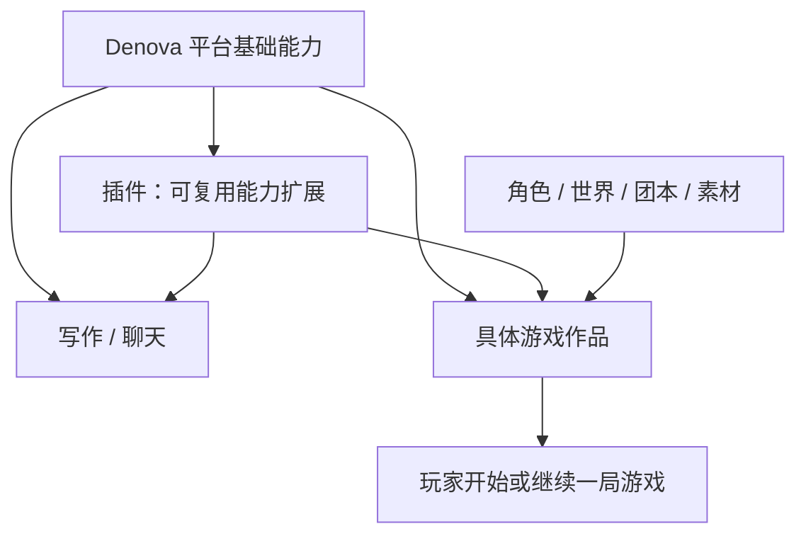
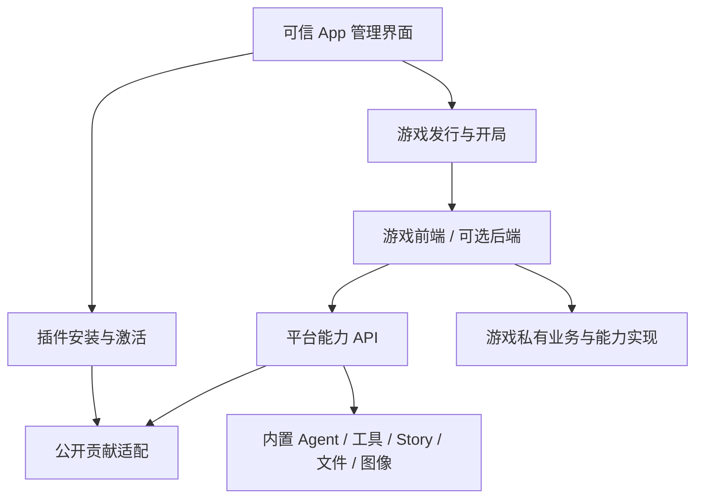

# Denova 插件与游戏平台设计

状态：设计草案；以下第三方插件／游戏开发管理、公开 SDK 和运行宿主尚未实现。更新：2026-09-06；代码核对基线 `8dc5b22b`，用户数据保护基线按仓库 [CHANGELOG](../CHANGELOG.md) 当前所列 `v0.4.1`，实施时重新核定。

先读[插件开发手册](plugin-developer-guide.md)或[游戏开发手册](game-developer-guide.md)，再按本文理解系统职责。[API 参考](plugin-platform-api.md)定义边界契约；外部对照仅记录在本地参考审计中。

## 1. 产品模型

**插件扩展 Denova 的能力；游戏是基于平台能力实现、在游戏页中可游玩的具体作品。** 两者都可以包含代码、界面与资源，也可以复用安装、构建和进程机制，但它们的产品身份与生命周期分开。

| 对象 | 定义 | 用户操作 | 不应混淆的对象 |
| --- | --- | --- | --- |
| 插件 Plugin | 供平台及使用方选择的能力扩展 | 安装、启用、配置、选择能力、停用 | 具体游戏作品 |
| 游戏 Game | 具有入口、玩法、内容与开局的可玩作品 | 添加、查看详情、开始、继续、更新 | 通用引擎或一套工具 |
| 游戏实例 GameInstance | 某部游戏的一次持久游玩空间 | 游玩、保存、继续、分支、导出 | 游戏发行本身 |
| 内容资源 | 角色、世界、团本、素材、模板等数据 | 导入、编辑、选择、复用 | 可执行能力或完整作品 |
| 发行 Release | 上述可安装代码与默认资源的准确版本 | 固定、校验、引用和保留 | 正在运行的进程或存档 |

例如，NPC 对话、通用回合规则和舞台渲染能力可以是插件；将它们与人物、场景和玩法组合成《月下物语》则是游戏。只装通用引擎不会在游戏页自动生成一部作品。纯内容不自动成为插件，组合成有可用入口与开局的作品后才按游戏交付。

不再采用“插件包内 contributes.applications／gameModes，所有游戏都是插件的一种贡献”的模型。通用独立 App 的分发不纳入本次产品范围；插件自身的功能页仍属于能力扩展，不能据此把游戏降为插件页面。

## 2. 关系与独立性



游戏可以直接使用内置能力、选择插件，或用自己的后端实现业务。纯前端游戏可以组合 Denova 与插件完成全部能力；有无后端与是否是插件没有对应关系。

游戏私有 Agent 定义、工具、上下文与 flow 随游戏交付，只在该游戏运行范围可见。它们不进入平台的公开插件贡献目录。需要跨作品复用时再抽为独立插件，不要求每段游戏后端逻辑先做成插件。

一个源码仓库可以同时包含游戏和配套插件，但使用独立清单、身份、发行与授权。平台可以在游戏安装向导中一起处理依赖，不创造“一包同时是两个产品”的歧义。一个插件被多部游戏使用时，卸载其中一部游戏不会卸载共享依赖。

## 3. 两份开发手册反推两条产品链路

| 手册任务 | 用户需要的结果 | 平台责任 |
| --- | --- | --- |
| 插件 P1 创建与预览 | 在 App 内开发、选择测试范围并定位问题 | 插件模板、开发绑定、原工作台、测试激活 |
| 插件 P2 工具、P3 其他扩展 | 新能力可发现、可选择、可运行 | 贡献校验、范围注册、Agent／编辑器等适配 |
| 插件 P4 交付维护 | 安装后按范围生效，更新不破坏使用方 | 插件安装、配置、依赖影响预览和撤销 |
| 游戏 G1 开发、G2 纯前端实现 | 开发具体作品并创建测试开局 | 游戏模板、游戏清单、游戏运行容器和 SDK |
| 游戏 G3 自有后端 | 原有 HTTP／WebSocket 业务运行并可停止 | readiness、实例来源、进程管理和业务代理 |
| 游戏 G4 状态恢复 | 明确谁保存世界、会话和进度 | 自管实例数据与可选 Story 托管适配 |
| 游戏 G5 交付游玩 | 在游戏页开始、继续、升级和管理存档 | 游戏目录、发行绑定、开局、停止、备份迁移 |

“插件可调用”与“游戏可游玩”分别验收。底层共享机制不能成为把两个用户流程合成同一个管理页面的理由。

## 4. App 内入口

### 4.1 插件管理

共通能力中的“插件”包含已安装、开发中、运行中。详情展示提供的能力、适用范围、配置、权限、版本与使用方。前端扩展在声明的写作、聊天、游戏辅助或设置位置挂载；安装不等于向每个 Agent 自动注入工具和提示词。

点击开发项进入已有 Project 工作台，编辑文件、调用 Agent、查看终端；预览进入测试范围中的实际能力位置。插件开发不复制一个 IDE 或会话系统。

### 4.2 游戏页

游戏页拥有游戏列表、作品详情、开始／继续、存档和开发入口。列表里的每项都是作品，内置游戏也遵循这一产品概念。列表不混入工具插件、角色卡和通用玩法引擎。

玩家打开作品后，游戏拥有完整内容区、自己的交互与可选后端。宿主保留返回、全屏、设置、权限交互、运行状态与停止入口。作者的调试界面在开发入口内，玩家开局不暴露内部 scope、provider 或 journal 概念。

一次“开始新游戏”创建一次独立游玩空间；打开多个视图复用同一局运行与数据。不同游戏、不同开局不共享 NPC 历史，除非用户明确选择了公开的共享业务机制。

写作、游戏与共通能力维持并列导航，不增加全局“插件模式”或“游戏类型模式”，任何时刻只有一个一级菜单高亮。共通插件能力在写作与游戏分别验证。

## 5. 分开的清单，共用的工程机制

| 清单 | 领域字段 | 约束 |
| --- | --- | --- |
| denova.plugin.json | contributes、能力配置和扩展视图 | 提供平台扩展，不声明可玩游戏目录项 |
| denova.game.json | game 入口、存储选择、uses、私有 definitions、作品内容 | 交付一部作品，不注册其他游戏可见的公共贡献 |

共享字段包含版本、名称、本地化、构建配方、发行白名单、运行要求、能力申请和插件依赖。一个候选产物根只能有一种清单，预览与安装校验 kind 与内容一致；同一仓库有多个产品时分别定位目录。

共用源码绑定 `ProjectID + relativePath`、文件校验、固定来源下载、产物快照、进程协议、桥接和日志；上层分别使用 PluginID 和 GameID。技术内部可以有带 kind 的包引用，无需新增产品级“通用应用”层或插件继承系统。

开发检查是只读动作；准备与构建命令先展示、在可见终端执行。打包消费冻结的产物快照，安装消费同一批已验证字节，源码变化不能修改候选包。预览与正式开局隔离，不默认授权当前真实项目。前端 HMR 不改变运行中已冻结的 Agent 定义；后端和贡献变化重建激活。

## 6. 能力开放：使用、公开提供与私有实现



- **Consumer API** 供游戏和插件调用 Denova 能力，使用显式资源与范围；语言客户端共享语义，不直接公开内部 HTTP 路由。
- **Plugin Provider API** 注册 manifest 声明的公共贡献，只有被使用方选中才激活。
- **游戏私有实现绑定** 使用相同的有类型调用执行器，但只绑定到该游戏与开局，不能占用公共插件 ID。
- **Management API** 只由可信 App 使用，分别管理插件、游戏与开发任务。游戏不能自行安装并批准插件，插件也不能自行获得其他作品的数据。

内置能力逐项适配成可选择契约，仍可编译在主程序中。模型循环、工具执行、Skills、编辑审阅和领域提交继续复用原机制，不先重写整个 Denova 为动态服务图。

## 7. 依赖、范围与运行

游戏声明 uses 与所需插件发行范围，创建开局时固定实际解析结果。工具和 Agent 的选择显式保存，单实现槽不按加载顺序覆盖，多来源列表按明确顺序装配。依赖闭环拒绝，缺依赖显示诊断；角色卡引用不转移工具权限。

游戏进程归游戏运行；插件进程归插件在目标范围内的激活。初期不同开局分别激活，不做跨局共享进程；同一开局多个视图／使用方可复用同一插件激活。插件可被游戏请求使用，但不是游戏后端的别名。

停止一局时取消该局工作并释放它持有的插件激活；仍有使用方的同范围激活按引用释放。禁用插件则撤销其全部激活，显示并停止依赖它的受影响工作，保留游戏进度；不能让下一步换用不同规则继续运行。

原生后端使用启动、readiness、授权通道、shutdown 与进程树清理协议。无后端的面板／游戏通过隔离视图桥接调用；静态定义不启动进程。基础设施启动、连接和清理可以超时，LLM 默认没有总运行时长或迭代上限，始终可由用户取消。

视图独立来源、cookie、旧内部 API、WebSocket 和业务代理共同校验。原生程序具有宿主账户权限，进程与 API facade 不是 OS 沙箱；预览和安装如实展示运行性质。平台密钥通过能力调用使用，不由 SDK 返回。

## 8. 游戏实例与持久化

### 8.1 一个游玩概念，两种存储归属

| 实现选择 | 实例身份与权威绑定 | 世界状态 |
| --- | --- | --- |
| 游戏自管 | 稳定 instanceId；实例元数据保存 GameID、游戏发行、插件依赖、配置和可选 ProjectID | 自有 data 文件／数据库 |
| Denova 托管 | 直接使用既有 ProjectID + StoryID + BranchID；发行、依赖、配置写 Story 的版本化记录 | 同一 Story journal |

GameInstance 是产品/API 的游玩概念，不要求每种实现都新增一个实例数据库。托管玩法不同时写 instance.json 和 Story 中的权威绑定；列表和索引可从原事实重建。前后端形态与存储选择正交，纯前端也可选任意一种。

只调用 Agent 时，会话仍是原 Product Session；多个 NPC 可是独立根会话，只有真实委派才用 parent_session。托管动作委派的 NPC 使用同一 Project Store 中自己的自包含 journal。AppInstance、contributes.applications 与游戏／应用混合目录不保留为草案兼容层。

### 8.2 事实源与路径

```text
.denova/
  plugins/
    installed.json
    packages/<plugin_id>/<release_id>/
    settings/<plugin_id>.json
    data/<plugin_id>/...
  games/
    installed.json
    packages/<game_id>/<release_id>/
    instances/<instance_id>/
      instance.json
      data/...
  stores/<store_dir>/...
```

`games/instances` 只对应自管存储开局。托管游戏仍在既有 ContentRoot 的 Story JSONL 中保存事实，图中未展开。开发绑定复用项目级开发记录，受管源码由 Registry location 定位，设备依赖与缓存位于本机临时目录。

插件自身的非会话服务数据（如用户维护的词典）可放 plugins/data，并按授权范围隔离；缓存可丢弃。某局游戏世界、Agent transcript、Goal/Todo/Clear/Cleanup/Compaction 等恢复状态必须留在其唯一领域事实源，不能复制到插件 data 后参与恢复。

ProjectID 和 store_dir 不因改名、搬迁或 relink 改变。受管引用是使用 `/` 的规范相对路径，运行时绝对路径、端口、临时 URL 与凭证不持久化。插件与游戏新增文件同样遵守跨平台文件名、无符号链接／特殊文件／大小写冲突规则。External Project 和外部服务仍不承诺跨设备可用。

### 8.3 更新与恢复

安装新版游戏或插件不会改变已有开局绑定。升级开局时一起检查游戏发行、准确插件依赖、配置与数据兼容性；停止后备份，显式迁移并校验，失败恢复原绑定和数据。代码回退要匹配数据，不能只换版本号。

自管存档加 Denova NPC 历史默认分别提交，不承诺跨库事务。采用托管动作时，accepted 在副作用前持久化，成功 committed 一次保存世界、计划、正式结果和采纳的 NPC 完成位置；候选失败不进入正式进度。

回档需要根据采纳位置恢复完整 NPC 前缀，包括 Compaction、Goal/Todo 等；失败尾部不能进入下一轮记忆。缺少这一能力时关闭完整回档入口，不能只恢复面板数值。回放读取数据，不重新执行插件、模型、随机数或外部写操作。

requestId 只匹配传输，commandId 标识稳定业务意图。去重记录写入已有 canonical journal；响应丢失先查询，accepted 后未知终态标为 incomplete，不自动重复付费或外部写操作。事件 cursor 只用于观测，`.idx.json` 和 runs 不成为恢复事实源。

卸载游戏不级联卸载共享插件；禁用或卸载插件先展示影响。用户存档默认保留，被存档引用的发行不静默删除。导出数据库需停止写入或有可靠在线快照适配，分享排除密钥、授权与私人历史。

## 9. 当前基础与新增适配

| 当前代码 | 可复用 | 新增工作 |
| --- | --- | --- |
| [共通路由](../web/src/components/workbench/SharedWorkbenchRoutes.tsx)、[工作台路由](../web/src/components/workbench/WorkbenchRouteHost.tsx) | 共通目的地、工作台与编辑能力 | 插件管理、游戏作品／开发入口、运行容器 |
| [Project](../internal/project/types.go) | 稳定身份、location 与 Store | 两类开发目录绑定和测试目标选择 |
| [Skill 安装](../internal/agents/skills/install.go)、[GitHub 来源](../internal/agents/skills/github.go) | 安全文件处理和来源解析 | 两种清单校验、固定字节候选包、独立安装记录 |
| [Agent 包](../agent/README.md)、[定义边界](../agent/definition.go)、[自定义 Agent](../config/custom_agents.go) | Agent 执行、Toolset、ContextSource 与角色配置 | 公共与游戏私有定义适配、模型槽、授权 DTO、持久请求边界 |
| [Skill assembly](../internal/agents/skillassembly/assembly.go) | 有效目录、加载工具和资源引用统一 | 选定的插件／游戏资源接入同一来源 |
| [canonicalstore](../internal/agents/canonicalstore/store.go) | Product、Game 和子 Agent 的单一 journal | 游戏发行／依赖记录、通用角色绑定及去重 |
| [Story 提交](../internal/interactive/story_agent_commit.go)、[BranchPlan](../internal/interactive/branch_plan.go) | 托管状态、分支和规划归属 | 可选 flow、通用 schema、完整 NPC 前缀恢复 |
| [项目接口](../internal/api/routes.go)、[编辑器](../web/src/components/Editor/WritingDocumentEditor.tsx) | 文件、审阅、图像等领域能力 | 范围桥接、草稿保护与公开资产交付 |

Go 宿主承担身份、进程和领域适配，agent/ 保留通用执行职责。现有同步 Goja 脚本工具不承担任意前后端托管。文中类型都是新草案，无需保留上一版未发布命名的兼容层。

## 10. 分阶段验收

| 阶段 | 可完成的开发者体验 | 核心出口 |
| --- | --- | --- |
| A 插件与游戏的基础闭环 | 插件 P1/P2/P4；游戏 G1/G3/G5 与自管文件 | 插件独立安装选择；静态和 Node 游戏在游戏页开局、退出、继续；两种产物不混入对方列表 |
| B 平台能力与组合 | 插件 P3 的 Agent／Skill／context／写作；游戏 G2 | 同一 NPC／工具能力服务多部游戏和写作；纯前端游戏依赖插件可运行；刷新重启去重和授权正确 |
| C 托管玩法与高级恢复 | 可复用 flow／planner；游戏 G4 | 私有与插件玩法均可接托管状态；失败候选隔离，回档无未来 NPC 记忆 |

模板必须分别包含插件工具、写作扩展、纯前端游戏、前后端游戏以及组合插件的具体游戏。不能用一个演示页面同时宣称两个产品闭环已完成。

所有阶段验证禁用清理、准确依赖、备份迁移、浅色／暗色、中英文、宽窄屏及写作／游戏共通功能。macOS、WSL、Windows 原生分别验证声明支持的进程和路径行为。云部署、多人同步、原生语音和通用跨数据库恢复不因上述接口存在而被承诺。

新增插件／游戏目录不批量迁移既有 Project 和 Story。启用需要新记录的能力或转换存档时，按最近 Release 范围先备份、可重试地升级格式，不承诺旧程序读取新记录。本次仅更新文档。
