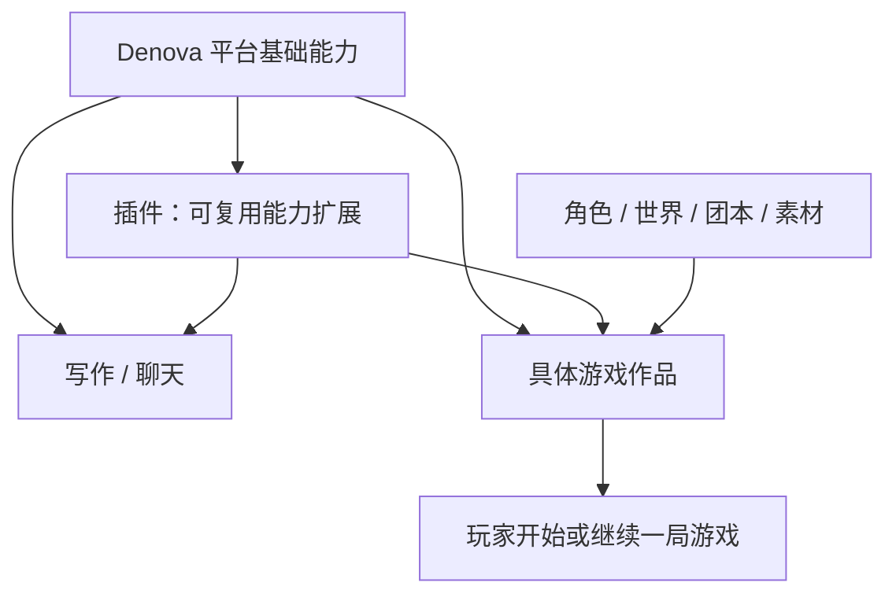
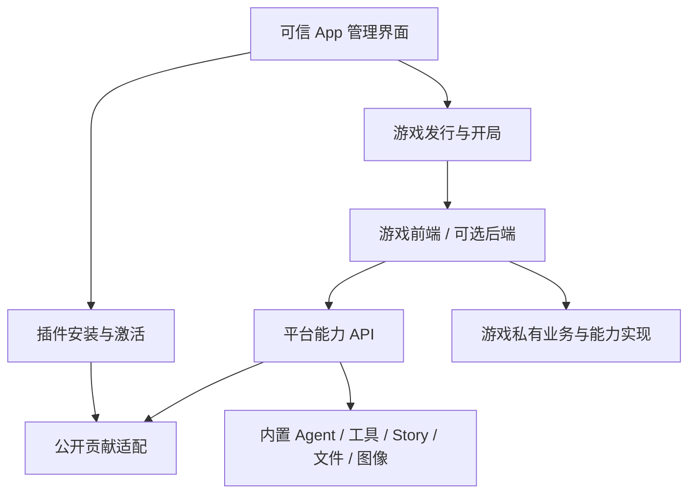

# Denova 插件与游戏平台设计

状态：第一版 A 已接入实现，尚未发布；B、C 保留为后续设计。更新：2026-09-10。用户数据保护基线为最近 Release v0.4.5。实际操作与 HTTP 契约见开发手册及 API 参考；本地 Node 后端不等于操作系统沙箱。

先读[插件开发手册](plugin-developer-guide.md)或[游戏开发手册](game-developer-guide.md)，再按本文理解系统职责。[API 参考](plugin-platform-api.md)定义边界契约；外部对照仅记录在本地参考审计中。

## 第一版范围与设计原则

**第一版完成插件的开发、安装、选择和调用，以及游戏的开发、运行、保存和继续。平台提供少量、清楚、可组合的基础能力，按实际作品的需要逐步扩展。**

- 平台能力与插件工具均使用普通 HTTP + JSON 接口，运行事件使用 SSE。SDK 只提供类型和便捷封装，作者可以直接用 HTTP 客户端调用；不增加 JSON-RPC 调度或远程对象协议。
- 第一版包含 Agent 调用、工具／工具集、游戏私有角色定义、自管实例文件，以及静态前端和 Node 后端运行。通用 flow／planner、第三方托管状态和完整回档属于后续阶段；既有内置 Story 流程保持原实现。
- 插件和游戏开发者负责适配平台的不兼容变更。平台维护公开接口文档、示例和变更说明，按清单中的 API 主版本判断是否可运行。
- 开发者自行决定是否提供源码、是否使用 Agent 开发。不要求发行包包含源码，不建设自动修复入口、源码改写或通用迁移引擎，也不维护多版本 API 兼容层。

下文同时描述第一版与后续能力的职责边界，具体交付范围以第 10 节为准。

## 1. 产品模型

**插件扩展 Denova 的能力；游戏是基于平台能力实现、在游戏页中可游玩的具体作品。** 两者都可以包含代码、界面与资源，也可以复用安装、构建和进程机制，但它们的产品身份与生命周期分开。

| 对象 | 定义 | 用户操作 | 不应混淆的对象 |
| --- | --- | --- | --- |
| 插件 Plugin | 供平台及使用方选择的能力扩展 | 安装、启用、配置、选择能力、停用 | 具体游戏作品 |
| 游戏 Game | 具有入口、玩法、内容与开局的可玩作品 | 添加、查看详情、开始、继续、更新 | 通用引擎或一套工具 |
| 游戏实例 GameInstance | 某部游戏的一次持久游玩空间 | 游玩、保存、继续、分支、导出 | 游戏发行本身 |
| 内容资源 | 角色、世界、团本、素材、模板等数据 | 导入、编辑、选择、复用 | 可执行能力或完整作品 |
| 发行 Release | 上述可安装代码与默认资源的准确版本 | 固定、校验、引用和保留 | 正在运行的进程或存档 |

例如，NPC 对话、通用回合规则和舞台渲染能力可以是插件；将它们与人物、场景和玩法组合成《月下物语》则是游戏。只装通用引擎不会在游戏页自动生成一部作品。纯内容不自动成为插件，组合成有可用入口与开局的作品后才按游戏交付。

不再采用“插件包内 contributes.applications／gameModes，所有游戏都是插件的一种贡献”的模型。通用独立 App 的分发不纳入本次产品范围；插件自身的功能页仍属于能力扩展，不能据此把游戏降为插件页面。

## 2. 关系与独立性



游戏可以直接使用内置能力、选择插件，或用自己的后端实现业务。纯前端游戏可以组合 Denova 与插件完成全部能力；有无后端与是否是插件没有对应关系。

游戏私有 Agent 定义、工具、上下文与 flow 随游戏交付，只在该游戏运行范围可见。它们不进入平台的公开插件贡献目录。可复用工具与后端服务可抽为插件；Skills 与 Agents 的作品管理仍由已有页面负责，不通过插件重复分发。

一个源码仓库可以同时包含游戏和配套插件，但使用独立清单、身份、发行与授权。平台可以在游戏安装向导中一起处理依赖，不创造“一包同时是两个产品”的歧义。一个插件被多部游戏使用时，卸载其中一部游戏不会卸载共享依赖。

## 3. 两份开发手册反推两条产品链路

| 手册任务 | 用户需要的结果 | 平台责任 |
| --- | --- | --- |
| 插件 P1 创建与预览 | 在 App 内开发、选择测试范围并定位问题 | 插件模板、源码 Project、工作台开发工具、测试激活 |
| 插件 P2 工具、P3 其他扩展 | 新能力可发现、可选择、可运行 | 贡献校验、范围注册、Agent／编辑器等适配 |
| 插件 P4 交付维护 | 安装后按范围生效，更新不破坏使用方 | 插件安装、配置、依赖影响预览和撤销 |
| 游戏 G1 开发、G2 纯前端实现 | 开发具体作品并创建测试开局 | 游戏模板、游戏清单、游戏运行容器、HTTP API 与可选 SDK |
| 游戏 G3 自有后端 | 原有 HTTP／WebSocket 业务运行并可停止 | readiness、实例来源、进程管理和业务代理 |
| 游戏 G4 状态恢复 | 明确谁保存世界、会话和进度 | 自管实例数据与可选 Story 托管适配 |
| 游戏 G5 交付游玩 | 在游戏页开始、继续、升级和管理存档 | 游戏目录、发行绑定、开局、停止、备份迁移 |

“插件可调用”与“游戏可游玩”分别验收。工作台统一开发与测试，扩展页负责安装、使用配置和管理，游戏页负责游玩。开发入口可以跨页面，但源码 Project、开发会话和开发工作流各自只有一份。

## 4. App 内入口

### 4.1 扩展管理

共通能力中的“扩展”采用二级目录，按插件、游戏分组并支持搜索。目录只展示当前安装的名称、版本、启停和可用性，不合并源码草稿。详情提供使用配置、实际授权、GitHub 来源与更新、卸载，不展示历史发行列表；「打开源码」跳转工作台原项目和会话。同一包可以关联多个源码副本，也可以完全没有源码。工作台中的项目可以产出多个扩展，安装扩展不自动创建 Project。

“创建扩展”选择开发插件或开发游戏，名称与可选需求是主要输入，模板、包 ID 和父目录位于高级选项。创建后统一进入工作台。安装支持公开 GitHub 源码、本地目录或 ZIP，自动识别类型；GitHub 按 commit 下载并冻结产物，需构建时显式导入普通工作台 Project。安装管理不要求源码发现成功。

停用阻止新建与重启，当前游戏和任务可以完成；卸载停止受影响实例并保留存档与发行。Skills 与 Agents 保留独立一级页。

### 4.2 游戏消费入口

一级“游戏”直接进入当前故事线。创建故事线时选择游戏类型，多种可用游戏时显示内嵌选择器，只有内置游戏时沿用原创建表单。可在同处设置默认游戏，禁用或缺依赖时回退内置互动故事。

每条故事线保留自己的游戏、发行与存档，切换故事线按各自绑定呈现；默认游戏从不转换已有故事线。开发预览不混入游玩列表。页面导航不停止后台，退出停止是明确操作。

### 4.3 源码 Project 与开发会话

“工作台 → 添加项目 → 新建工作目录”与“扩展 → 创建扩展”复用同一创建实现并统一进入工作台。默认创建受管 General Project，也可选择其他父目录。模板写入新 Project 根；有初始需求时由目标会话准备完成后发送一次。源码入口恢复原项目、会话和所选源码目录。

工作台复用既有文件编辑、General Agent、终端和源码版本能力，提供源码清单表单、构建、检查打包、隔离预览、测试存档、工具调用、导出和安装；安装确认使用同一组件和平台服务。Agent 自动获得开发 Skill、所选源码位置及最多 16,384 字符的最近反馈，超限保留末尾并标记省略。选中源码和诊断是临时 UI 状态，不复制 Project 注册信息或 journal。打开带根清单的 Project 自动识别，损坏的已识别清单保留工作台修复入口。失败保留用户目录与源文件。

## 5. 分开的清单，共用的工程机制

| 清单 | 领域字段 | 约束 |
| --- | --- | --- |
| denova.plugin.json | contributes、能力配置和扩展视图 | 提供平台扩展，不声明可玩游戏目录项 |
| denova.game.json | game 入口、存储选择、uses、私有 definitions、作品内容 | 交付一部作品，不注册其他游戏可见的公共贡献 |

共享字段包含版本、名称、本地化、构建配方、发行白名单、运行要求、能力申请和插件依赖。一个候选产物根只能有一种清单，预览与安装校验 kind 与内容一致；同一仓库有多个产品时分别定位目录。

共用源码绑定 `ProjectID + relativePath`、文件校验、固定来源下载、产物快照、进程协议、桥接和日志；上层分别使用 PluginID 和 GameID。技术内部可以有带 kind 的包引用，无需新增产品级“通用应用”层或插件继承系统。

开发检查是只读动作；准备与构建命令先展示、在可见终端执行。打包消费冻结的产物快照，安装消费同一批已验证字节，源码变化不能修改候选包。预览与正式开局隔离，不默认授权当前真实项目。前端 HMR 不改变运行中已冻结的 Agent 定义；后端和贡献变化重建激活。

## 6. 能力开放：使用、公开提供与私有实现



- **Consumer API** 供游戏和插件调用 Denova 的公开 HTTP 能力，使用显式资源与范围；HTTP 契约是调用边界，SDK 可选，不直接公开内部路由。
- **Plugin Provider API** 由 manifest 声明公共贡献及工具的相对 HTTP 端点，宿主在选中并激活后绑定；静态定义与资源不需要后台进程。
- **游戏私有实现绑定** 使用相同的有类型调用执行器，但只绑定到该游戏与开局，不能占用公共插件 ID。
- **Management API** 只由可信 App 使用，分别管理插件、游戏与开发任务。游戏不能自行安装并批准插件，插件也不能自行获得其他作品的数据。

内置能力逐项适配成可选择契约，仍可编译在主程序中。模型循环、工具执行、Skills、编辑审阅和领域提交继续复用原机制，不先重写整个 Denova 为动态服务图。

普通请求使用 HTTP 方法、路径、状态码和 JSON 请求／响应体；流式结果使用 SSE，文件使用普通 HTTP 传输。游戏调用插件工具经过宿主的同一授权和执行入口，宿主再请求已绑定的插件端点。插件端点的监听地址由启动过程确定，清单只声明相对路径。

公开 API 的 OpenAPI 描述、示例和实现随版本一起核对。接口围绕 Agent、工具、文件／资产和实例存储等明确能力组织，不用一个任意 method 调度入口代替契约，也不为每种具体玩法提前增加接口。

## 7. 依赖、范围与运行

游戏声明 uses 与所需插件发行范围，创建开局时固定实际解析结果。工具和 Agent 的选择显式保存，单实现槽不按加载顺序覆盖，多来源列表按明确顺序装配。依赖闭环拒绝，缺依赖显示诊断；角色卡引用不转移工具权限。

游戏进程归游戏运行；插件进程归插件在目标范围内的激活。初期不同开局分别激活，不做跨局共享进程；同一开局多个视图／使用方可复用同一插件激活。插件可被游戏请求使用，但不是游戏后端的别名。

停止一局时取消该局工作并释放它持有的插件激活；仍有使用方的同范围激活按引用释放。禁用插件只阻止新的激活；当前工作保留原凭证与定义，停止后需要重新启用。卸载或修改授权才撤销受影响激活并停止工作。

原生后端使用启动、readiness、授权通道、shutdown 与进程树清理协议。无后端的面板／游戏从隔离视图调用范围受限的 HTTP API；静态定义不启动进程。浏览器握手与宿主界面通知可使用少量 postMessage，业务调用不经过 MessagePort RPC。基础设施启动、连接和清理可以超时，LLM 默认没有总运行时长或迭代上限，始终可由用户取消。

视图独立来源、cookie、旧内部 API、WebSocket 和业务代理共同校验。原生程序具有宿主账户权限，进程与 API facade 不是 OS 沙箱；预览和安装如实展示运行性质。平台密钥通过能力调用使用，不由 SDK 返回。

## 8. 游戏实例与持久化

### 8.1 一个游玩概念，两种存储归属

| 实现选择 | 实例身份与权威绑定 | 世界状态 |
| --- | --- | --- |
| 游戏自管 | 稳定 instanceId；实例元数据保存 GameID、游戏发行、插件依赖、开局参数和可选 ProjectID | 自有 data 文件／数据库 |
| Denova 托管 | 直接使用既有 ProjectID + StoryID + BranchID；发行、依赖、配置写 Story 的版本化记录 | 同一 Story journal |

GameInstance 是产品/API 的游玩概念，不要求每种实现都新增一个实例数据库。托管玩法不同时写 instance.json 和 Story 中的权威绑定；列表和索引可从原事实重建。前后端形态与存储选择正交，纯前端也可选任意一种。

只调用 Agent 时，会话仍是原 Product Session；多个 NPC 可是独立根会话，只有真实委派才用 parent_session。托管动作委派的 NPC 使用同一 Project Store 中自己的自包含 journal。AppInstance、contributes.applications 与游戏／应用混合目录不保留为草案兼容层。

### 8.2 事实源与路径

```text
.denova/
  plugins/<plugin_id>/
    installed.json
    settings.toml
    releases/<release_id>/
    data/<scope_id>/
    previews/<preview_id>/
    backups/
  games/<game_id>/
    installed.json
    settings.toml
    releases/<release_id>/
    instances/<instance_id>/
      instance.json
      data/
    previews/<preview_id>/
    backups/
  stores/<store_dir>/...
```

一个扩展一个目录，设置与数据按稳定包 ID 聚合；目录枚举每个 installed.json，不维护全局安装注册表。自管游戏实例位于各游戏目录内，模型会话的唯一 journal 仍归 Project Store。源码由 Registry 定位，开发绑定保留在项目记录中。

设置使用单份 TOML 用户覆盖，发行包提供不可变的 JSON Schema、TOML 默认值与双语标题。扩展页生成表单并提供 TOML 编辑；保存前校验在用发行、固定依赖和实例，使用 revision 防止并发覆盖并备份旧文件。运行中的快照不变，下次启动才生效。game.setup 只用于故事线开局并随实例保存，权限变更另行停止受影响实例。完整契约见[扩展设置标准](extension-settings.md)。

插件自身的非会话服务数据（如用户维护的词典）可放 plugins/<plugin_id>/data，并按授权范围隔离；缓存可丢弃。某局游戏世界、Agent transcript、Goal/Todo/Clear/Cleanup/Compaction 等恢复状态必须留在其唯一领域事实源，不能复制到插件 data 后参与恢复。

ProjectID 和 store_dir 不因改名、搬迁或 relink 改变。受管引用是使用 `/` 的规范相对路径，运行时绝对路径、端口、临时 URL 与凭证不持久化。插件与游戏新增文件同样遵守跨平台文件名、无符号链接／特殊文件／大小写冲突规则。External Project 和外部服务仍不承诺跨设备可用。

### 8.3 更新与恢复

更新以源码提交与产物摘要识别，允许同版本号对应不同源码快照；语义版本由作者表达兼容性。新增消费者使用当前安装并校验依赖范围，不在历史发行中自动求解版本。历史快照为已有会话、存档和恢复服务，不作为日常发行管理功能。构建与运行兼容性由作者负责，宿主不自动改写源码或迁移数据格式。

安装新版游戏或插件不会改变已有开局绑定。第一版允许用户显式更换游戏／依赖发行，但仅限开发者明确声明兼容原存档格式的更新；先停止、备份并检查 API 与依赖，更新绑定和验证失败时恢复原绑定及数据。需要转换存档格式的升级在后续按实际需求支持，由开发者提供必要的数据迁移，不建设通用迁移引擎。代码回退要匹配数据，不能只换版本号。

固定发行只固定游戏／插件代码，不保证新宿主仍支持旧 API。清单的 apiMajor 与当前宿主不兼容时拒绝激活并说明原因，保留安装信息和用户存档，等待开发者提供适配版本。接口适配与用户数据迁移是不同责任，不通过自动修改插件来掩盖不兼容。

自管存档加 Denova NPC 历史默认分别提交，不承诺跨库事务。采用托管动作时，accepted 在副作用前持久化，成功 committed 一次保存世界、计划、正式结果和采纳的 NPC 完成位置；候选失败不进入正式进度。

回档需要根据采纳位置恢复完整 NPC 前缀，包括 Compaction、Goal/Todo 等；失败尾部不能进入下一轮记忆。缺少这一能力时关闭完整回档入口，不能只恢复面板数值。回放读取数据，不重新执行插件、模型、随机数或外部写操作。

HTTP 请求标识只用于诊断，commandId 标识稳定业务意图。去重记录写入已有 canonical journal；响应丢失先查询，accepted 后未知终态标为 incomplete，不自动重复付费或外部写操作。事件 cursor 只用于观测，`.idx.json` 和 runs 不成为恢复事实源。

卸载游戏不级联卸载共享插件；停用插件直接更新开关；卸载前展示停止影响。用户存档默认保留，被存档引用的发行不静默删除。导出数据库需停止写入或有可靠在线快照适配，分享排除密钥、授权与私人历史。

## 9. 当前基础与新增适配

| 当前代码 | 可复用 | 新增工作 |
| --- | --- | --- |
| [共通路由](../web/src/components/workbench/SharedWorkbenchRoutes.tsx)、[工作台路由](../web/src/components/workbench/WorkbenchRouteHost.tsx) | 共通目的地、工作台与编辑能力 | 插件管理、游戏作品／开发入口、运行容器 |
| [Project](../internal/project/types.go) | 稳定身份、location 与 Store | 两类开发目录绑定和测试目标选择 |
| [Skill 安装](../internal/agents/skills/install.go)、[GitHub 来源](../internal/agents/skills/github.go) | 安全文件处理和来源解析 | 两种清单校验、固定字节候选包、独立安装记录 |
| [Agent 包](../agent/README.md)、[定义边界](../agent/definition.go)、[自定义 Agent](../config/custom_agents.go) | Agent 执行、Toolset、ContextSource 与角色配置 | 内置与游戏私有定义适配、模型槽、授权 DTO、持久请求边界 |
| [Skill assembly](../internal/agents/skillassembly/assembly.go) | 有效目录、加载工具和资源引用统一 | 继续负责作品 Skills，插件不接入第二套 Skill 分发 |
| [canonicalstore](../internal/agents/canonicalstore/store.go) | Product、Game 和子 Agent 的单一 journal | 游戏发行／依赖记录、通用角色绑定及去重 |
| [Story 提交](../internal/interactive/story_agent_commit.go)、[BranchPlan](../internal/interactive/branch_plan.go) | 托管状态、分支和规划归属 | 可选 flow、通用 schema、完整 NPC 前缀恢复 |
| [项目接口](../internal/api/routes.go)、[编辑器](../web/src/components/Editor/WritingDocumentEditor.tsx) | 文件、审阅、图像等领域能力 | 范围桥接、草稿保护与公开资产交付 |

Go 宿主承担身份、进程和领域适配，agent/ 保留通用执行职责。现有同步 Goja 脚本工具不承担任意前后端托管。文中类型都是新草案，无需保留上一版未发布命名的兼容层。

## 10. 分阶段验收

| 阶段 | 可完成的开发者体验 | 核心出口 |
| --- | --- | --- |
| A 第一版完整闭环 | 插件 P1/P2/P4 与游戏私有角色；游戏 G1/G2/G3/G5 的运行和自管存档 | 本地开发、构建、导入／导出安装包；HTTP Agent 与工具调用、SSE、取消和请求查回；静态和 Node 游戏开局、保存、退出、继续；存档格式兼容时显式更换发行；写作与游戏复用插件能力 |
| B 按实际需求扩展 | 插件 P3 的动态 context、面板和写作编辑；图像／资产、更多后端运行环境及分发来源 | 复用既有领域能力，按样例补充公开 HTTP 接口；需要转换存档格式的升级提供明确的数据迁移边界 |
| C 托管玩法与高级恢复 | 可复用 flow／planner；游戏 G4 | 私有与插件玩法均可接托管状态；失败候选隔离，回档无未来 NPC 记忆 |

产品只提供文本工具插件与「月下来信」游戏两个示例，默认不安装、不启用。能力验证覆盖插件复用、NPC 游戏与 Node 后端；额外的存档和进程场景使用测试素材，不增加产品示例。使用普通 HTTP 客户端可以完成平台能力调用，不依赖专用 SDK。面板、编辑扩展和其他运行环境随对应阶段增加样例。

第一版必须验证刷新／重启后的请求查回与去重、不同开局隔离、禁用后继续运行、停止后拒绝新启动、准确依赖、API 主版本不兼容提示、发行更换的备份与失败恢复，以及浅色／暗色、中英文、宽窄屏和写作／游戏共通功能。涉及数据格式迁移的后续能力单独验证。macOS、WSL、Windows 原生分别验证声明支持的进程和路径行为。云部署、多人同步、原生语音和通用跨数据库恢复不因上述接口存在而被承诺。

新增插件／游戏目录不批量迁移既有 Project 和 Story。新平台会话在自己的 Product Session JSONL 中保存版本化配置与请求记录；v0.4.5 不能继续这些新会话。写作、工作台和内置 Story 通过共享 Toolset 自动接入已启用且获授权的插件公开工具，子 Agent 复用当前执行的工具与权限范围。启停、版本和设置只从插件安装记录及 settings.toml 读取，不写入会话配置。新执行采用当前配置；运行中的任务使用已经装载的工具。配置变化后暂停任务可能无法原地恢复，不自动重放旧工具调用。运行时按 Session／Story 分支隔离；此调整不涉及 v0.4.5 用户数据迁移。
