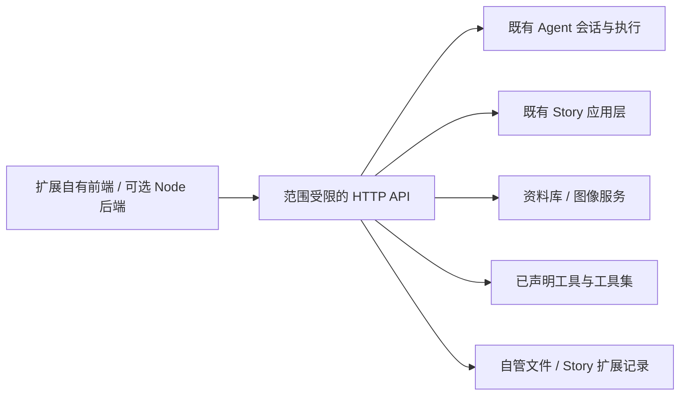

# Denova 扩展平台设计

状态：当前工作区实现，尚未发布。更新：2026-09-13。

本文说明职责与取舍。开发流程见[扩展开发手册](extension-development.md)，接口字段见 [HTTP API](plugin-platform-api.md)，配置格式见[扩展设置标准](extension-settings.md)。代码、测试和仓库长期不变量是事实源。

## 目标：能力可以组合，玩法归扩展

Denova 提供现有领域能力的公开入口，让作者用自己的前端、交互和数据结构构建应用。宿主负责身份、授权、执行生命周期和可靠存储；业务协议由扩展决定。

例如，Galgame 示例组合资料库、Story、私有 Agent 与图像生成：Story 推进剧情，私有 Agent 将指定正文整理为演出，游戏代码决定台词、表情、背景、立绘、CG 和播放。宿主不认识这些演出概念，也不根据游戏类型增加业务分支。样例用于验证能力能否独立组合，不要求其他扩展采用同一种演出协议。

扩展不依赖 Denova 内部 React 组件、状态仓库或历史管理路由。当前完整自定义界面通过游戏 view 承载，无须先建立通用组件覆盖、DOM 钩子或动态服务图。公开 HTTP 契约提供稳定边界，SDK 只做可选便捷封装。

## 产品身份与工程复用

| 对象 | 责任与生命周期 |
| --- | --- |
| Plugin | 提供可复用工具和工具集，由宿主 Agent 或游戏使用；按范围激活 |
| Game | 提供自己的可玩界面及私有定义，可以复用 Story，也可以自行实现玩法 |
| Instance | 一次持久使用空间，固定游戏发行、依赖、开局配置和模型选择 |
| Release | 已校验的准确发行字节，通过摘要区分；不随源码编辑改变 |
| Project | 源码或内容的稳定身份；既有 Registry 负责 location 与 Store |

根目录只能有 `denova.plugin.json` 或 `denova.game.json` 中的一种。共享的是候选包校验、发行冻结、设置、来源下载、进程和连接机制；不增加通用 AppInstance、插件继承或“游戏作为插件贡献”的额外层。一个仓库可包含多个产品，每个目录分别声明身份、发行和授权。

插件公开贡献目前为 tools/toolsets；游戏可以携带私有工具和 Agent 定义。Skills 与公开用户 Agent 继续使用已有管理能力，不通过插件重复分发。完整游戏界面可以定制，不意味着通用插件面板、编辑器插槽或任意宿主界面改写已经开放。

## 能力边界

Go 平台层校验凭证、权限、输入和可见贡献；App 的薄适配层解析稳定 Project，取得生命周期租约，再调用现有领域服务。原来的写作、聊天和内置 Story 仍走同一套执行与提交机制。`agent/` 继续承担通用 Agent 执行，不引入玩法知识。

| 公开能力 | 复用机制 | 扩展承担的部分 |
| --- | --- | --- |
| Agent | 模型槽、Product Session journal、命令去重、SSE、取消 | 提示词、私有定义、调用顺序和结果解释 |
| 工具 | JSON Schema、贡献可见性、效果声明、授权和后端 HTTP | 具体计算、外部服务和结构化反馈 |
| 资料库 | 绑定 Project 的既有 Lore Store、分页投影 | 选择条目、组织应用上下文 |
| 图像 | 用户选定的 image 槽、共享 provider 适配、范围资源存储 | 图片用途、提示词、素材映射与采用时机 |
| Story | 玩家可见快照、历史、已有推进/暂停/分支/版本操作 | 完整呈现与交互、额外演出数据 |
| 存储 | 自管 revision 文件或 Story 扩展 JSON | 应用数据结构、schemaVersion 与兼容策略 |

资料正文按需读取，不自动向每次模型调用注入整库。图片以 `{ kind: "project" | "generated", path }` 引用，只表达资产来源，不发展为通用 VFS。运行时通过认证请求取得图片字节；浏览器 blob URL、端口、绝对路径和凭证不能成为持久引用。

## 授权与运行隔离

每次游戏运行或插件激活有独立 HTTP 来源和 bearer 凭证。凭证绑定包、准确发行、Project/Session/Story/实例范围和已授予权限。请求 body 不能扩大范围，第三方页面不能使用可信宿主的管理接口。

Story API 要求托管 `game-instance` 范围以及明确的 InstanceID/StoryID；依赖插件在同一范围内仍须单独获得授权。普通宿主 Agent 工具保留原有 Session 或 Story 分支权限，不因新增 API 获得整条故事的控制权。

文本与图像模型均由用户选择 profile。扩展只能引用清单中的槽，宿主不返回密钥、headers 或 provider 配置。资料、资产、图像、Story 读写使用独立权限。`write/propose` 工具还要求写能力授权，普通模型问题回答不能充当权限批准。

前端握手检查父页面、来源和 nonce；业务通过普通 HTTP 调用。游戏可以完全无后端。Node 后端通过 stdin 接收启动配置，按 readiness/shutdown 协议运行，宿主负责进程树清理。Node 具有当前系统账户权限，API 范围隔离不是操作系统沙箱。

停止运行会取消该范围的 Agent 与图像工作，并等待持久状态完成；托管游戏只暂停自身发起的 Story 运行。切换导航不会隐式停止任务。基础设施启动与清理可以有超时，模型任务没有固定总时长或迭代上限，并保留用户取消。

## 两种存储归属

`game.storage.kind` 只决定谁拥有玩法的恢复事实，与前端技术、是否使用 Node 后端无关。

| 选择 | 权威事实源 | 适用情况 |
| --- | --- | --- |
| self | `games/<game>/instances/<instance>/instance.json` 与自有 data | 作者自行组织玩法、数据库和存档 |
| story | 既有 Story 的 canonical JSONL | 复用内置互动故事，同时自定义完整呈现与交互 |

自管游戏的 Agent 会话仍使用各自 Product Session journal；游戏存档和 Agent 历史独立提交，平台不承诺跨库事务或任意回档后的 NPC 历史自动回退。

托管游戏在 Story journal 内保存应用绑定、发行、依赖、开局参数和扩展 JSON；不再维护第二份 instance.json 恢复事实。绑定使用稳定 ProjectID、StoryID 和 GameID，显示名、当前路径与分支切换不改变身份。托管实例列表可以从 journal 重建。

生成文件放在所属 Project Store 的 `extensions/<game>/<story>/data-resources`；作者的资产目录为同级 `data`。这些文件随托管导出一起保存，模型会话各自保留 canonical journal。移除托管绑定追加可恢复的移除记录，并保留 Story 正文、扩展历史和素材，便于回到内置界面或重新绑定。

### 扩展 JSON 不成为第二份故事

一条扩展记录包含包归属、key、schemaVersion、JSON value 和乐观并发 revision。宿主只验证这些公共属性，不解释其中的角色、场景、棋盘或演出结构，也不把它自动注入模型上下文。

需要依附正文的数据，同时以 branchId、turnId 和准确 sourceRevision 寻址。写入时检查该分支仍包含这份正文修订；异步生成结果不能覆盖后来切换或改写的版本。正文修订 ID 表示一次具体编辑，即使文字改回原样，也不会误用旧演出。

记录进入同一 Story journal，但不推进分支 head，也不改变模型上下文版本。索引仅保存可重建定位信息。应用偏好可使用不带回合的记录；二进制素材独立保存，记录只持有资产引用。扩展负责自己的 schemaVersion 升级和播放位置，不能把逐句播放误当作新的剧情推进。

### 三类操作各自恢复

| 操作 | 去重与恢复策略 |
| --- | --- |
| Agent 运行 | commandId 与结果进入同一 Product Session journal；未知终态为 incomplete，不自动重放副作用 |
| Story 推进 | 复用既有 Story 命令、提交和恢复机制；stop 指向准确 operationId |
| 直接图像生成 | 付费请求前持久化范围内请求记录；结束后保存资产引用；进程丢失后为 interrupted，需新 commandId 显式重试 |

直接图像生成不创建 Agent Session，因此其请求记录不是第二份 Agent journal。扩展采纳图片后，再将引用写入应用记录或自管存档。HTTP 连接断开不代表取消或没有副作用；消费者先用原 commandId 查回。播放或回看读取记录，不重新调用模型、随机数、外部工具或图像 provider。

## 开发、安装与更新

工作台负责源码 Project、开发会话、文件、可见构建命令、检查、预览和反馈；扩展页负责已安装发行、配置和授权；游戏页负责开始、继续和管理故事线。源码目录和安装产品是不同对象，安装不要求保留源码，也不自动创建 Project。

创建只按 plugin/game 初始化通用开发骨架，包含入口、连接辅助代码、本地化和开发说明，不带预定玩法、角色或模型槽。`creative-toolkit` 保留为完整插件参考源码，不进入创建选项。具体游戏引擎独立开发和安装，不作为平台构建依赖。工作台「试运行」承担模型和测试参数，「发布到本机」确认基本信息后检查并安装，启用声明的必需能力；可选能力沿用已授予且仍声明的权限，在扩展设置中管理。扩展详情页导出指定已安装发行，摘要与安装内容一致，不包含源码变动、本机设置或存档。对外发布由用户自行管理。

检查冻结准确分发字节，预览与安装消费同一个候选快照。源码编辑不会改变运行中或已安装的发行。GitHub 来源保存固定 commit；来源、语义版本和产物摘要职责分开，不通过自动重写源码或迁移脚本掩盖兼容性问题。

新增实例使用当前安装并检查依赖范围；已有实例保留准确发行及依赖。显式升级要求兼容 API、相同存储归属与相同非空 saveFormat，先停止、备份、检查目标运行，再更新绑定。格式转换没有通用迁移引擎。停用阻止新建与重启，卸载或修改授权会停止受影响运行；共享插件不随某个游戏级联卸载。

偏好按发行保存在 settings/<releaseId>/settings.toml，结合发行默认值和 JSON Schema；保存后在下次启动应用。新版继承上一发行设置，不兼容值留待配置页修复，不阻止安装或约束旧存档。配置页仅提供表单，不提供第二套 TOML 编辑与转换接口。game.setup 属于开局配置，随实例保存。角色素材绑定、演出选项等应用数据由扩展界面与其存储负责，不增加宿主专用表单或业务字段。

受管内容坚持 ProjectID、不可变 store_dir、规范相对路径及跨平台文件名。首次向原 Story 追加新扩展记录时，复用 journal 的先备份写入机制；未使用新功能的用户数据不做批量迁移。旧宿主不理解新记录，降级须使用对应备份。

## 明确边界与验证重点

当前没有通用 DOM 改写、宿主组件插槽、提示词拦截器、第三方 flow/planner 托管框架或任意跨会话回档。Story 使用快照与分页历史作为已提交视图，通过按 operationId 绑定的 SSE 公开临时根任务正文；断线恢复不触发生成，完成后重新读取快照。Agent 运行另有 SSE。添加能力需由实际应用证明必要，不能因样例出现某种玩法而提前把它提升为宿主类型。

必要验证覆盖准确发行与依赖、模型槽授权、跨 Project/实例隔离、重复请求、取消与进程重启、正文编辑与分支切换后的来源校验、索引重建、导出与移除后的默认界面恢复，以及既有自管游戏和工具插件不回归。共享入口还需检查写作与游戏、中英文、明暗主题和宽窄屏；各操作系统的路径及进程行为以目标系统验证为准。
